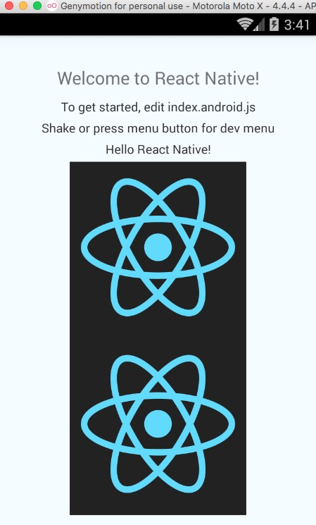

# React Native For Android 环境配置以及第一个实例

## (一)前言
FaceBook 早期开源发布了 React Native For IOS,终于在 2015 年 9 月 15 日也发布了 React Native for Android,虽然 Android 版本的项目发布比较迟，但是也没有阻挡了广大开发者的热情。可以这样讲在 2015 年移动平台市场上有两个方向技术研究比较火，第一种为阿里，百度，腾讯，携程，360 等一线互联网公司的插件化，热修改等技术，第二种就是广大开发者一直在讨论的 React Native 技术。前几天同我在美国的童鞋了解到，在国外现在很多创业型互联网公司都在使用 React Native 技术，由此可以看出该项技术的前景还是不错的。我在这边我自己就大胆预测一下吧(呵呵,勿喷哦~)：2016 年将是 React Native 大力发展的一年。所以对于我自己来而言，2016 年的主要技术方向,React Native 是占了主角了。在接下来的很长一段时间内，我的博客会持续更新 React Native 的应用开发教程，欢迎大家关注以及相关交流！

刚创建的 React Native 技术交流群(282693535),欢迎各位大牛,React Native 技术爱好者加入交流!同时博客左侧欢迎微信扫描关注订阅号,移动技术干货,精彩文章技术推送!

[关于 Windows 系统安装 React Native 环境教程点击进入....](http://www.lcode.org/%e5%8f%b2%e4%b8%8a%e6%9c%80%e8%af%a6%e7%bb%86windows%e7%89%88%e6%9c%ac%e6%90%ad%e5%bb%ba%e5%ae%89%e8%a3%85react-native%e7%8e%af%e5%a2%83%e9%85%8d%e7%bd%ae/)

## (二)React Native 介绍
React Native  For Android 是伟大的互联网公司 Facebook 与 2015 年 9 月 15 日发布的，该可以让我们广大开发者使用 JavaScript 和 React 开发我们的应用，该提倡组件化开发，也就是说 React Native 给我们提供一个个封装好的组件让开发者来进行使用，甚至我们可以相关嵌套形成新的组件。使用 React Native 我们可以维护多种平台(Web,Android 和 IOS)的同一份业务逻辑核心代码来创建原生应用。现阶段 Web APP 的的体验还是无法达到 Native APP 的体验，所以这边 fackbook 更加强调的是 learn once,write everywhere，应用前端我们使用 js 和 React 来开发不同平台的 UI，下层核心模块编写复用的业务逻辑代码，提供应用开发效率。

React Native 项目 github 地址:https://github.com/facebook/react-native

React Native 项目官网文档:http://facebook.github.io/react-native/docs/getting-started.html

## (三)React Native 配置安装
特别声明:facebook 官网说当前 react native 欢迎是需要 OS X,不过我也看到了有人通过 windows 系统配置该环境哈~大家有兴趣可以百度搜索一下。

3.1.Homebrew 安装
Homebrew 是 OS X 不可获取的套件管理器，我们可以通过它获取并且安装很多组件,安装方式如下:

```
ruby -e "$(curl -fsSL <a href="https://raw.githubusercontent.com/Homebrew/install/master/install">https://raw.githubusercontent.com/Homebrew/install/master/install</a>)
```

然后通过命令行执行 brew -v 进行检查 brew 是否已经安装成功。整体截图如下:


3.2.Node.js 安装,我们需要安装 Node.js 4.0 或者更高版本,这边推荐采用 Node 管理器 nvm 来进行安装,nvm 项目地址:https://github.com/creationix/nvm

第一部分:安装 nvm，查看项目官网官方推送 curl 或者 wget 方式安装或者更新 nvm:

第一种:curl 方式:

```
curl -o- <a href="https://raw.githubusercontent.com/creationix/nvm/v0.30.1/install.sh">https://raw.githubusercontent.com/creationix/nvm/v0.30.1/install.sh</a> | bash
```

第二种:wget 方式:

```
wget -qO- https://raw.githubusercontent.com/creationix/nvm/v0.30.1/install.sh | bash
```

不过在使用这两种方式之前，我们可以采用 brew install curl 或者 brew install wget 来确保已经安装 curl 或者 wget。我这边采用了第一种方式安装，具体安装截图如下:


这样我们已经安装了 nvm，但是最好我们配置一下环境变量到.bash_profile 文件中，具体配置如下:


最终我们通过命令行执行 nvm  --version 检查一下 nvm 是否已经安装成功。

第二部分:安装 Node.js，根据官网文档我们直接命令行执行如下命令即可完成完成:

```
nvm install node && nvm alias default node
```

安装截图如下:


该会进行安装 Node.js 最新版本，并且会给我们打个别名，方便使用。通过 nvm 我们可以安装多个版本的 Node.js，并且可以非常轻松的选择不同的版本进行切换使用。

【注意】如果现在采用是 Node5.0 版本的版本，官网是推荐安装 npm 2，该版本比 npm 3 速度更加快。在安装完 Node 之后，命令行运行 npm install  -g npm@2 安装即可。

第三部分:安装 watchmam，该用于监控 bug 文件，并且可以触发指定的操作，安装方式如下:

```
brew install watchman
```

安装截图如下:


第四部分:安装 flow,flow 是一个 JavaScript 的静态类型检查器，建议安装它，以方便找出代码中可能存在的类型错误，官网:http://www.flowtype.org/

安装截图如下:


3.3.原生开发环境安装:

针对 iOS 开发，我们只需要安装 Xcode 7.0 或者 7.0 以后版本，该可以通过 App Store 进行下载安装

针对 Android 开发，Android 环境配置网上非常多了，我相应看这篇文章的朋友电脑上面基本都有 Android 开发环境的了~针对安装详细([点击进入参考文章](http://wiki.jikexueyuan.com/project/react-native/DevelopmentSetupAndroid.html))

3.4.React Native 安装

现在就是最后一步，也是最激动人心的时刻到了，我们使用命令行运行如下命令安装 React Native:

```
npm install -g react-native-cli
```

安装截图如下:


经过以上的四个大步骤我们基本完成 React Native 从基本环境的搭建工作，下面我们来进行一个实例演示 React Native 项目的效果。

## (四)React Native 第一个应用(AwesomeProject)

经过以上的四个大步骤我们基本完成 React Native 从基本环境的搭建工作，下面我们来进行一个实例演示 React Native 项目的效果。React Native 第一个 AwesomeProject，就不是 HelloWorld 啦。

首先执行如下命令,生成一个工程:

```
react-native init AwesomeProject
```

运行截图如下:


目录结构如下:


我们仔细看上面的目录，会发现该该生成 android 和 ios 两个平台的原生项目，大家有兴趣可以打开 android 和 ios 目录看一下，里边就是一个 Android  Studio 和 Xcode 创建的项目。其中 index.android.js 和 index.ios.js 文件为 Android 和 IOS 的空壳应用文件。另外还有一个 node_modules 文件夹，该为 Node.js 存放和管理 npm 包得，也包含 React Native 框架文件。

查看项目部分代码:index.android.js 如下:


4.1.运行 iOS 应用:

1. 命令行执行 cd AwesomeProject,路径切换到项目主目录

2. 点击 ios/AwesomeProkect.xcodeproj 进行运行 Xocde

3. 使用编辑器进行打开 index.ios.js 进行相关修改，然后运行应用即可。

4.2.运行 Android 应用:

1. 命令行执行 cd AwesomeProject,路径切换到项目主目录

2. 命令行执行 react-native run-android 进行加载运行 android 应用。

3. 同样可以使用编辑器进行打开和修改 index.android.js 文件，接着通过菜单按钮选择 Reload JS 来进行刷新修改

运行截图如下:


这些步骤，命令执行完之后，那么我们第一个应用也完美运行啦，具体看如下效果！



## (五)已存在 React Native 项目添加 Android 版本

因为 React Native 的 Android 版本的发布要晚于 iOS 版本，所以有很多接触 React Native 比较早的应用可能只有 iOS 版本，我们可以进行如下的操作，给添加 Android 版本:

1. 修改 package.json 文件来更新 react-native 到最新版本

2. 运行 npm install 命令

3. 最后执行以下 react-native android 命令即可

## (六)最后总结

今天我们从初始开始，安装各种工具以及命令，完成了 React Native 的基础环境的搭建，并且成功运行第一个 React Native for Android 的应用。下一篇我们对推荐 IDE(Atom)以及相关插件的安装配置讲解。敬请期待~
