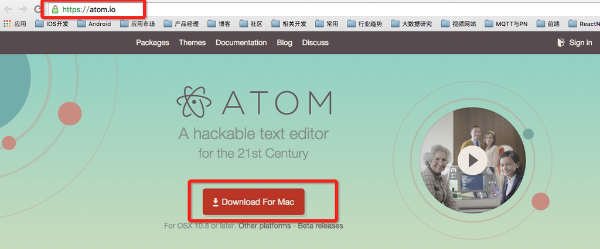
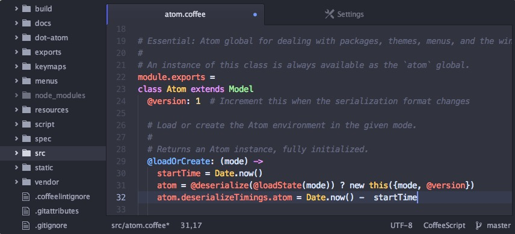
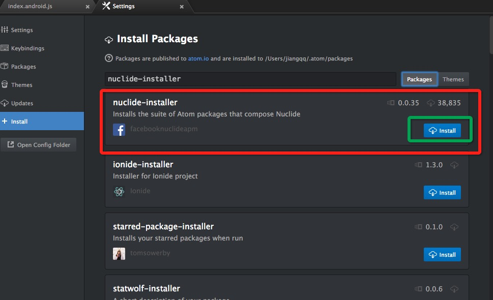
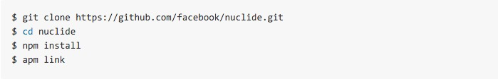
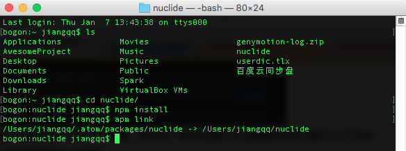
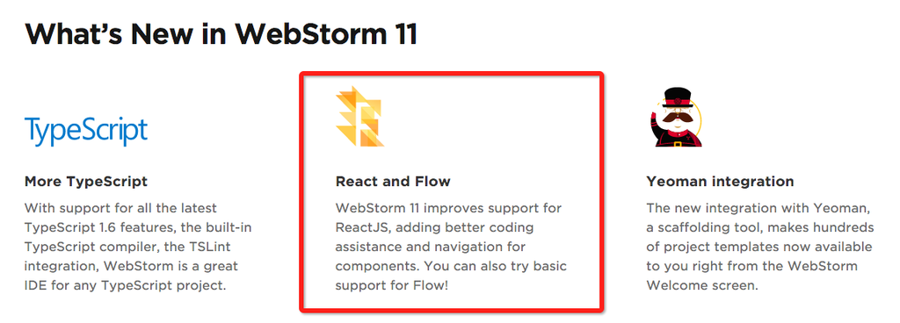
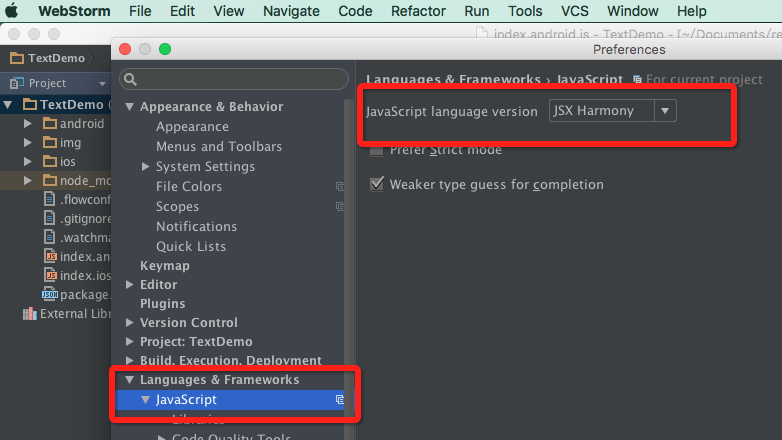
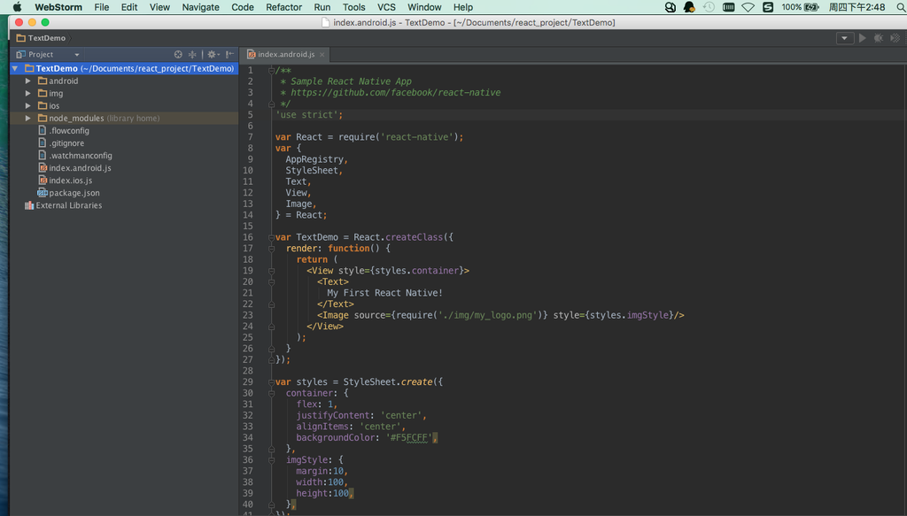

# React Native 开发 IDE 安装及配置

## (一)前言
上一讲我们已经对于在 OS X 系统上面对于 React Native For Android 的环境搭建以及第一个实例做了详细讲解。所谓工欲善其事，必先利其器，做 React  Native 开发也和其他应用开发一样，做好有一个比较好的 IDE 工具。那么这边比较推荐以下几款工具:sublime,webstorm 以及官网推荐的 Nuclide。下面我们主要讲解以下后面两款工具。
刚创建的 React Native 技术交流群(282693535),欢迎各位大牛,React Native 技术爱好者加入交流!同时博客左侧欢迎微信扫描关注订阅号,移动技术干货,精彩文章技术推送!

## (二)Nuclide 常规安装以及配置
Nuclide 是 Fackbook 专门为 React 开发 IDE，官网提供哦~。但是 Nuclide 是哎 Atom 的基础上面提供了一系列的插件集合。所以我们需要首先安装 Atom。
Nuclide 项目官方地址:https://github.com/facebook/nuclide
2.1.Atom 安装
Atom 是一个开源版本的编辑器，非常强大以及完美的体验，Atom 最大的特色就是可以安装很多的插件来完成我们的需求。官网地址:https://atom.io/  去官网下载安装即可。
官网页面以及软件运行截图如下:





2.2.Nuclide 安装
Atom 已经安装成功了，下面就开始安装 Nuclide，直接打开 Atom 软件，点击 Atom->Preferences 打开 Setting,然后点击 install，输入 nuclide-installer 搜索，进行下载即可，如下图 :



这种方式我们是选择插件下载进行安装，另外的一种方式我们可以直接在命令行执行以下命令(利用 Atom 的包管理器 apm 安装):

```
apm install nuclide-installer
```

最后重启一下 Atom 即可。不过这两种方式我这边都不太推荐大家使用，因为楼主亲身体验过，这两种方式一方面是安装速度比较慢，而且下载安装完之后 Atom 直接会卡，然后提示找不到 Nuclide 相关模块。           

## (三)Nuclide 源代码编译安装(强烈推荐)
Nuclide 项目官方地址:https://github.com/facebook/nuclide，我们知道该项目是 facebook 官方提供的，当然我们也给开发者提供了一种源代码编译安装的方式。使用起来非常简单:



终端安装截图如下:



这样就 OK 了，下面就是打开 Atom 软件，开始进行狂写 React Native 项目代码吧。至于项目初始化 init 以及编译运行的方法，大家还是看前一篇文章哦~这边就不多说了。(四)WebStorm IDE 介绍和安装

我相信做过 Web 前端的童鞋们，肯定对 WebStorm IDE 非常的熟悉 WebStorm 是 jetbrains 公司旗下一款 JavaScript 开发工具。被广大中国 JS 开发者誉为“Web 前端开发神器”、“最强大的 HTML5 编辑器”、“最智能的 JavaScript IDE”等。与 IntelliJ IDEA 同源，继承了 IntelliJ IDEA 强大的 JS 部分的功能。该 IDE 官网地址:https://www.jetbrains.com/webstorm/  。该新版本已经支持了 React 了，所以在现如今的开发阶段 WebStrom 已经算是支持性最好的 IDE 了，大家有兴趣可以下载使用以下哦~，不过该是收费的，土豪忽略，至于破解版本看大家的了。
新版本更新信息如下:



[注]:WebStorm 对于 JSX 最好配置一下哦，打开 Settings,作如下截图配置即可:



最后通过 WebStorm 打开我们一个已经存在的 React Native 项目。



## (五)最后总结
今天主要讲解了开发 React Native 的相关 IDE(WebStorm， Nuclide)的安装和基础配置使用，下一篇我们对于应用的调试(Debug)方法做相关详解，敬请期待~