# React Native 应用设备运行(Running)以及调试(Debugging)

## (一)前言

前面的课程我们已经对 React Native 的环境搭建以及开发的 IDE 做了相关的讲解，今天我们的主要讲解的是应用设备运行(Running)以及调试方法(Debugging)。本节的前提条件就是大家已经搭建了 React Native 的相关环境。如果没有请关注第一讲([点击进入](http://www.lcode.org/%E3%80%90react-native%E5%BC%80%E5%8F%91%E3%80%91react-native-for-android%E7%8E%AF%E5%A2%83%E9%85%8D%E7%BD%AE%E4%BB%A5%E5%8F%8A%E7%AC%AC%E4%B8%80%E4%B8%AA%E5%AE%9E%E4%BE%8B/))。

刚创建的 React Native 技术交流群(282693535),欢迎各位大牛,React Native 技术爱好者加入交流!同时博客左侧欢迎微信扫描关注订阅号,移动技术干货,精彩文章技术推送!

## (二)创建 React Native 项目

需要运行和调试应用，首先我们需要使用 react-native init xxproject 来创建一个项目，这个步骤虽然在之前我们已经讲过了，不过这边在掩饰一下。

2.1.命令行运行:react-native init TestOne   [注].该命令创建项目时间有时候会比较耗时，一般几分钟吧，请耐心等待!运行日志截图如下:

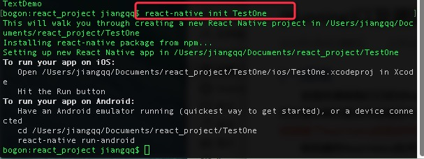

2.2.在相应目录生成项目，项目的目录机构如下:

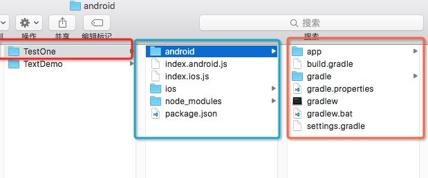

2.3.最后我们通过 IDE 引入该项目(Atom 或者 WebStorm)，进行编写代码即可。

(三)应用设备运行(Running)

[注意].如果你需要应用运行在真机设备中，那么我们首先设备要开启 USB 调试模式。具体真机怎么样打开 USB 调试模式，请百度哈([点击打开 USB 调试模式](https://www.baidu.com/s?wd=%E5%AE%89%E5%8D%93%E6%89%93%E5%BC%80usb%E8%B0%83%E8%AF%95))

真机打开 USB 调试模式之后，然后连接电脑，命令行 adb devices 可以查看当前的设备列表信息，不过我现在电脑没有连接真机，所有只有会显示模拟器信息了。

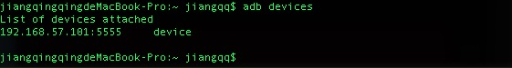

现在大家可以看到里边有一台设备已经连接了，不过如果我们需要运行应用的话，那我们必须确保当前只有一台设备已经连接即可了。接下来我们命令行运行以下命令:

```
react-native run-android
```

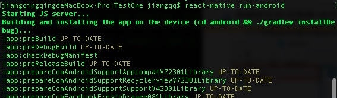

接着就是开始编译代码，然后运行程序到设备中了。

[注意]

在真机上运行时可能会遇到白屏的情况，请找到并开启悬浮窗权限。比如小米系统设置([点击设置](http://jingyan.baidu.com/article/f25ef25466c0fc482d1b824d.html))

3.1.从设备上面访问实时服务器数据(这边服务器指本地代码)

当我们启动开发服务的情况下，我们可以通过以下两种方法来更新远程代码来快速的更新修改我们的应用

[注意]现在很多 Android 设备以及那个去除了 Menu 按键了，这时候我们可以通过摇晃设备来进行打开菜单,然后完成应用的重新加载，调试以及其他功能。

  - Android 5.0 以上及更高版本，可以使用 adb reverse 命令
首先你的设备连接电脑，然后打开 USB 调试模式。接着命令行运行

```
adb reverse tcp:8081 tcp:8081
```

然后我们就可以使用 Reload JS 和其他的开发选项了。

  - Android 以下版本可以通过 Wifi 连接
1. 手机和电脑 USB 连接并且电脑和手机设备在同一个 Wifi 网络环境下

2. 采用 react-native run-android 运行应用。

3. 现在会发现屏幕是"红色"，继续下面的步骤进行解决,截图如下:

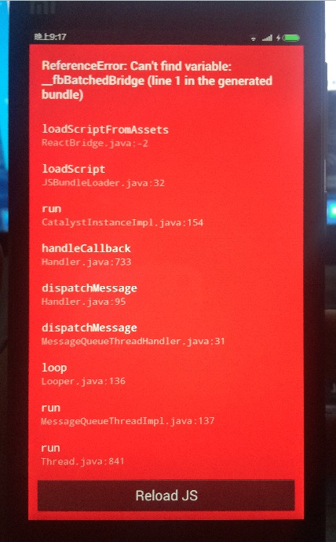

4. 摇晃设备或者命令行输入 adb shell input keyevent 82，打开开发者菜单，如下效果:

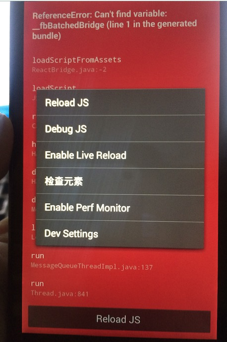

5. 点击 Dev Settings 进入，然后选择 Debug server host & port for device

6. 输入电脑的 IP 地址和端口号(主要查看电脑的 IP 地址哦,，这边用我这边的 IP 地址和端口，具体要根据实际情况哦)，截图如下：

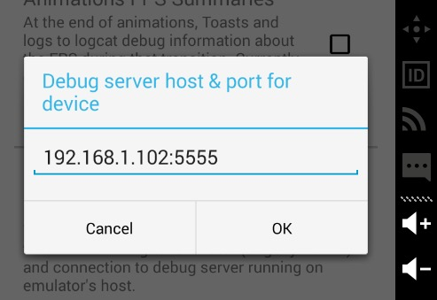

7. 回到开发者菜单，然后选择点击 Reload JS。重新加载以下即可。


## (四)应用调试(Debugging)-针对 Android 应用设备

4.1.访问应用内开发者菜单

Android 设备我们可以摇晃或者点击菜单键(不过现在很多手机已经没有这个模拟按键了)。如果你使用的是 genymotion 模拟器，你可以打开应用，然后发现屏幕右下方有一个箭头，点击然后点击菜单图标即可。截图如下:


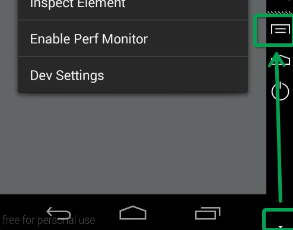

[注意]如果我们的 APP 正式发布的话(Release 版本)。默认情况下我们采用 gradle 的 assembleRelease 来进行构建即可。或者通过代码 ReactInstanceManager 的 setUseDeveloperSupport 方法来进行设置是否开启调试支持。

4.2.应用刷新

正常情况下，如果我们只是修改应用的 JS 代码的话，那么我们可以直接点击 Reload JS 选择实时刷新即可。但是如果我们修改 Android 项目中的资源文件(例如 res/drawable 文件中图片)或者修改 Android 的源代码，那么就需要重新编译生成应用才可以生效。

4.3.Chrome 开发调试工具

开发的应用进行调试的时候，我们可以使用 Chrome 来调试 js 代码，点击开发菜单中的 Debug in Chrome。然后会打开一个网页: http://localhost:8081/debugger-ui   界面截图如下:

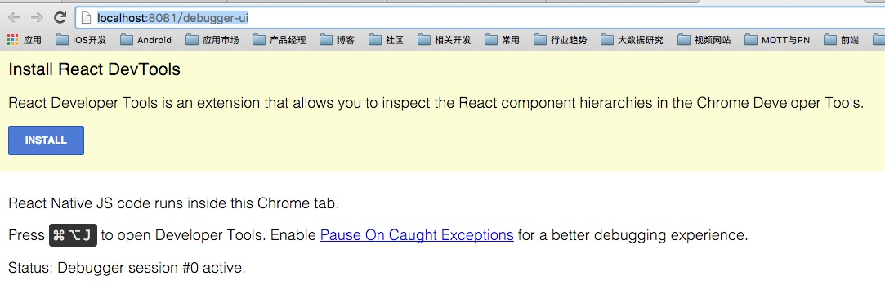

不过第一次打开需要安装 React DevTools(最好翻墙一下)。

安装方法教程:

http://facebook.github.io/react/blog/2015/09/02/new-react-developer-tools.html

Chrome 添加开发调试插件:

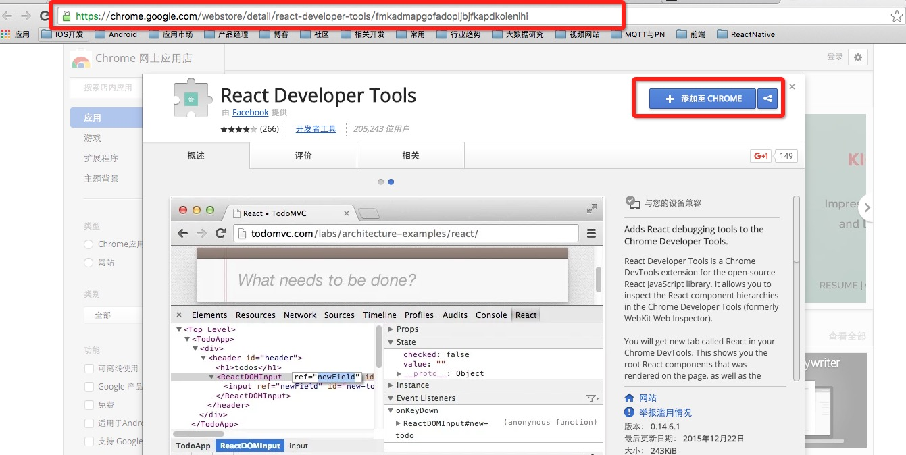

安装完插件，回退到原来的界面，然后刷新一下即可:

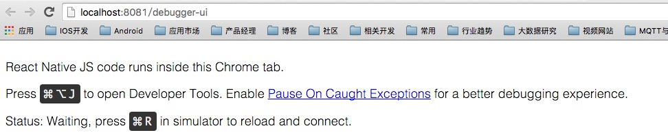

如何打开开发者工具:

想必做过 Web 前端开发的人都知道：Chrome 中可以使用 option+cammod+i 打开或者 Chrome 选择菜单-更多工具-开发者工具来进行打开控制台。不过如果我们的程序出现异常话，可以开启(Pause On Caught Exceptions)。这样程序出现异常的时候，程序会暂停执行可以更好的调试错误。

真机调试方法:

1. 针对 Android 5.0 或更高版本的设备，可以通过 USB 连接，然后使用 adb 命令建立一个设备到电脑的转向端口:命令如下:

```
adb reverse tcp:8081 tcp:8081
```

或者摇晃打开开发者菜单，选择 Dev Settings，然后 Debug server host for device 中设置电脑的 IP 和端口号。

2. 针对 Android5.0 以下的设备，连接方式 Wifi，其他步骤差不多哦。

4.4..实时刷新 JS

我们可以进行那个如下修改，当我们前端 JS 代码发生更改的时候，自动让设备进行刷新界面。

在 Android 平台上面，打开开发者菜单，选择 Dev Settings,然后点击 Auto reload on JS change 选择，不过有些版本好像没有这个更选项了，默认自动刷新的。

## (五)最后总结

今天我们主要讲解了 React Native 应用设备运行方式和真机方式，主要材料来自 React Native 官网，这边所有步骤我已经全部测试过下的。因为讲解起来和实际使用还是回遇到各种问题的。大家有问题可以加一下群 React Native 技术交流群(282693535)或者底下进行回复一下。