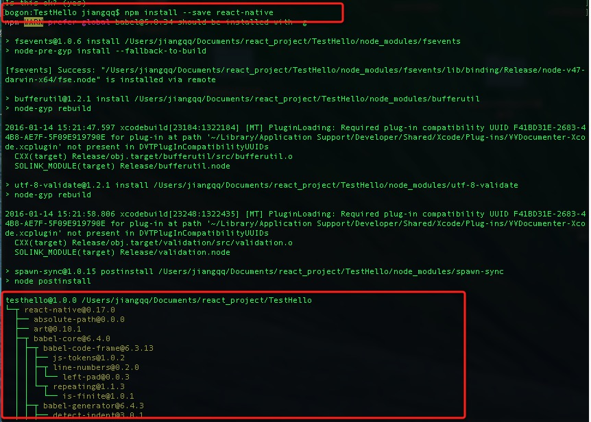

# React Native 移植原生 Android 项目

## (一)前言

前三节课程我们已经对于 React Native For Android 的环境搭建，IDE 安装配置以及应用运行，调试相关的知识点做了讲解。今天我们来讲一个非常有用的知识点。移植我们已有的原生 Android 项目到 React Native 中。

刚创建的 React Native 技术交流群(282693535),欢迎各位大牛,React Native 技术爱好者加入交流!同时博客左侧欢迎微信扫描关注订阅号 codedev123,移动技术干货,精彩文章技术推送!

在 React Native 中 React 其实更多关注的是视图 View 层。所以 React Native 本身也支持并且可以让我们非常简单方便的移植一个 Android 原生的项目到 React Native 中。

## (二)前提准备工作

1. 首先我们有一个采用 Gradle 构建的 Android 应用项目，这个大家直接采用 Android Studio 进行创建一个项目即可。我这边新建一个目录 TestHello，然后采用 Android Studio 创建一个 android 项目在该文件夹下面。具体如下:


2. 电脑必须安装 Node.js，具体安装使用方法([点击进入](http://www.lcode.org/%E3%80%90react-native%E5%BC%80%E5%8F%91%E3%80%91react-native-for-android%E7%8E%AF%E5%A2%83%E9%85%8D%E7%BD%AE%E4%BB%A5%E5%8F%8A%E7%AC%AC%E4%B8%80%E4%B8%AA%E5%AE%9E%E4%BE%8B/))

## (三)Android 项目相关配置

2.1 在我们 Android 项目的 build.gradle 中添加 React Native 依赖，然后同步，具体代码如下:

```
compile 'com.facebook.react:react-native:0.17.+'
```

[注意].该会同步 0.17 版本以上的 react native，官方的版本还是停留在 0.13 没有更新，我本地的 react native 是 0.17 版本的，所以大家这边配置一定要跟自己本地的版本保持一致或者更新。关于这个问题今天我下午研究了一下去，踩了很多坑啊~~ 不过 React Native 中文网那边我已经让站长更新了版本。

2.2 紧接着我们需要在项目 AndroidManifest.xml 中加入网络访问权限

```
<uses -permission android:name="android.permission.INTERNET" />
```

该仅仅用于开发阶段从开发服务器加载最细的 JavaScript 代码，在正式发布版本中，如果有需要可以把该网络权限删掉。

## (四)添加原生代码

在 Android 项目的 MainActivity 中，我们需要配置相关代码来进行启动运行 React Native 库。我们需要创建 ReactRootView，然后在里边渲染 React 引用，并且设置成 Activity 的主视图即可。
具体代码如下:

```
public class MainActivity extends Activity implements DefaultHardwareBackBtnHandler {
    private ReactRootView mReactRootView;
    private ReactInstanceManager mReactInstanceManager;

    @Override
    protected void onCreate(Bundle savedInstanceState) {
        super.onCreate(savedInstanceState);

        mReactRootView = new ReactRootView(this);
        mReactInstanceManager = ReactInstanceManager.builder()
                .setApplication(getApplication())
                .setBundleAssetName("index.android.bundle")
                .setJSMainModuleName("index.android")
                .addPackage(new MainReactPackage())
                .setUseDeveloperSupport(BuildConfig.DEBUG)
                .setInitialLifecycleState(LifecycleState.RESUMED)
                .build();
        mReactRootView.startReactApplication(mReactInstanceManager, "TestHello", null);

        setContentView(mReactRootView);
    }

    @Override
    public void invokeDefaultOnBackPressed() {
        super.onBackPressed();
    }
}
```

注意以下的代码:

```
mReactRootView.startReactApplication(mReactInstanceManager, "TestHello", null);
```

以上其中方法第二种个参数我这边采用 TestHello 来进行命名了，注意这个要和后面讲到的东西进行统一，具体我们继续往下看。
在 React Native 中，其实 FB 给我们提供了 ReactInstanceManger 来替我们管理 Activity 相关的生命周期，所以我们需要传递一些 Actitivty 相关的生命周期到 ReactInstanceManger 中。具体代码 onPause()和 onResume()方法如下:

```
@Override
    protected void onPause() {
        super.onPause();

        if (mReactInstanceManager != null) {
            mReactInstanceManager.onPause();
        }
    }
    @Override
    protected void onResume() {
        super.onResume();

        if (mReactInstanceManager != null) {
            mReactInstanceManager.onResume(this,this);
        }
    }
```

紧接着对于返回按钮键的事件我们也需要传递一下：

```
@Override
 public void onBackPressed() {
    if (mReactInstanceManager != null) {
        mReactInstanceManager.onBackPressed();
    } else {
        super.onBackPressed();
    }
}
```

这样我们就可以当用户按下返回键的时候，javaScript 代码可以做相关处理。当然如果前端不处理响应的事件，那么会回调到上面的 invokeDefaultOnBackPressed()方法中。继而回退事件转移到 Activity 了，下面就是 Activity 该怎么样执行，就怎么样执行了。默认事件就是关闭 Activity 了
最后一步就是需要处理一下设备菜单了，默认情况下我们可以摇晃一下手机来弹出菜单，但是对于模拟器，该方法就不适用了，所以我们才拦截事件方法进行相关处理一下即可。

```
@Override
public boolean onKeyUp(int keyCode, KeyEvent event) {
    if (keyCode == KeyEvent.KEYCODE_MENU && mReactInstanceManager != null) {
        mReactInstanceManager.showDevOptionsDialog();
        return true;
    }
    return super.onKeyUp(keyCode, event);
}
```

到此为止我们的 Android 项目 Activity 和配置文件以及完成了最基本的配置方法了。

## (五)添加 js

下面我们采用命令行，首先切换到项目的根目录上面(我的例子是切换到 TestHello 目录下)

5.1.命令行运行 npm init 运行截图如下:


该命令会创建一个 package.json 文件，并且提示我们输入一些信息，默认不输入即可，不过 name 必须要为全英文小写哦，具体结果执行结果如下:


5.2.命令行运行 npm install  --save react-native  进行安装 react native 模块以及相关 node 模块，运行截图如下:



这里开始安装 node 模块以及 react native 模块，具体运行结果会生成 node_module 文件夹如下：


5.3.最后运行如下命令即可:

```
curl -o .flowconfig  https://raw.githubusercontent.com/facebook/react-native/master/.flowconfig
```

做一下 flow 配置


以上三步全部完成了，上面给我们创建 node 模块，然后添加了 react-native npm 依赖。接下来我们需要修改 package.json 文件，在 scripts 标签那边添加如下代码:

```
"start": "node_modules/react-native/packager/packager.sh"
```

具体修改截图如下:


5.4.现在我们创建一下文件命名为:index.android.js，然后在里边添加如下代码:

```
'use strict';
var React = require('react-native');
var {
  Text,
  View
} = React;

class MyAwesomeApp extends React.Component {
  render() {
    return (
      <view style={styles.container}>
        <text style={styles.hello}>Hello, World</text>
      </view>
    )
  }
}
var styles = React.StyleSheet.create({
  container: {
    flex: 1,
    justifyContent: 'center',
  },
  hello: {
    fontSize: 20,
    textAlign: 'center',
    margin: 10,
  },
});
React.AppRegistry.registerComponent('TestHello', () => TestHello);
```

以上就完成了所有的相关代码以及 react-native 配置了，注意上上面的都采用 TestHello 了，希望大家都用一样的名字和前面 MainActivity 进行统一哦。

## (六)运行 APP

上面的配置步骤全部完成了，下面我们要运行 APP 了，首先我们需要开启开发服务器，使用如下命令即可:

```
npm start
```

运行结果如下:


接下来就是最后一步了，直接运行 react-native run-android 命令编译运行应用就可以了，运行结果如下:


这样就完成了一个简单的 Android 原生项目移植到 React Native 中了。

## (七)最后总结

今天移植 Android 原生项目移植到 React Native 中，期间也遇到了很多问题，例如因为官网的文档没有保持最新，后来经过排查踩坑才发现。大家有问题可以加一下群 React Native 技术交流群(282693535)或者底下进行回复一下。