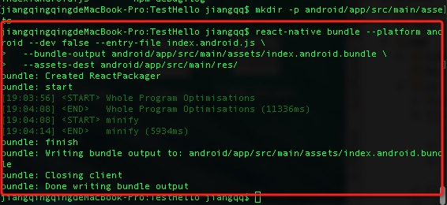

# React Native 进行签名打包成 Apk

## (一)前言

前几节课程我们对于 React Native 的一些基础配置,开发工具以及调试，Android 项目移植做了相关讲解，今天一起来学习一下另外一个比较重要的知识点，就是 React Native 项目签名打包。

刚创建的 React Native 技术交流群(282693535),欢迎各位大牛,React Native 技术爱好者加入交流!同时博客左侧欢迎微信扫描关注订阅号,移动技术干货,精彩文章技术推送!

在我们的 React Native For Android 应用开发完成之后，那么就需要进行发布上传应用市场了，在上传之后，那么有一个很重要的步骤就是签名打包。下面我们来详细看一下怎么样进行签名打包 React Native 应用。具体关于 Android 的签名文件生成([点击进入-注意翻墙](https://developer.android.com/tools/publishing/app-signing.html))

## (二)Android 签名文件生成

上面有一个 Android 官方的签名生成方法的地址，大家可以进行详情查看，不过需要翻墙哦~。我现在给大家讲解两种签名生成的方法：1:keytool 命令方式生成 ，2:Android Studio IDE 进行生成。

2.1.keytool 命令生成签名秘钥

我们可以命令行运行如下命令:

```
keytool -genkey -v -keystore my-release-key.keystore  -alias my-key-alias -keyalg RSA -keysize 2048 -validity 10000
```

[注意].我这边环境变量已经配置了，注意上面的 my-release-key 这个名字可以自己取名，同时 my-key-alias 也是自己取名，其中第二个名称 alias 参数后边的别名，在后面你在为应用签名的时候需要用到，所以暂时记录一下这个别名。

上面的命令我们需要输入密钥库(keystore)密码和对应秘钥的密码，然后设置名字，组织，国家，省份相关的信息，最后会生成 my-release-key.keystore 的签名文件。

具体命令截图如下:


现在我们去用户默认目录下面会生成 my-release-key.keystore 文件。具体截图如下:


2.2.Android Studio IDE 进行生成秘钥文件

个人比较倾向于这一种方法，首先是图形界面的，而且少了命令行书写的问题，而且以前我记得在使用 Eclipse 开发 Android 的时候也一直使用这种方式，下面我们来看一下生成签名的具体步骤:

首先打开 Android Studio 菜单选择 build->Generate Signed APK 在打开的界面点击 Next，会弹出下面的界面


然后点击 create new 在弹出的界面中选择填写秘钥存放的位置,名称,密码。同样还要写别名的名字，证书的所有者，国家，组织以及城市相关信息。


点击 OK，会默认填写上创建好的签名的信息,


最后点击 finish 会生成签名秘钥，不过大家请注意看这边生成的秘钥和第一个命令行方法的秘钥的后缀不太一样的,这边是以 jks 结尾的，不过也没问题哦~也是同样可以签名的。


以上两种方式已经给大家演示了，打包签名的方法了，下面我们正式来进行配置打包生成 APK 了。

(三)Gradle 配置

3.1.Gradle 配置

①.首先我们要把刚刚生成的签名文件复制到项目 android/app 文件夹下面(这边采用 AS 生成签名 test.jks)。


然后进行修改项目中 gradle.properties 文件，进行添加如下的代码(注意下面的签名和别名的名称和上一步放入的 test.jks 要一样，下面两项分别填写签名和别名的密码)-我取的密码为 ztt12345

```
MYAPP_RELEASE_STORE_FILE=test.jks
MYAPP_RELEASE_KEY_ALIAS=test_alias
MYAPP_RELEASE_STORE_PASSWORD=ztt12345
MYAPP_RELEASE_KEY_PASSWORD=ztt12345
```

这一步我们是进行全局的 gradlde 进行变量化的配置，后边我们会在后边的步骤中给相应的应用进行签名。

[注意].以上的签名秘钥请大家一定要妥善保管，因为在应用发布的时候需要的。

3.2.给应用添加签名-配置局部应用 Gradle 文件
直接在工程目录下得 android/app/build.gradle 中以下节点添加如下内容:

```
...
android {
    ...
    defaultConfig { ... }
    signingConfigs {
        release {
            storeFile file(MYAPP_RELEASE_STORE_FILE)
            storePassword MYAPP_RELEASE_STORE_PASSWORD
            keyAlias MYAPP_RELEASE_KEY_ALIAS
            keyPassword MYAPP_RELEASE_KEY_PASSWORD
        }
    }
    buildTypes {
        release {
            ...
            signingConfig signingConfigs.release
        }
    }
}
…
```

具体实例配置截图如下:


## (四)生成签名包

对于生成签名包得方式我们要分两种情况进行区分对待。第一种在项目目录 android/app 下有 react.gradle 文件的(这个采用 react-native init xxproject 命令生成项目详情请看:[点击进入第一讲](http://www.lcode.org/%E3%80%90react-native%E5%BC%80%E5%8F%91%E3%80%91react-native-for-android%E7%8E%AF%E5%A2%83%E9%85%8D%E7%BD%AE%E4%BB%A5%E5%8F%8A%E7%AC%AC%E4%B8%80%E4%B8%AA%E5%AE%9E%E4%BE%8B/))

第二种是不存在 react.gradle 文件，主要是通过原生 Android 项目移植到 React Native 平台中(该生成详情详情请看:[点击进入第四讲](http://www.lcode.org/%E3%80%90react-native%E5%BC%80%E5%8F%91%E3%80%91react-native%E7%A7%BB%E6%A4%8D%E5%8E%9F%E7%94%9Fandroid%E9%A1%B9%E7%9B%AE/))。下面这两种方法都讲一下:
4.1.对存在 react.gradle 文件的项目打包
命令行切到 react native 主目录，然后运行下面的命令，请注意下面 android 就是 Android 项目的目录名称

```
cd android && ./gradlew assembleRelease
```

这样运行截图如下:


该命令运行结束之后，会在 android/app/build/outputs/apk 目录下面生成 app-release.apk 该文件，然后可以使用该 apk 进行上线发布。


4.2.对与不存在 react.gradle 文件的项目打包

这边因为 react.gradle 文件不存在，主要针对第四讲课程中的项目(Android 原生项目移植到 React Native 平台)来进行举例。

首先命令切换到该 react native 项目的主目录，然后运行以下的命令，生成 assets 文件夹

```
mkdir -p android/app/src/main/assets
```

紧接着运行以下命令，进行生成 inde.android.bundle 文件

```
react-native bundle --platform android --dev false --entry-file index.android.js \
  --bundle-output android/app/src/main/assets/index.android.bundle \
  --assets-dest android/app/src/main/res/
```

具体运行截图如下:



生成该文件目录截图如下:


最后运行之前的命令，进行代码和资源文件打包，生成的带有签名的 apk 还是在上面的目录中。

```
cd android && ./gradlew assembleRelease
```

## (五)运行 Apk
上面的步骤我们已经完成了项目的签名打包在对应的目录中生成中 apk 文件，下面我们直接运行以下的命令进行将 apk 安装到设备中，我这边直接采用了模拟器进行测试了。

```
cd android && ./gradlew installRelease
```

该命令会进行安装我们的 apk 到我们的设备中，不过该不会安装完自动打开我们的 app，我们需要自己点击启动一下即可了。完美运行截图如下:


## (六)最后总结

今天我们主要介绍了 React Native for Android 项目如何创建签名，以及打包的方法。大家有问题可以加一下群 React Native 技术交流群(282693535)或者底下进行回复一下。