# React Native 库版本升级(Upgrading)与降级讲解

## (一)前言
现在 React Native For  Android 刚刚开源才不久，现在整体功能还不健全完善以及开发中的坑(Bug)还是比较多的 ，以至于到现在还没有正式版本。项目人员正在加紧开发维护，修复 Bug，所以现在 React Native 项目的版本更新速度还是相对来讲是比较快的。
刚创建的 React Native 技术交流群(282693535),欢迎各位大牛,React Native 技术爱好者加入交流!同时博客左侧欢迎微信扫描关注订阅号,移动技术干货,精彩文章技术推送!
在如此现状之下，我们就要及时关注项目官网了，要将 React Native 往新版本进行更新，这样我们可以去使用更多的 APIs,视图 Views,以及开发者工具以及其他一些好用的东西。【注】.浏览版本更新日志就会发现整体 FB 官方开发进度还是非常紧张的，这样就很容易导致旧版本会出现不能用的情况，后期可能会出现不可预料的情况，这边建议大家尽量更新最新正式版本。
我们大家都知道一个 React Native 项目使用 Android 项目,iOS 项目和 JavaScript 项目三部分进行组成的，而且三者都关联打包在 npm 包内的，所以该项目版本进行更新是比较繁琐的。下面我来给大家讲解一下 React Native 项目的升级步骤。

## (二)更新 React Native 项目依赖包版本
首先我们需要查看本地的 React Native 的版本，命令行输入如下命令:
```
react-native --version
```

如果之前我们是按照我前面的文章([点击进入 React Native 环境搭建](http://blog.csdn.net/developer_jiangqq/article/details/50456967))直接命令行 npm install -g react-native-cli 创建的话，那么应该会出现如下的情况:

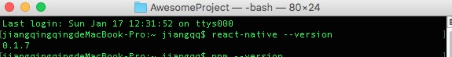

会发现版本号是:0.1.7，这其实是我本地 cli 的版本，我们需要执行如下的代码

```
npm update -g react-native-cli
```

这样之后就可以同时查看 react native 和 cli 的版本了，update 更新截图如下:

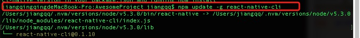

接下来在执行以下 react-native  --version 查看版本发现，我当前的 react native 版本为 0.17.0

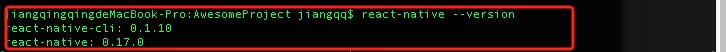

接下来我们来进行查询 react-native 的 npm 包得最新版本(react native 的 npm 包的地址为:https://www.npmjs.com/package/react-native)，或者采用命令 npm info react-native 进行查看:具体截图如下:

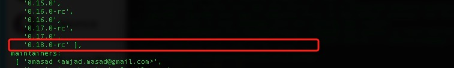

现在最新版本为:0.18.0-rc 预览版本。

下面我拿之前创建的项目进行测试 AwesomeProject：

进行打开该项目中的 package.json 文件，找到 dependencies 标签里边我们把 react-native 的版本修改成最新版本如下:

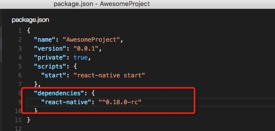

接下来就是执行如下代码进行安装(注意请命令行切换到项目主文件夹):-这个安装过程还是需要花点时间的

```
npm install
```

运行截图如下:

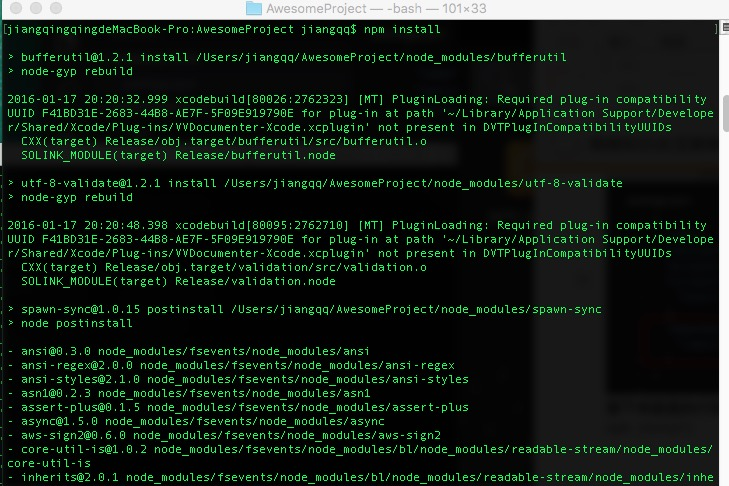

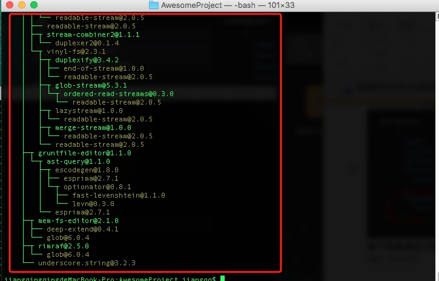

这样该项目就已经更新成了最新版本的 React Native 的 Node 依赖包了。

下面在运行 react-native --version 命令查看一下当前版本:

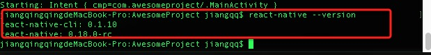

当然根据官网文档能知道:
现在已经支持在项目中运行 npm install - -save 命令来进行安装 react-native 的新版本了，例如我们需要更新到 0.18 版本可以采用终端执行如下的命令:

```
npm install --save react-native@0.18
```

## (三)更新项目 templates 文件

新的 npm 包会包含更新在运行 react-native init 命令生成的一些动态文件，例如 init 创建项目的时候会生成 iOS 和 Android 的子项目，我们可以通过以下的命令进行获取最新的代码

```
react-native upgrade
```

运行截图如下:

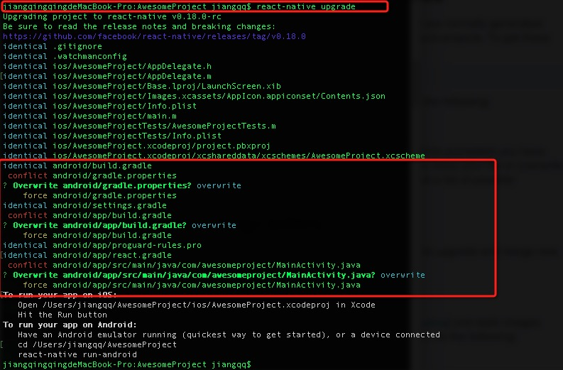

注意以上红色框出来的地方，这边会检查修改的文件，让我们进行选择覆盖还是保留的，我这边直接选择了覆盖。具体情况看大家实际使用情况。

以上的 react-native upgrade 会进行检查项目的文件，然后进行如下几个操作:

 - 如果是新添加的文件，会进行直接创建
 - 如果更新的文件和当前项目的文件是一样的，就会直接忽略跳过
 - 如果更新的文件和当前项目的文件不同，有冲突的情况，会让我们进行选择是保留原来的文件还是用更新的文件覆盖，这个要看实际情况了。
现在更新已经完成了，下面就是运行一下看一下是否能够成功运行，运行如下命令:

```
react-native run-android
```

运行截图如下:

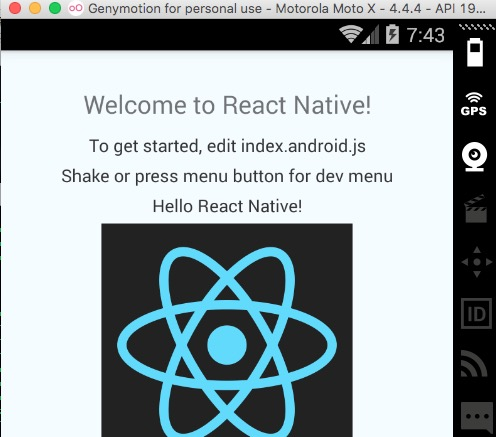

## (四)React Native 版本降级方法

刚刚我们已经完成 React Native 库升级了，现在假如有这样的一个情况，我们的项目直接创建的用了最新版本的，突然发现最新版本可能不太稳定，在开发过程中就会遇到不可预期的 bug。那么就可以考虑进行降级到一个比较稳定的版本比较保险。第一种方案我们参考上面的流程就行了，上面是修改成最新版本的，那么现在我们修改一个低版本，然后执行上面的同样的命令就 OK 了。但是我们降级这边给大家讲第二个方案，还记得上面有一个官方推荐安装 react-native 的命令不？

```
npm install --save react-native@0.18
```

那么我们现在假如要降级到 0.17 版本，如下命令行执行一下就 OK 了。

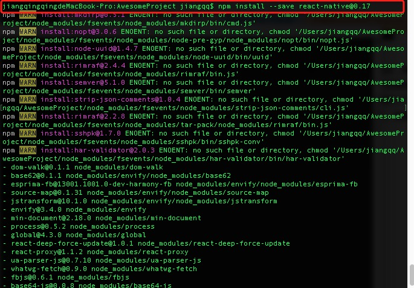

上面运行已经安装了 0.17 版本了，查看项目的 package.json 文件会发现版本已经变成了 0.17

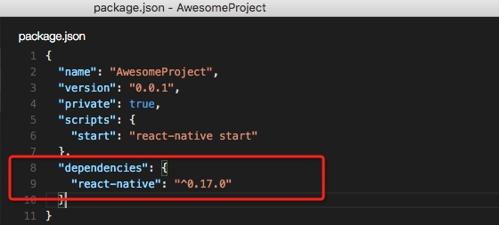

接下来执行和上面的步骤一样执行一下 react-native upgrade 命令如下:

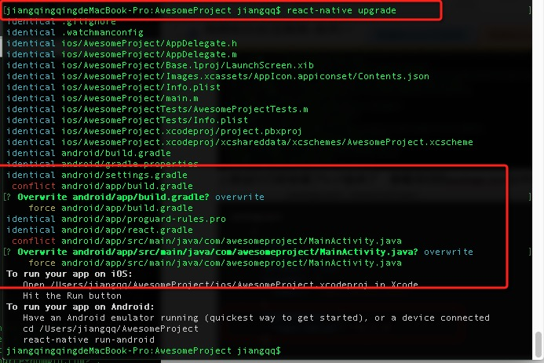

最后测试运行 react-native run-android 一下，看看降级成功与否就可以了。

## (五)最后总结

今天我们主要介绍了 React Native for Android 项目 React Native 库的升级以及降级的方法，大家有问题可以加一下群 React Native 技术交流群(282693535)或者底下进行回复一下。