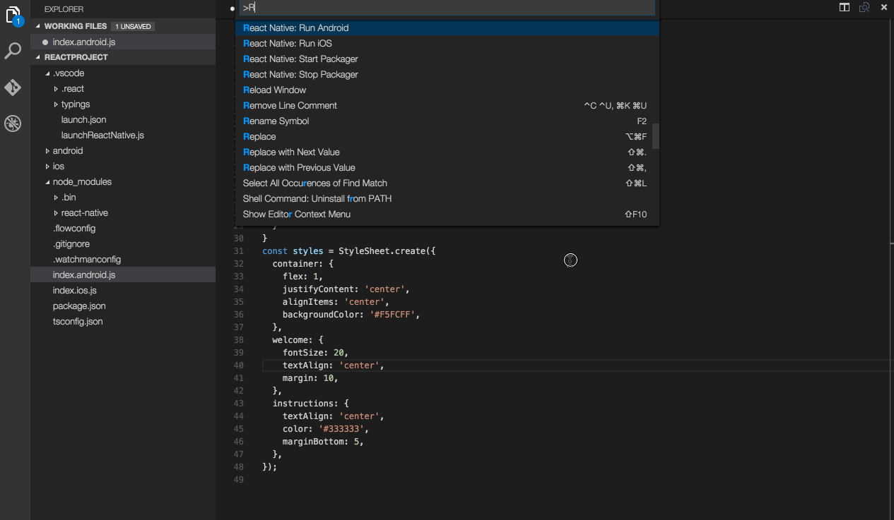
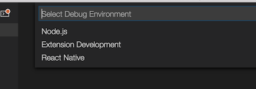
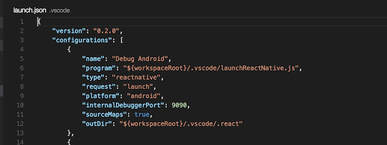
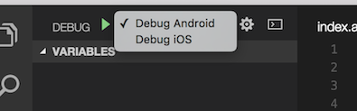
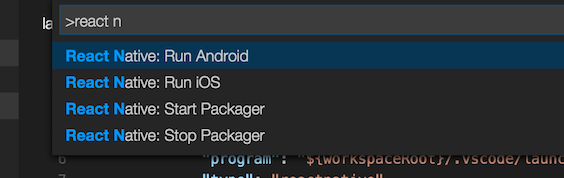
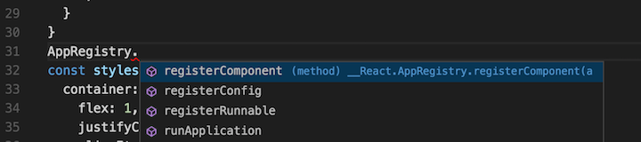
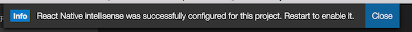
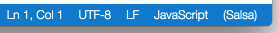

# React Native VSCode IDE 超强开发插件介绍(智能,代码提醒,运行调试…)

本文翻译自:https://marketplace.visualstudio.com/items?itemName=vsmobile.vscode-react-native

转载请注明:[来自江清清的技术专栏](http://www.lcode.org/)

刚创建的 React Native 技术交流 2 群(496601483),欢迎各位大牛,React Native 技术爱好者加入交流!同时博客右侧欢迎微信扫描关注订阅号,移动技术干货,精彩文章技术推送!

## (一)React Native 工具(预览版)

该扩展工具(React Native Tools)给 React Native 项目提供了一个开发环境。你可以调试你的代码、通过命令面板终端快速的运行 react-native 命令、并且支持代码智能补全,对象搜索浏览、方法、参数以及其他一些 React Native  API。使用效果演示如下:

## (二)开始使用(Getting started)

1.在 VS Code 中安装扩展(0.10.8+)-插件地址:https://github.com/Microsoft/vscode-react-native

2.命令行运行 npm install -g react-native-cli 来安装 React Native CLI(0.1.10+)

3.然后 React Native 环境,版本需 0.19+  具体 Windows 和 Mac OS X 安装 React Native 教程:http://www.lcode.org/react-native/

4.使用 VS Code 通过 React Native 的根目录进行打开

5.可选开启代码智能补全(该还在测试中)

## (三)调试(Debugging)

3.1.安装调试环境(Setup debug environment)

在菜单中点击调试图标 ,然后点击 configure 齿轮样子的图标来选择 React Native 调试环境，以上两个小图标的样式分别如下:

VSCode 会生成一个 launch.json 文件保存在项目，同时里面会有一些默认的数据配置，如下图所示:

上面的配置文件你可以修改这些配置信息，或者往列表中添加新的项。你也可以在这些配置信息中使用其他属性。

例如:你可以修改 target 属性来指定 iOS 调试的模拟器

3.2.开启调试(Start debug session)

为了开始调试，通过配置下拉框选择一个调试项，然后点击运行箭头或者 F5 按键.如下图所示:

你可以调试 Android 模拟器,Android 设备或者 iOS 模拟器中的应用，当前插件提供 iOS 设备的支持。有关使用 VS Code 进行调试的更多详细信息[请点击查看](https://code.visualstudio.com/docs/editor/debugging)

3.3.使用 iOS 设备调试(Debugging on iOS Device)

采用 iOS 设备调试需要完成以下一些常规步骤:

1. 在 APP 中改变 jsCodeLocation IP，更多详细的步骤[请点击查看](https://facebook.github.io/react-native/docs/running-on-device-ios.html#accessing-development-server-from-device)

2. 从调试配置下拉框选择 Debug iOS 并且按 F5 按键

3. 摇一摇设备，打开开发者菜单，并且选择"Debug in Chrome"

## (四).命令面板终端中使用 React Native 命令

在命令面板中，可以匹配 React Native 类型命令，并且选择命令，如下图所示:

1. 运行 Android 命令，触发 react-native run-android 来进行打开 android app

2. 运行 iOS 命令，触发 react-native run-ios 来进行打开并且在 iOS 模拟器中运行(iPhone 6)

3. Packager 命令，可以允许我们打开/关闭 [React-Packager](https://github.com/facebook/react-native/tree/master/packager)

## (五).使用智能提醒(Using IntelliSense)

代码智能提醒可以帮助我们发现 React Native 中相关对象,方法以及参数，具体效果如下图所示:

## (六).开启智能提醒(Enabling IntelliSense)

该功能现在还处理测试实验阶段，所以我们需要开启该功能，React Native 智能提醒功能依赖于 VS Code 工具支持 JSX 语法。为了打开该特性，当我们打开 React Native 项目的时候，会立即出现如下的提示。

该提醒是一次性的是的开启 JSX 支持，我们需要重启 VS Code 来让该智能提醒功能生效。同时我们可以验证是否已经正确安装，如果现实如下的状态条，就表示当前已经开启了智能提醒功能。

一旦你遵循以上的步骤进行开启智能提醒功能，你就可以在代码编辑器中看到 React Native 库中的对象,方法,参数相关提醒了。

下面是一些开启 JSX 支持，VS Code 的配置做了一些如下修改:

1. 环境变量 VSCODE_TSJS=1 设置来开启 Salsa

2. Salsa 需要最起码 TypeScript 1.8 版本，但是最终 1.8 发布版本还不可用。插件 typescript@nexet 安装在~/.vscode

3. 在.vscode 目录中生成一个 setting.json 文件，文件中使用 typescript.tsdk 来指向 typescript@next 安装的位置

4. 在项目根目录中创建 tsconfig.json 文件，并且配置 allowsJs:true 来允许 TypeScript 来处理 JavaScript 文件

5. React Native 的 Typing 复制到.vscode 目录中

## (七).已知的问题

下面列表一下，在使用本插件中可能会遇到的一些已知的问题。

1. 调试器不能关闭断点：  该调试器仅仅会在通过 VS Code 打开 packager 服务中运行。如果 packager 在 VS Code 外部运行需要关闭 packager

2. 'adb' 命令没有找到: 如果你遇到 adb:command not founc，那么你需要进行配置 android 环境变量了。最好把 PATH 和 ANDROID_HOME 环境变量都配置上.

3. 目标 iPhone 6 不工作:当使用 iPhone6 运行 app 的时候，该为一个已知的问题，[详细请点击:](https://github.com/facebook/react-native/issues/5850)

最后[点击](https://github.com/Microsoft/vscode-react-native/issues?q=is%3Aopen+is%3Aissue+label%3Apreview-known-issues)这边查看已经解决的所有的问题。

## (八)最后总结

今天我们主要翻译讲解了提高 React Native 开发效率的插件 React Native Tools(VS Code Tools)。该插件挺好的支持了代码智能提醒,运行调试，，大家有问题可以加一下群 React Native 技术交流 2 群(496601483).或者底下进行回复一下。