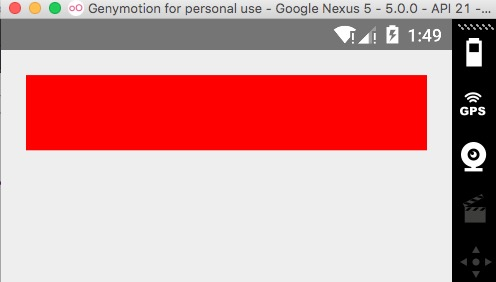
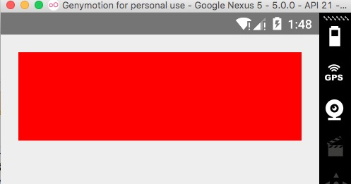
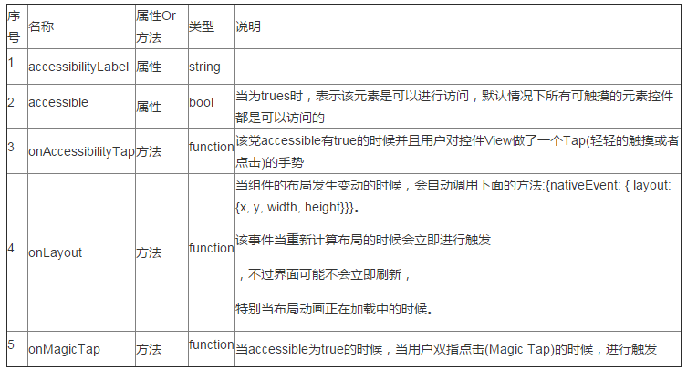
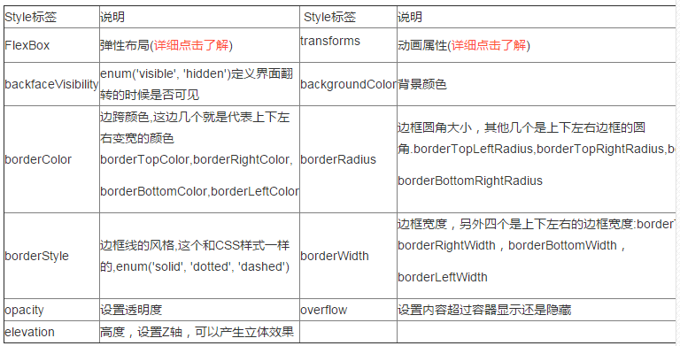

# React Native 控件之 View 视图讲解

## (一)前言

现在几讲我们对于 React Native 一些基础做了相关讲解(例如:环境搭建,开发 IDE,调试以及升级降级等)，今天开始正式进入 UI 相关组件学习的阶段了。首先我们来讲一个非常基础的组件 View。

刚创建的 React Native 技术交流群(282693535),欢迎各位大牛,React Native 技术爱好者加入交流!同时博客左侧欢迎微信扫描关注订阅号,移动技术干货,精彩文章技术推送!

## (二)View 组件介绍

View 作为创建 UI 时候的最基础，最常用的组件。这边的 View 组件是支持 FlexBox 布局([对于 FlexBox 布局的详细使用讲解，请点击](http://www.w3cplus.com/css3/a-guide-to-flexbox.html))，CSS 样式以及相关触摸处理的容器组件。该组件我们可以嵌套在其他视图 View 里边，并且可以包含很多种类型的子视图。在 Web,Android，iOS 三种平台上面该 View 视图可以对应平台中的三种原生视图，其中 iOS 对于 UIView

，Web 端对应<div>标签，Android 对于 android.view。下面我们来看一个比较简单的实例:

```
'use strict';
var React = require('react-native');
var {
  AppRegistry,
  View,
} = React;
var TestText = React.createClass({
  render: function() {
    return (
      <View style={{flexDirection:'row',padding:20,height:100}}>
        <View style={{backgroundColor:'red',flex:1}}>
        </View>
      </View>
    );
  }
});
AppRegistry.registerComponent('TestText', () => TestText);
```

上述例子,我们这般首先创建了一个 View，该 View 高度为 100 ，但是该 View 的 padding 为 20，所以整体效果如下:



如果把 padding 修改成 margin:20 的话，那么是效果如下:



这个相信做过 CSS ,原生布局开发的话，大家应该都能看得懂的。

其实 React Native 开发，View 设计的时候，也支持我们采用 StyleSheet 来进行书写控件的的布局，这样的话，我们的代码会更加的清晰以及便于维护了。其实 React Native 开发也更加推荐这种方式，下面我们采用 StyleSheet 来实现一下:

```
'use strict';
var React = require('react-native');
var {
AppRegistry,
View,
StyleSheet,
} = React;

var TestText = React.createClass({
render: function() {
return (

);
}
});
var styles = StyleSheet.create({
first_view:{
flexDirection:'row',
height:100,
padding:20
},
second_view: {
backgroundColor:'red',
flex:1
},
});
AppRegistry.registerComponent('TestText', () =&gt; TestText);
```

以上的代码我们发现使用 StyleSheet，进行创建相关 styles，然后赋值给 styles 对象，在控件中直接 styles 对象进行使用即可。还是比较 OK 的。

## (三)View 属性方法介绍

View 属性方法介绍如下:



其他的一些方法如下(下面很多是关于事件响应者链的，基本都是比较简单的，就不着重讲解的，有兴趣大家都可以去测试一下):

onMoveShouldSetResponder，onMoveShouldSetResponderCapture,onPresponderGrant,onResponderMove,

onResponderReject,onResponderRelease,

onResponderTerminate,onResponderTerminationRequest,onStartShouldSetResponder,onStartShouldSetResponderCapture,

pointerEvents enum('box-none', 'none', 'box-only', 'auto')(触摸事件是否可以进行穿透控件 View);

removeClippedSubviews:该控件由于进行优化性能，尤其在一些滑动控件上面。该属性生效的要求如下:首先子视图的内容非常多，

已经超过父容器，并且子视图和付容器视图都有 overflow:hidden 风格样式。

【注】关于上面一些方法的具体使用，后面在讲到事件响应者的时候会进行着重讲解。

## (四)View 风格 Style 介绍

在 React Native 中的 Style 风格布局，其实和 CSS 样式有很多相似的地方，这边介绍一下:



下面是几个特殊的属性，这边直接介绍所有平台通用以及只在 Android 平台有效果的属性

1. testID  (全平台)

可以根据该 testID 在测试的时候定位该 View

2. accessibilityComponentType(android 平台)

定义是否该 UI 组件和原生组件一致化处理

3. accessibilityLiveRegion  enum('none','polite','assertive')  (android 平台)

该当 View 发生更新时候的，是否需要通过用户，不过该只对 Android4.4 以及以上的平台设备有效果

4. collapsable (android 平台)

布局合并优化使用

5. importantForAccessibility enum('auto', 'yes', 'no', 'no-hide-descendants') (android 平台)

设置视图响应事件等级

6. needsOffscreenAlphaCompositing  (android 平台)

设置 View 是否需要渲染和半透明度效果处理的先后次序。

7. renderToHardwareTextureAndroid  (android)

设置是否需要 GPU 进行渲染

最后实例的官方实例为:https://github.com/facebook/react-native/blob/master/Examples/UIExplorer/ViewExample.js

## (五)最后总结

今天我们主要介绍了基础控件 View 的使用方法以及相关属性风格，大家有问题可以加一下群 React Native 技术交流群(282693535)或者底下进行回复一下。
