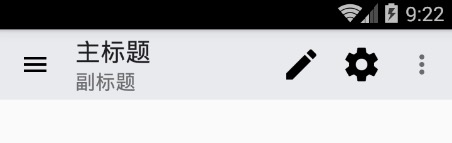
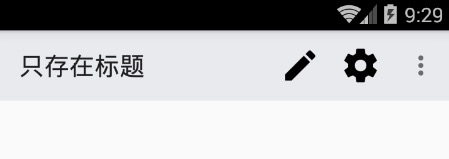
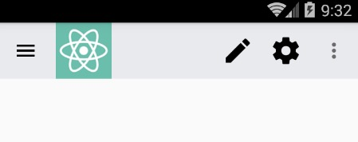
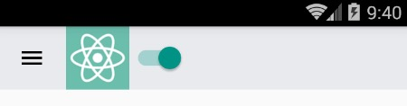

# React Native 控件之 ToolbarAndroid 工具栏控件讲解以及使用(15)

## (一)前言

今天我们一起来看一下工具栏控件 ToolBarAndroid 的介绍完全解析以及最佳实践。

刚创建的 React Native 技术交流群(282693535),欢迎各位大牛,React Native 技术爱好者加入交流!同时博客右侧欢迎微信扫描关注订阅号,移动技术干货,精彩文章技术推送!

该 ToolBarAndroid 组件进行封装了 Android 平台中的 ToolBar 组件(只适用于 Android 平台)。一个 ToolBar 组件可以显示一个 Logo 图标以及一些导航图片(例如:菜单功能按钮)，一个标题以及副标题还有一系列功能的列表。标题和副标题是上下位置。所以 logo 图标和导航图标显示在左边，标题和副标题显示在中间，功能列表显示在右边。

【注】如果 Toolbar 只有一个子节点，该会显示在标题和功能列表中间。

特别声明:尽管 Toolbar 的 Logo 图标，导航图标以及功能列表的图标支持加载远程的图片(网络图片等)。不过该加载远程图片资源只是在 Dev(开发模式)模式中支持。但是在 Release(发布模式)模式中，你应该只能使用应用中的资源来进行渲染。例如使用 request('./some_icon.png')会自动帮我进行加载资源。所以我们在开发中只要不直接使用{uri:'http://...'}就一般没啥问题啦。

## (二)官方实例代码

这边我们大家看一下官方提供的一个 ToolBar 使用的很简单的例子:

```
render: function() {
  return (
    <ToolbarAndroid
      logo={require('./app_logo.png')}
      title="AwesomeApp"
      actions={[{title: 'Settings', icon: require('./icon_settings.png'), show: 'always'}]}
      onActionSelected={this.onActionSelected} />
  )
},
onActionSelected: function(position) {
  if (position === 0) { // index of 'Settings'
    showSettings();
  }
}
```

该代码添加了一个 ToolBarAndroid 组件，其中加入 Logo 图标，标题信息，以及功能列表信息，当功能被点击的时候进行响应相关方法。具体关于使用实例会在下面详细进行讲解。

## (三)属性方法(只介绍通用以及 Android 平台)

3.1.View 相关属性样式全部继承(例如:宽和高,背景颜色,边距等相关属性样式)

3.2.actions 设置功能列表信息属性 传入的参数信息为: [{title: string, icon: optionalImageSource, show: enum('always', 'ifRoom', 'never'), showWithText: bool}]   进行设置功能菜单中的可用的相关功能。该会在显示在组件的右侧(显示方式为图标或者文字)，如果界面上面区域已经放不下了，该会加入到隐藏的菜单中(弹出进行显示)。该属性的值是一组对象数组，每一个对象包括以下以下一些参数:

  - title: 必须的，该功能的标题
  - icon: 功能的图标  采用该代码进行获取 require('./some_icon.png')
  - show: 该设置图标直接显示，还是隐藏或者显示在弹出菜单中。always 代表总是显示,ifRoom 代表如果 Bar 中控件够进行显示，或者 never 代表使用直接不显示
  - showWithText  boolean 进行设置图标旁边是否要显示标题信息
3.3.contentInSetEnd  number 该用于设置 ToolBar 的右边和屏幕的右边缘的间距。

3.4.contentInsetStart number 该用于设置 ToolBar 的左边和屏幕的左边缘的间距。

3.5.logo  optionalImageSource  可选图片资源  用于设置 Toolbar 的 Logo 图标

3.6.navIcon optionalImageSource 可选图片资源 用于设置导航图标

3.7.onActionSelected function 方法 当我们的功能被选中的时候回调方法。该方法只会传入唯一一个参数:点击功能在功能列表中的索引信息

3.8.onIconClicked function 当图标被选中的时候回调方法

3.9.overflowIcon  optionalImageSource 可选图片资源 设置功能列表中弹出菜单中的图标

3.10. rtl   设置 toolbar 中的功能顺序是从右到左(RTL:Right To Left)。为了让该效果生效，你必须在 Android 应用中的 AndroidMainifest.xml 中的 application 节点中添加 android:supportsRtl="true"，然后在你的主 Activity(例如:MainActivity)的 onCreate 方法中调用如下代码:setLayoutDirection(LayoutDirection.RTL)。

3.11.subtitle  string 设置 toolbar 的副标题

3.12.subtitleColor  color  设置设置 toolbar 的副标题颜色

3.13.title string  设置 toolbar 标题

3.14.titleColor color 设置 toolbar 的标题颜色

## (四)ToolbarAndroid 实例讲解

4.1.实例只是简单的显示 Toolbar 的标题/副标题以及功能列表，导航图标，实例代码如下:

```
'use strict';
import React, {
  AppRegistry,
  Component,
  StyleSheet,
  Text,
  View,
} from 'react-native';
var ToolbarAndroid = require('ToolbarAndroid');
class ToolBarAndroidDemo extends Component {
  render() {
    return (
       <ToolbarAndroid
            actions={toolbarActions}
            navIcon={require('./ic_menu_black_24dp.png')}
            style={styles.toolbar}
            subtitle="副标题"
            title="主标题"></ToolbarAndroid>
    );
  }
}
var toolbarActions = [
  {title: 'Create', icon: require('./ic_create_black_48dp.png'), show: 'always'},
  {title: 'Filter'},
  {title: 'Settings', icon: require('./ic_settings_black_48dp.png'), show: 'always'},
];
const styles = StyleSheet.create({
  toolbar: {
    backgroundColor: '#e9eaed',
    height: 56,
  },
});
AppRegistry.registerComponent('ToolBarAndroidDemo', () => ToolBarAndroidDemo);
```

运行效果如下:



4.2.只设置标题以及功能列表，无导航图标效果,代码如下:

```
'use strict';
import React, {
  AppRegistry,
  Component,
  StyleSheet,
  View,
} from 'react-native';
var ToolbarAndroid = require('ToolbarAndroid');
class ToolBarAndroidDemo extends Component {
  render() {
    return (
       <ToolbarAndroid
            actions={toolbarActions}
            style={styles.toolbar}
            title="只存在标题"></ToolbarAndroid>
    );
  }
}
var toolbarActions = [
  {title: 'Create', icon: require('./ic_create_black_48dp.png'), show: 'always'},
  {title: 'Filter'},
  {title: 'Settings', icon: require('./ic_settings_black_48dp.png'), show: 'always'},
];
const styles = StyleSheet.create({
  toolbar: {
    backgroundColor: '#e9eaed',
    height: 56,
  },
});
AppRegistry.registerComponent('ToolBarAndroidDemo', () => ToolBarAndroidDemo);
```

运行效果如下:



4.3.只存在导航图标，Logo 图标以及功能列表实例代码如下:

```
'use strict';
import React, {
  AppRegistry,
  Component,
  StyleSheet,
  View,
} from 'react-native';
var ToolbarAndroid = require('ToolbarAndroid');
class ToolBarAndroidDemo extends Component {
  render() {
    return (
       <ToolbarAndroid
            navIcon={require('./ic_menu_black_24dp.png')}
            logo={require('./launcher_icon.png')}
            actions={toolbarActions}
            style={styles.toolbar}
            >
        </ToolbarAndroid>
    );
  }
}
var toolbarActions = [
  {title: 'Create', icon: require('./ic_create_black_48dp.png'), show: 'always'},
  {title: 'Filter'},
  {title: 'Settings', icon: require('./ic_settings_black_48dp.png'), show: 'always'},
];
const styles = StyleSheet.create({
  toolbar: {
    backgroundColor: '#e9eaed',
    height: 56,
  },
});
AppRegistry.registerComponent('ToolBarAndroidDemo', () => ToolBarAndroidDemo);
```

运行效果如下:



4.4.最后讲一个知识点就是 ToolbarAndroid 组件还支持组件的嵌套，我们来看一个实例 ToolbarAndroid 嵌套 SwitchAndroid 组件的例子,功能代码如下:

```
'use strict';
import React, {
  AppRegistry,
  Component,
  StyleSheet,
  View,
} from 'react-native';
var ToolbarAndroid = require('ToolbarAndroid');
var SwitchAndroid = require('SwitchAndroid');
class ToolBarAndroidDemo extends Component {
  render() {
    return (
       <ToolbarAndroid
            navIcon={require('./ic_menu_black_24dp.png')}
            logo={require('./launcher_icon.png')}
            style={styles.toolbar}>
            <SwitchAndroid
                value={true}
                />
        </ToolbarAndroid>
    );
  }
}
var toolbarActions = [
  {title: 'Create', icon: require('./ic_create_black_48dp.png'), show: 'always'},
  {title: 'Filter'},
  {title: 'Settings', icon: require('./ic_settings_black_48dp.png'), show: 'always'},
];
const styles = StyleSheet.create({
  toolbar: {
    backgroundColor: '#e9eaed',
    height: 56,
  },
});
AppRegistry.registerComponent('ToolBarAndroidDemo', () => ToolBarAndroidDemo);
```

运行效果如下:



## (五)最后总结

今天我们主要学习一下工具栏 ToolbarAndroid 组件的详解以及使用方法。大家有问题可以加一下群 React Native 技术交流群(282693535)或者底下进行回复一下。