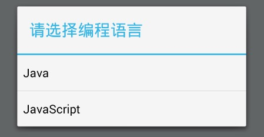
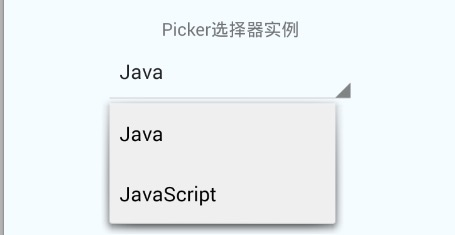

# React Native 控件之 Switch 与 Picker 组件讲解以及使用(16)

## (一)前言

今天我们一起来看一下 Switch 选择开关控件以及 Picker 选择器控件的介绍完全解析以及最佳实践。

刚创建的 React Native 技术交流群(282693535),欢迎各位大牛,React Native 技术爱好者加入交流!同时博客左侧欢迎微信扫描关注订阅号,移动技术干货,精彩文章技术推送!

(二)Switch 选择开关控件

2.1.该为 Android/iOS 两个平台通用的两种状态的选择开关组件

2.2.Switch 属性方法介绍(这边只介绍平台通用属性以及只适合 Android 平台上面的属性方法)

  - View 相关属性样式全部继承(例如:宽和高,背景颜色,边距等相关属性样式)
  - disabled bool 如果该值为 true,用户就无法点击 switch 开关控件，默认为 false
  - onValueChange function 方法，当该组件的状态值发生变化的时候回调方法
  - value bool 该开关的值，如果该值为 true 的时候，开关呈打开状态，默认为 false
2.3.Switch 使用实例

1. 基础 Switch 开关控件实例演示,添加点击开关状态切换，实例代码如下:

```
'use strict';
import React, {
  AppRegistry,
  Component,
  StyleSheet,
  Text,
  View,
  Switch,
} from 'react-native';
var SwitchDemo = React.createClass({
  getInitialState() {
    return {
      trueSwitchIsOn: true,
      falseSwitchIsOn: false,
    };
  },
  render() {
    return (
      <View style={styles.container}>
        <Text>
           Swtich 实例
        </Text>
        <Switch
          onValueChange={(value) => this.setState({falseSwitchIsOn: value})}
          style={{marginBottom:10,marginTop:10}}
          value={this.state.falseSwitchIsOn} />
        <Switch
          onValueChange={(value) => this.setState({trueSwitchIsOn: value})}
          value={this.state.trueSwitchIsOn} />
      </View>
    );
  }
});
const styles = StyleSheet.create({
  container: {
    flex: 1,
    justifyContent: 'center',
    alignItems: 'center',
    backgroundColor: '#F5FCFF',
  },
});
AppRegistry.registerComponent('SwitchDemo', () => SwitchDemo);
```

运行效果如下:


2. Switch 开关控件设置无法点击状态，该第一个 Switch 无法响应点击状态,实例代码如下:

```
var SwitchDemo = React.createClass({
  getInitialState() {
    return {
      trueSwitchIsOn: true,
      falseSwitchIsOn: false,
    };
  },
  render() {
    return (
      <View style={styles.container}>
        <Text>
           Swtich 实例
        </Text>
        <Switch
          disabled={true}
          onValueChange={(value) => this.setState({falseSwitchIsOn: value})}
          style={{marginBottom:10,marginTop:10}}
          value={this.state.falseSwitchIsOn} />
        <Switch
          disabled={false}
          onValueChange={(value) => this.setState({trueSwitchIsOn: value})}
          value={this.state.trueSwitchIsOn} />
      </View>
    );
  }
});
```

效果运行如下:


## (三)Picker 选择器控件

2.1.该 Picker 渲染 iOS 和 Android 平台上面的原生选择器组件，官方实例代码如下:

```
<Picker
  selectedValue={this.state.language}
  onValueChange={(lang) => this.setState({language: lang})}>
  <Picker.Item label="Java" value="java" />
  <Picker.Item label="JavaScript" value="js" />
</Picker>
```

2.2.Picker 属性方法(这边只介绍平台通用属性以及只适合 Android 平台上面的属性方法)

  - View 相关属性样式全部继承(例如:宽和高,背景颜色,边距等相关属性样式)
  - onValueChange  function 方法,当选择器 item 被选择的时候进行调用。该方法被调用的时候回传入一下两个参数
itemValue:该属性值为被选中的 item 的属性值

itemPosition:该选择器被选中的 item 的索引 position

  - selectedValue: any 任何参数值，选择器选中的 item 所对应的值，该可以是一个字符串或者一个数字
  - style pickerStyleType 该传入 style 样式，设置 picker 的样式风格
  - enabled bool 如果该值为 false，picker 就无法被点击选中。例如:用户无法进行做出选择
  - mode enum ('dialog','dropdown')  选择器模式。在 Android 平台上面，设置 mode 可以控制用户点击 picker 弹出的样式风格
'dialog': 该值为默认值，进行弹出一个模态 dialog(弹出框)

'dropdown':以 picker 视图为基础，在该视图下面弹出下拉框

  - prompt string  设置 picker 的提示语(标题),在 Android 平台上面，模式设置成'dialog',显示弹出框的标题
3.3.Picker 使用实例

1. 基础选择器控件实例:弹出框,实例代码如下:

```
'use strict';
import React, {
  AppRegistry,
  Component,
  StyleSheet,
  Text,
  View,
  Picker,
} from 'react-native';
var PickerDemo = React.createClass({
   getInitialState: function() {
    return {
      language: '',
    };
  },
  render() {
    return (
      <View style={styles.container}>
        <Text >
          Picker 选择器实例
        </Text>
        <Picker 
          style={{width:200}}
          selectedValue={this.state.language}
          onValueChange={(value) => this.setState({language: value})}>
          <Picker.Item label="Java" value="java" />
          <Picker.Item label="JavaScript" value="javaScript" />
        </Picker>
        <Text>当前选择的是:{this.state.language}</Text>
      </View>
    );
  }
});
const styles = StyleSheet.create({
  container: {
    flex: 1,
    justifyContent: 'center',
    alignItems: 'center',
    backgroundColor: '#F5FCFF',
  },
});
AppRegistry.registerComponent('PickerDemo', () => PickerDemo);
```

运行效果如下:


2. 基础选择器控件实例:设置弹出框标题,实例代码如下:

```
var PickerDemo = React.createClass({
   getInitialState: function() {
    return {
      language: '',
    };
  },
  render() {
    return (
      <View style={styles.container}>
        <Text >
          Picker 选择器实例
        </Text>
        <Picker 
          prompt="请选择编程语言"
          style={{width:200}}
          selectedValue={this.state.language}
          onValueChange={(value) => this.setState({language: value})}>
          <Picker.Item label="Java" value="java" />
          <Picker.Item label="JavaScript" value="javaScript" />
        </Picker>
        <Text>当前选择的是:{this.state.language}</Text>
      </View>
    );
  }
});
```

运行效果如下:



3. 基础选择器控件实例:设置下拉选择框,实例代码如下:

```
var PickerDemo = React.createClass({
   getInitialState: function() {
    return {
      language: '',
    };
  },
  render() {
    return (
      <View style={styles.container}>
        <Text >
          Picker 选择器实例
        </Text>
        <Picker 
          mode={'dropdown'}
          style={{width:200}}
          selectedValue={this.state.language}
          onValueChange={(value) => this.setState({language: value})}>
          <Picker.Item label="Java" value="java" />
          <Picker.Item label="JavaScript" value="javaScript" />
        </Picker>
        <Text>当前选择的是:{this.state.language}</Text>
      </View>
    );
  }
});
```

运行效果如下:



## (四)最后总结

今天我们主要学习一下 Switch 选择开关控件以及 Picker 选择器控件的介绍完全解析以及最佳实践。大家有问题可以加一下群 React Native 技术交流群(282693535)或者底下进行回复一下。