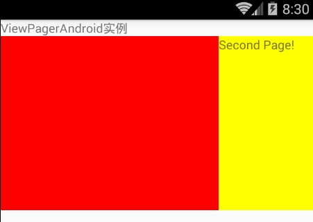
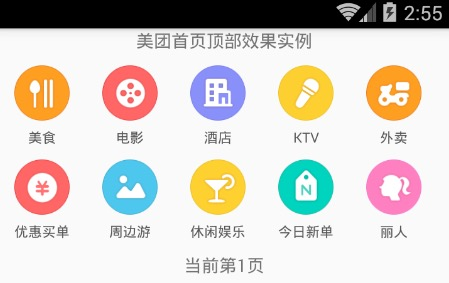

# React Native 控件之 ViewPagerAndroid 讲解以及美团首页顶部效果实例(17)

## (一)前言

今天我们一起来看一下 ViewPagerAndroid 组件完成解析以及仿照实现美团首页顶部效果。

刚创建的 React Native 技术交流群(282693535),欢迎各位大牛,React Native 技术爱好者加入交流!同时博客左侧欢迎微信扫描关注订阅号,移动技术干货,精彩文章技术推送!

说到 React Native for Android 版本中的 ViewPagerAndroid 组件和 Android 中的 ViewPager 控件作用相类似。该容器允许容器中的子视图相互的左右滑动。每一个 ViewPagerAndroid 中的子视图都会当做一个单独的页面，并且会撑满整个 ViewPagerAndroid 组件的界面。

【特别注意】ViewPagerAndroid 中的所有子 View 必须为<View>控件，不能为复合型的组件。你可以为每一个子视图添加列如:padding 或则 backgroundColor 之类的属性。

## (二)官方实例

如果你学过 Android 或者 Web 前端开发，对这样的 ViewPagerAndroid 组件还是比较容易学的，该组件我们可以做广告轮播等相关效果哦~

首先我们来看一下官方给我们的实例(本人做过相应修改)，具体代码如下:

```
37
'use strict';
import React, {
  AppRegistry,
  Component,
  StyleSheet,
  Text,
  View,
  ViewPagerAndroid,
} from 'react-native';
 
class ViewPagerDemo extends Component {
  render() {
    return (
      <View >
        <Text style={styles.welcome}>
            ViewPagerAndroid 实例
        </Text>
        <ViewPagerAndroid style={styles.pageStyle} initialPage={0}>
             <View style={{backgroundColor:"red"}}>
                   <Text>First Page!</Text>
             </View>
             <View style={{backgroundColor:"yellow"}}>
                   <Text>Second Page!</Text>
             </View>
        </ViewPagerAndroid>
      </View>
    );
  }
}
const styles = StyleSheet.create({
   pageStyle: {
    alignItems: 'center',
    padding: 20,
    height:200,
  }
});
AppRegistry.registerComponent('ViewPagerDemo', () => ViewPagerDemo);
```

该官方实例运行效果如下:



## (三)属性方法

  - View 相关属性样式全部继承(例如:宽和高,背景颜色,边距等相关属性样式)
  - initialPage  number  ViewPagerAndroid 初始索引页，不过我们可以使用 setPage 方法来更新页码，通过 onPageSelected 方法来监听页面滑动。
  - keyboardDismissMode  enum('none','on-drag')  枚举类型，进行设置在拖拽滑动的过程中是否要显示键盘。
'none'  默认值,在拖拽中不隐藏键盘

'on-drag'   当拖拽滑动开始的时候隐藏键盘

  - onPageScroll  function 方法，该方法在页面进行滑动的时候执行(不管是因为页面滑动动画原因还是由于页面之间的拖拽以及滑动原因).该会回调传入的 event.nativeEvent 对象会有携带如下参数:
'position'   从左起开始第一个可见的页面的索引

'offset'  该 value 值的范围为[0,1)，该用来代表当前页面的却换的状态。值 x 代表该索引页面(1-x)的范围可见，另外 x 范围代表下一个页面可见的区域

  - onPageScrollStateChanged  function 该回调方法会在页面滚动状态发生变化的时候进行调用。页面的滚动状态有下面三种情况:
'idle' 该表示当前用户和页面滚动没有任何交互

'dragging'  拖动中，该表示当前页面正在被拖拽滑动中

'settling'   该表示存在页面拖拽或者滑动的交互。页面滚动正在结束。并且正在关闭或者打开动画。

  - onPageSelected  function 方法 该在页面进行拖拽滑动切换完成之后回调。该方法回调参数中的 event.nativeEvent 对象会携带如下一个属性 : 'position'  该属性代表当前选中的页面的索引.

## (四)ViewPagerAndroid 使用实例

上面我们已经对于 ViewPagerAndroid 组件的基本介绍实例以及相关的属性方法做了详细讲解了，下面我们来返照实现美团首页顶部分类切换页面。

首先我们分析一下美团首页顶部效果，该包含美团的业务 Item 入口，该每个页面包含十大版本，一共两个页面可以进行左右滑动切换。下面来看一下具体代码:

```
/**
 * @autor:江清清
 * 模仿实现美团首页顶部分类 item 功能效果实例
 * https://github.com/facebook/react-native
 */
'use strict';
import React, {
  AppRegistry,
  Component,
  StyleSheet,
  Text,
  View,
  Image,
  ViewPagerAndroid,
} from 'react-native';
 
var titles_first_data=["美食","电影","酒店","KTV","外卖","优惠买单","周边游","休闲娱乐","今日新单","丽人"];
var titles_second_data=["购物","火车票","生活服务","旅游","汽车服务","足疗按摩","小吃快餐","经典门票","境外游","全部分类"];
var ViewPagerDemo = React.createClass({
  getInitialState: function() {
    return {
      page:1,
    };
  },
  onPageSelected: function(e) {
    this.setState({page: 1+e.nativeEvent.position});
  },
  render() {
    return (
      <View >
        <Text style={{textAlign:'center'}}>
            美团首页顶部效果实例
        </Text>
        <ViewPagerAndroid style={styles.pageStyle} initialPage={0}  onPageSelected={this.onPageSelected}>
          <View>
            <View style={{flexDirection:'row'}}>
              <View style={{width:70}}>
                 <Image source={require('./img/one.png')} style={styles.imageStyle} />
                 <Text style={styles.textStyle}>{titles_first_data[0]}</Text>
              </View>
              <View style={{width:70}}>
                 <Image source={require('./img/two.png')} style={styles.imageStyle} />
                 <Text style={styles.textStyle}>{titles_first_data[1]}</Text>
              </View>
              <View style={{width:70}}>
                 <Image source={require('./img/three.png')} style={styles.imageStyle} />
                 <Text style={styles.textStyle}>{titles_first_data[2]}</Text>
              </View>
              <View style={{width:70}}>
                 <Image source={require('./img/four.png')} style={styles.imageStyle} />
                 <Text style={styles.textStyle}>{titles_first_data[3]}</Text>
              </View>
              <View style={{width:70}}>
                 <Image source={require('./img/five.png')} style={styles.imageStyle} />
                 <Text style={styles.textStyle}>{titles_first_data[4]}</Text>
              </View>
              </View>
            <View style={{flexDirection:'row',marginTop:10}}>
              <View style={{width:70}}>
                 <Image source={require('./img/six.png')} style={styles.imageStyle} />
                 <Text style={styles.textStyle}>{titles_first_data[5]}</Text>
              </View>
              <View style={{width:70}}>
                 <Image source={require('./img/seven.png')} style={styles.imageStyle} />
                 <Text style={styles.textStyle}>{titles_first_data[6]}</Text>
             </View>
             <View style={{width:70}}>
                 <Image source={require('./img/eight.png')} style={styles.imageStyle} />
                 <Text style={styles.textStyle}>{titles_first_data[7]}</Text>
             </View>
             <View style={{width:70}}>
                 <Image source={require('./img/nine.png')} style={styles.imageStyle} />
                 <Text style={styles.textStyle}>{titles_first_data[8]}</Text>
             </View>
             <View style={{width:70}}>
                 <Image source={require('./img/ten.png')} style={styles.imageStyle} />
                 <Text style={styles.textStyle}>{titles_first_data[9]}</Text>
              </View>
            </View>
          </View>
           <View>
             <View style={{flexDirection:'row'}}>
             <View style={{width:70}}>
                 <Image source={require('./img/next_one.png')} style={styles.imageStyle} />
                 <Text style={styles.textStyle}>{titles_second_data[0]}</Text>
             </View>
              <View style={{width:70}}>
                 <Image source={require('./img/next_two.png')} style={styles.imageStyle} />
                 <Text style={styles.textStyle}>{titles_second_data[1]}</Text>
             </View>
             <View style={{width:70}}>
                 <Image source={require('./img/next_three.png')} style={styles.imageStyle} />
                 <Text style={styles.textStyle}>{titles_second_data[2]}</Text>
             </View>
             <View style={{width:70}}>
                 <Image source={require('./img/next_four.png')} style={styles.imageStyle} />
                 <Text style={styles.textStyle}>{titles_second_data[3]}</Text>
             </View>
             <View style={{width:70}}>
                 <Image source={require('./img/next_five.png')} style={styles.imageStyle} />
                 <Text style={styles.textStyle}>{titles_second_data[4]}</Text>
             </View>
          </View>
          <View style={{flexDirection:'row',marginTop:10}}>
             <View style={{width:70}}>
                 <Image source={require('./img/next_six.png')} style={styles.imageStyle} />
                 <Text style={styles.textStyle}>{titles_second_data[5]}</Text>
             </View>
              <View style={{width:70}}>
                 <Image source={require('./img/next_seven.png')} style={styles.imageStyle} />
                 <Text style={styles.textStyle}>{titles_second_data[6]}</Text>
             </View>
             <View style={{width:70}}>
                 <Image source={require('./img/next_eight.png')} style={styles.imageStyle} />
                 <Text style={styles.textStyle}>{titles_second_data[7]}</Text>
             </View>
             <View style={{width:70}}>
                 <Image source={require('./img/next_nine.png')} style={styles.imageStyle} />
                 <Text style={styles.textStyle}>{titles_second_data[8]}</Text>
             </View>
             <View style={{width:70}}>
                 <Image source={require('./img/next_ten.png')} style={styles.imageStyle} />
                 <Text style={styles.textStyle}>{titles_second_data[9]}</Text>
             </View>
            </View>
          </View>
        </ViewPagerAndroid>
        <Text style={{flex:1,alignSelf:'center'}}>当前第{this.state.page}页</Text>
      </View>
    );
  }
});
const styles = StyleSheet.create({
   pageStyle: {
    marginTop:10,
    alignItems: 'center',
    height:150,
  },
  textStyle:{
    marginTop:5,alignSelf:'center',fontSize:11,color:'#555555',textAlign:'center'
  },
  imageStyle:{
    alignSelf:'center',width:45,height:45
  }
});
AppRegistry.registerComponent('ViewPagerDemo', () => ViewPagerDemo);
```

具体运行效果如下:




## (五)最后总结

今天我们主要学习一下 ViewPagerAndroid 组件使用讲解以及仿照实现美团首页顶部功能页面切换效果。大家有问题可以加一下群 React Native 技术交流群(282693535)或者底下进行回复一下。