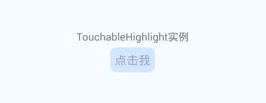
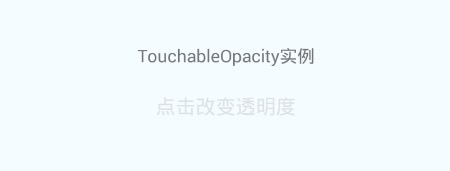
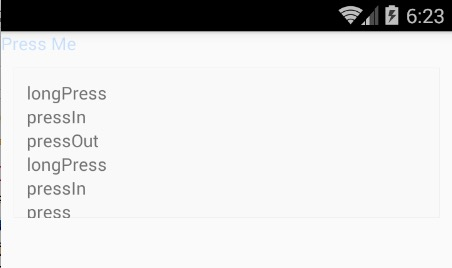
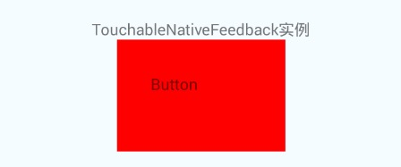
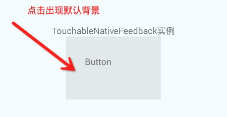

# React Native 控件之 Touchable*系列组件详解(18)

## (一)前言

今天我们一起来看一下 Touchable*系列组件的使用详解，该系列组件包括四种分别为:TouchableHighlight,TouchableNativeFeedback,TouchableOpacity,TouchableWithoutFeedback。其中最后一个控件是触摸点击不带反馈效果的，另外三个都是有反馈效果。可以这样理解前面三个都是继承自 TouchableWithoutFeedback 扩展而来。

刚创建的 React Native 技术交流群(282693535),欢迎各位大牛,React Native 技术爱好者加入交流!同时博客右侧欢迎微信扫描关注订阅号,移动技术干货,精彩文章技术推送!

今天我们需要讲解的这四种控件都是属于 Touchable 系列的，是封装了触摸点击相关事件,例如:触摸,点击,长按,反馈等相关。下面我们来把这四种组件分别进行讲解一下。

## (二)TouchableWithoutFeedback

2.1.TouchableWithoutFeedback 组件基本介绍

该控件除非你不得不使用，否则请不要使用该组件哦~任何可以响应事件的控件当触摸或者点击的时候应该会有视觉上面的反应效果(但是该组件没有)。这就是一个很大的原因，看起来像 Web 效果而不是原生的效果(Native)。

【特别声明】TouchableWithFeedback 只支持一个字节点，如果你需要设置多个子视图组件，那么就需要使用 View 节点进行包装。

2.2.属性方法

  - accessibilityComponentType   View.AccessibilityComponentType  设置可访问的组件类型
  - accessibilityTraits View.AccessibilityTraits,[View.AccessibilityTraits] 设置访问特征
  - accessible  bool  设置当前组件是否可以访问
  - delayLongPress  number  设置延迟的时间，单位为毫秒。从 onPressIn 方法开始，到 onLongPress 被调用这一段时间
  - delayPressIn  number 设置延迟的时间，单位为毫秒，从用户触摸控件开始到 onPressIn 被调用这一段时间
  - delayPressOut  number 设置延迟的时间，单位为毫秒，从用户触摸事件释放开始到 onPressOut 被调用这一段时间
  - onLayout  function  当组件加载或者改组件的布局发生变化的时候调用。调用传入的参数为{nativeEvent:{layout:{x,y,width,height}}}
  - onLongPress function 方法，当用户长时间按压组件(长按效果)的时候调用该方法
  - onPress function 方法 当用户点击的时候调用(触摸结束)。 但是如果事件被取消了就不会调用。(例如:当前被滑动事件所替代)
  - onPressIn  function  用户开始触摸组件回调方法
  - onPressOut function 用户完成触摸组件之后回调方法
  - pressRetentionOffset {top:number,left:number,bottom:number,right:number}   该设置当视图滚动禁用的情况下，可以定义当手指距离组件的距离。当大于该距离该组价会失去响应。当少于该距离的时候，该组件会重新进行响应。

该组件我们一般不会直接进行使用，下面三种 Touchable*系列组件对于该组件的属性方法都可以进行使用。具体会具体演示这些属性方法的使用实例。

## (三)TouchableHighlight(触摸点击高亮效果)

3.1.TouchableHighlight 组件基本介绍

该组件进行封装视图触摸点击的属性。当手指点击按下的时候，该视图的不透明度会进行降低同时会看到相应的颜色(视图变暗或者变亮)。如果我们去查看该组件的源代码会发现，该底层实现是添加了一个新的视图。如果如果我们没有正确的使用，就可能不会出现正确的效果。例如:我们没有给该组件视图设置 backgroudnColor 的颜色值。

【特别声明】TouchableHighlight 只支持一个子节点，如果你需要设置多个子视图组件，那么就需要使用 View 节点进行包装。

3.2.属性方法

  - TouchableWithoutFeedback 的 属性，这边 TouchableHighlight 组件全部可以进行使用
  - activeOpacity  number 该用来设置视图在进行触摸的时候，要要显示的不透明度(通常在 0-1 之间)
  - onHideUnderlay  function  方法 当底层被隐藏的时候调用
  - onShowUnderlay  function 方法 当底层显示的时候调用
  - style  可以设置控件的风格演示，该风格演示可以参考 View 组件的 style
  - underlayColor  当触摸或者点击控件的时候显示出的颜色

3.3.组件使用实例代码

```
'use strict';
import React, {
  AppRegistry,
  Component,
  StyleSheet,
  Text,
  View,
  TouchableHighlight,
} from 'react-native';
 
class TouchableHighlightDemo extends Component {
  render() {
    return (
      <View style={styles.container}>
        <Text >
          TouchableHighlight 实例
        </Text>
        <TouchableHighlight 
          underlayColor="rgb(210, 230, 255)"
          activeOpacity={0.5}  
          style={{ borderRadius: 8,padding: 6,marginTop:5}}
          >
             <Text style={{fontSize:16}}>点击我</Text>
        </TouchableHighlight>
      </View>
    );
  }
}
const styles = StyleSheet.create({
  container: {
    flex: 1,
    justifyContent: 'center',
    alignItems: 'center',
    backgroundColor: '#F5FCFF',
  },
});
AppRegistry.registerComponent('TouchableHighlightDemo', () => TouchableHighlightDemo);
```

3.4.运行效果如下:



## (四)TouchableOpacity(透明度变化)

4.1.TouchableOpacity 组件介绍

该组件封装了响应触摸事件。当点击按下的时候，该组件的透明度会降低。该组件使用过程中并不会改变视图的层级关系，而且我们可以非常容易的添加到应用并且不会产生额外的异常错误。

4.2.属性方法

  - TouchableWithoutFeedback 的 属性，这边 TouchableOpacity 组件全部可以进行使用
  - activeOpacity  number  设置当用户触摸的时候，组件的透明度
4.3.组件使用实例代码:

```
'use strict';
import React, {
  AppRegistry,
  Component,
  StyleSheet,
  Text,
  View,
  TouchableOpacity,
} from 'react-native';
 
class TouchableDemo extends Component {
  render() {
    return (
      <View style={styles.container}>
        <Text>
           TouchableOpacity 实例
        </Text>
        <TouchableOpacity style={{marginTop:20}}>
           <Text style={{fontSize:16}}>点击改变透明度</Text>
        </TouchableOpacity>
      </View>
    );
  }
}
const styles = StyleSheet.create({
  container: {
    flex: 1,
    justifyContent: 'center',
    alignItems: 'center',
    backgroundColor: '#F5FCFF',
  },
});
 
AppRegistry.registerComponent('TouchableDemo', () => TouchableDemo);
```

4.4.运行效果截图:



4.5.实例演示 onPress,onPressIn,onPressOut,onLongPress 方法代码如下:

```
'use strict';
import React, {
  AppRegistry,
  Component,
  StyleSheet,
  Text,
  View,
  TouchableOpacity,
} from 'react-native';
 
var TouchableDemo = React.createClass({
    getInitialState: function() {
    return {
      eventLog: [],
    };
  },
  render: function() {
    return (
      <View >
        <View style={[styles.row, {justifyContent: 'center'}]}>
          <TouchableOpacity
            style={styles.wrapper}
            onPress={() => this._appendEvent('press')}
            onPressIn={() => this._appendEvent('pressIn')}
            onPressOut={() => this._appendEvent('pressOut')}
            onLongPress={() => this._appendEvent('longPress')}>
            <Text style={styles.button}>
              Press Me
            </Text>
          </TouchableOpacity>
        </View>
        <View  style={styles.eventLogBox}>
          {this.state.eventLog.map((e, ii) => <Text key={ii}>{e}</Text>)}
        </View>
      </View>
    );
  },
  _appendEvent: function(eventName) {
    var limit = 6;
    var eventLog = this.state.eventLog.slice(0, limit - 1);
    eventLog.unshift(eventName);
    this.setState({eventLog});
  },
});
const styles = StyleSheet.create({
  button: {
    color: '#007AFF',
  },
  wrapper: {
    borderRadius: 8,
  },
  eventLogBox: {
    padding: 10,
    margin: 10,
    height: 120,
    borderWidth: StyleSheet.hairlineWidth,
    borderColor: '#f0f0f0',
    backgroundColor: '#f9f9f9',
  },
});
AppRegistry.registerComponent('TouchableDemo', () => TouchableDemo);
```

4.6.运行效果截图:



## (五)TouchableNativeFeedback

5.1.TouchableNativeFeedback 组件介绍

该封装了可以进行响应触摸事件的组件(仅限 Android 平台)。在 Android 平台上面该该组件可以使用原生平台的状态资源来显示触摸状态变化。【特别注意】现如今该组件只是支持仅有一个 View 的子视图实例(作为子节点)。在底层实现上面实际上面是创建一个新的 RCTView 的节点来进行替换当前的 View 节点视图，并且可以携带一些附加的属性。

该组件触摸反馈的背景图资源可以通过 background 属性进行自定义设置

下面一个很简单的使用实例方法如下:

```
var TouchableDemo = React.createClass({
  render() {
    return (
      <View style={styles.container}>
        <Text>
           TouchableNativeFeedback 实例
        </Text>
        <TouchableNativeFeedback style={{marginTop:20}}>
            <View style={{width: 150, height: 100, backgroundColor: 'red'}}>
               <Text style={{margin: 30}}>Button</Text>
            </View>  
        </TouchableNativeFeedback>
      </View>
    );
  }
});
```

运行效果如下:



5.2.属性方法介绍

  - TouchableWithoutFeedback 的 属性，这边 TouchableNativeFeedback 组件全部可以进行使用
  - background  backgroundPropType  该用来设置背景资源的类型，该属性会传入一个 type 属性和依赖的额外资源的 data 的对象。官方推荐采用如下的静态方法来进行生成该 dictionary 对象
1:TouchableNativeFeedback.SelectableBackground()   该会创建使用 android 默认主题背景(?android:attr/selectableItemBackground)

2:TouchableNativeFeedback.SelectableBackgroundBorderless()  该会创建使用 android 默认的无框的主题背景(?android:attr/selectableItemBackgroundBorderless)。不过该参数需要 Android API 21+才可以使用

3:TouchableNativeFeedback.Ripple(color,borderless)  该会创建当组件被按下的时候有一个水滴的效果.通过 color 参数指定颜色，如果 borderless 为 true 的时候，那么该水滴效果会渲染到该组件视图的外边。同样该背景类型参数也需要 Android API 21+才可以使用

5.3.使用实例代码:

1:首先设置 backgroundPropType 为默认的背景效果代码:

```
var TouchableDemo = React.createClass({
  render() {
    return (
      <View style={styles.container}>
        <Text>
           TouchableNativeFeedback 实例
        </Text>
        <TouchableNativeFeedback style={{marginTop:20}} 
            background={TouchableNativeFeedback.SelectableBackground()}>
            <View style={{width: 150, height: 100,}}>
               <Text style={{margin: 30}}>Button</Text>
            </View>  
        </TouchableNativeFeedback>
      </View>
    );
  }
});
```

效果如下:



## (六)最后总结

今天我们主要学习一下 Touchable*系列组件的使用详解，该系列组件包括四种分别为:TouchableHighlight,TouchableNativeFeedback,TouchableOpacity,TouchableWithoutFeedback。大家有问题可以加一下群 React Native 技术交流群(282693535)或者底下进行回复一下。