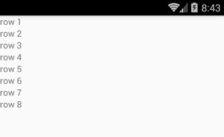
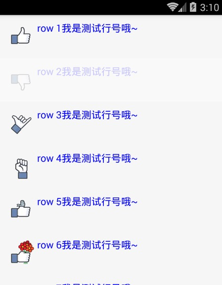
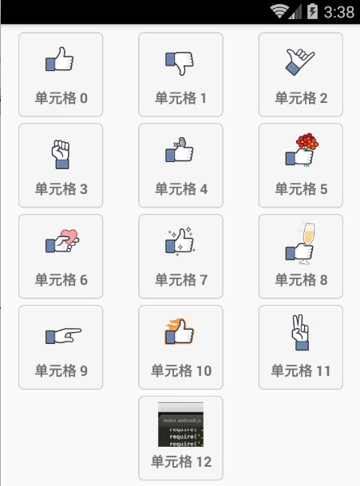

# React Native 控件之 ListView 组件讲解以及详细实例(19)

## (一)前言

今天我们一起来看一下 ListView 组件的使用详解以及具体事例

刚创建的 React Native 技术交流群(282693535),欢迎各位大牛,React Native 技术爱好者加入交流!同时博客左侧欢迎微信扫描关注订阅号,移动技术干货,精彩文章技术推送!

ListView 组件是 React Native 中一个比较核心的组件，用途非常的广。该组件设计用来高效的展示垂直滚动的数据列表。最简单的 API 就是创建一个 ListView.DataSource 对象，同时给该对象传入一个简单的数据集合。并且使用数据源(data source)实例化一个 ListView 组件,定义一个 renderRow 回调方法(该方法的参数是一个数组)，该 renderRow 方法会返回一个可渲染的组件(该就是列表的每一行的 item)

## (二)官方 ListView 简单实例

下面看一个关于 ListView 最简单的例子:

```
'use strict';
import React, {
  AppRegistry,
  Component,
  StyleSheet,
  Text,
  View,
  ListView,
} from 'react-native';
var ListViewDemo = React.createClass({
    getInitialState: function() {
      var ds = new ListView.DataSource({rowHasChanged: (r1, r2) => r1 !== r2});
        return {
          dataSource: ds.cloneWithRows(['row 1', 'row 2','row 3','row 4','row 5','row 6','row 7','row 8']),
        };
    },
    render: function() {
      return (
        <ListView
          dataSource={this.state.dataSource}
          renderRow={(rowData) => <Text>{rowData}</Text>}
        />
      );
    }
});
AppRegistry.registerComponent('ListViewDemo', () => ListViewDemo);
```

实例运行效果如下:



## (三)高级特性

ListView 可以支持一些高级特性，包括设置每一组的粘性的头部(类似于 iPhone)、支持设置列表的 header 以及 footer 视图、当数据列表滑动到最底部的时候支持 onEndReached 方法回调、设备屏幕列表可见的视图数据发生变化的时候回调 onChangeVisibleRows 以及一些性能方面的优化特性。

ListView 设计的时候，当需要动态加载非常大的数据的时候，下面有一些方法性能优化的方法可以让我妈 ListView 滚动的时候更加平滑：

  - 只更新渲染数据变化的那一行  ，rowHasChanged 方法会告诉 ListView 组件是否需要重新渲染当前那一行。具体可以查看 ListViewDataSource 实例
  - 选择渲染的频率  默认情况下面每一个 event-loop(事件循环)只会渲染一行(可以同 pageSize 自定义属性设置)。这样可以把大的工作量进行分隔，提供整体渲染的性能。

## (四)基本属性方法

  - ScrollView 相关属性样式全部继承
  - dataSource   ListViewDataSource  设置 ListView 的数据源
  - initialListSize  number  进行设置 ListView 组件刚刚加载的时候渲染的列表行数，用这个属性确定首屏或者首页加载的数量，而不是花大量的时间渲染加载很多页面数据，提供性能哦
  - onChangeVisibleRows  function  (visibleRows,changedRows)=>void。当可见的行发生变化的时候回调该方法。visibleRows 参数对所有可见的行为{selectionID:{rowId:true}}的形式，changedRow 参数对已经改变可见的行为{selectionID:{rowID:true|false}}。该值 true 代表可见，false 代表在视图之外不可见的行。
  - onEndReachedThreshold  number 当偏移量达到设置的临界值调用 onEndReached
  - onEndReached function 方法，当所有的数据项行被渲染之后，并且列表往下进行滚动。一直滚动到距离底部 onEndReachedThredshold 设置的值进行回调该方法。原生的滚动事件进行传递(通过参数的形式)。
  - pageSize   number 每一次事件的循环渲染的行数
  - removeClippedSubviews  bool  该属性用于提供大数据列表的滚动性能。该使用的时候需要给每一行(row)的布局添加 over:'hidden'样式。该属性默认是开启状态。
  - renderFooter function 方法  ()=>renderable ，在每次渲染过程中头和尾总会重新进行渲染。如果发现该重新绘制的性能开销比较大的时候，可以使用 StaticContainer 容器或者其他合适的组件。在每一次渲染过程中 Footer(尾)该会一直在列表的底部，header(头)该会一直在列表的头部
  - renderHeader  function 方法 使用情况和上面的 renderFooter 差不多
  - renderRow function 方法   (rowData,sectionID,rowID,highlightRow)=>renderable   该方法有四个参数，其中分别为数据源中一条数据，分组的 ID，行的 ID，以及标记是否是高亮选中的状态信息。
  - renderScrollComponent function 方法 (props)=>renderable  该方法可以返回一个可以滚动的组件。默认该会返回一个 ScrollView
  - renderSectionHeader function (sectionData,sectionID)=>renderable   如果设置了该方法，这样会为每一个 section 渲染一个粘性的 header 视图。该视图粘性的效果是当刚刚被渲染开始的时候，该会处于对应的内容的顶部，然后开始滑动的时候，该会跑到屏幕的顶端。直到滑动到下一个 section 的 header(头)视图，然后被替代为止。
  - renderSeparator function  (sectionID,rowID,adjacentRowHighlighted)=>renderable 如果设置该方法，会在被每一行的下面渲染一个组件作为分隔。除了每一个 section 分组的头部视图前面的最后一行。
  - scrollRenderAheadDistance number  进行设置当该行进入屏幕多少像素以内之后就开始渲染该行

## (五)使用实例

5.1.首先看一个相对简单的实例，列表每一行显示一个图片以及文字，具体代码如下:

```
'use strict';
import React, {
  AppRegistry,
  Component,
  StyleSheet,
  Text,
  View,
  ListView,
  Image,
  TouchableOpacity,
} from 'react-native';
var THUMB_URLS = [
  require('./imgs/like.png'),
  require('./imgs/dislike.png'),
  require('./imgs/call.png'),
  require('./imgs/fist.png'),
  require('./imgs/bandaged.png'),
  require('./imgs/flowers.png'),
  require('./imgs/heart.png'),
  require('./imgs/liking.png'),
  require('./imgs/party.png'),
  require('./imgs/poke.png'),
  require('./imgs/superlike.png'),
  require('./imgs/victory.png'),
  ];
var ListViewDemo = React.createClass({
    getInitialState: function() {
      var ds = new ListView.DataSource({rowHasChanged: (r1, r2) => r1 !== r2});
        return {
          dataSource: ds.cloneWithRows(['row 1', 'row 2','row 3','row 4','row 5','row 6','row 7','row 8','row 9','row 10','row 11','row 12']),
        };
    },
    _renderRow: function(rowData: string, sectionID: number, rowID: number) {
    var imgSource = THUMB_URLS[rowID];
    return (
        <TouchableOpacity>
          <View>
            <View style={styles.row}>
              <Image style={styles.thumb} source={imgSource} />
              <Text style={{flex:1,fontSize:16,color:'blue'}}>
                {rowData + '我是测试行号哦~'}
              </Text>
            </View>
          </View>
        </TouchableOpacity>
    );
   },
    render: function() {
      return (
        <ListView
          dataSource={this.state.dataSource}
          renderRow={this._renderRow}
        />
      );
    }
});
var styles = StyleSheet.create({
  row: {
    flexDirection: 'row',
    justifyContent: 'center',
    padding: 10,
    backgroundColor: '#F6F6F6',
  },
  thumb: {
    width: 50,
    height: 50,
  },
});
AppRegistry.registerComponent('ListViewDemo', () => ListViewDemo);
```

运行效果如下:



5.2.实例实现表格布局，代码如下:

```
'use strict';
var React = require('react-native');
var {
  AppRegistry,
  Image,
  ListView,
  TouchableHighlight,
  StyleSheet,
  Text,
  View,
} = React;
 
var THUMB_URLS = [
  require('./imgs/like.png'),
  require('./imgs/dislike.png'),
  require('./imgs/call.png'),
  require('./imgs/fist.png'),
  require('./imgs/bandaged.png'),
  require('./imgs/flowers.png'),
  require('./imgs/heart.png'),
  require('./imgs/liking.png'),
  require('./imgs/party.png'),
  require('./imgs/poke.png'),
  require('./imgs/superlike.png'),
  require('./imgs/victory.png'),
  require('./imgs/logo.png'),
];
 
var ListViewDemo = React.createClass({
  getInitialState: function() {
    var ds = new ListView.DataSource({rowHasChanged: (r1, r2) => r1 !== r2});
    return {
      dataSource: ds.cloneWithRows(this._genRows({})),
    };
  },
  _pressData: ({}: {[key: number]: boolean}),
  componentWillMount: function() {
    this._pressData = {};
  },
  render: function() {
    return (
      <ListView
        initialListSize={12}
        contentContainerStyle={styles.list}
        dataSource={this.state.dataSource}
        renderRow={this._renderRow}
      />
    );
  },
  _renderRow: function(rowData: string, sectionID: number, rowID: number) {
    var imgSource = THUMB_URLS[rowID];
    return (
      <TouchableHighlight underlayColor="red">
        <View>
          <View style={styles.row}>
            <Image style={styles.thumb} source={imgSource} />
            <Text style={styles.text}>
              {rowData}
            </Text>
          </View>
        </View>
      </TouchableHighlight>
    );
  },
  _genRows: function(pressData: {[key: number]: boolean}): Array<string> {
    var dataBlob = [];
    for (var ii = 0; ii < THUMB_URLS.length; ii++) {
      dataBlob.push('单元格 ' + ii);
    }
    return dataBlob;
  },
});
var styles = StyleSheet.create({
  list: {
    marginTop:5,
    justifyContent: 'space-around',
    flexDirection: 'row',
    flexWrap: 'wrap'
  },
  row: {
    justifyContent: 'center',
    padding: 5,
    margin: 3,
    width: 85,
    height: 85,
    backgroundColor: '#F6F6F6',
    alignItems: 'center',
    borderWidth: 1,
    borderRadius: 5,
    borderColor: '#CCC'
  },
  thumb: {
    width: 45,
    height: 45
  },
  text: {
    flex: 1,
    marginTop: 5,
    fontWeight: 'bold'
  },
});
AppRegistry.registerComponent('ListViewDemo', () => ListViewDemo);
```

运行效果如下:



## (六)最后总结

今天我们主要学习一下 ListView 组件的谅解以及相关实例演示。大家有问题可以加一下群 React Native 技术交流群(282693535)或者底下进行回复一下。