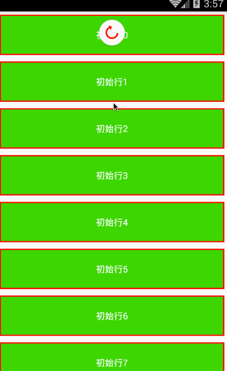

# React Native 控件之 PullToRefreshViewAndroid 下拉刷新组件讲解(20)

## (一)前言

今天我们一起来看一下 PullToRefreshViewAndroid 下拉刷新组件讲解以及使用实例

刚创建的 React Native 技术交流群(282693535),欢迎各位大牛,React Native 技术爱好者加入交流!同时博客左侧欢迎微信扫描关注订阅号,移动技术干货,精彩文章技术推送!

该 PullToRefreshViewAndroid 视图是封装了 Android 平台的下拉刷新组件(SwipeRefreshLayout)，该组件支持设置单一的可以滚动的子视图(例如:ScrollView)。当内部的子视图的垂直方向的偏移量 scrollY:0 的时候，手指往下拖拽该视图的时候回触发 onRefresh 事件方法。

[注意].该组件风格需要设置成{flex:1}。当我们滚动的子视图为 ScrollView 或者 ListView 的时候。

## (二)属性方法

1.继承可以使用 View 组件的所有 Style(具体查看:http://facebook.github.io/react-native/docs/view.html#style)

2.colors [ColorPropType] 设置下拉刷新加载进度指示器的颜色，可以设置多多种颜色(最多设置四种)

3.enabled  bool  设置是否启动下拉刷新的功能

4.progressBackgroundColor   ColorPropType   设置设置下拉刷新加载进去指示器的背景颜色

5.refreshing bool   设置当前进去指示器是否在活跃状态，也表明当前是不是在下拉刷新状态

6.size   RefreshLayoutConsts.SIZE.DEFAULT   下拉刷新指示器的尺寸大小，详细请查看 PullToRefreshViewAndroid.SIZE 值([点击进入](https://github.com/facebook/react-native/blob/master/Libraries/PullToRefresh/PullToRefreshViewAndroid.android.js))

## (三)使用实例

上面已经基本介绍了 PullToRefreshAndroidView 的的基本介绍和相关属性介绍，下面我们来用一个实例来具体演示一下该组件的具体使用。

该实例从官方实例中进行修改而来，具体代码如下:

```
'use strict';
 
const React = require('react-native');
const {
  AppRegistry,
  ScrollView,
  StyleSheet,
  PullToRefreshViewAndroid,
  Text,
  View,
} = React;
 
const styles = StyleSheet.create({
  row: {
    borderColor: 'red',
    borderWidth: 2,
    padding: 20,
    backgroundColor: '#3ad734',
    margin: 5,
  },
  text: {
    alignSelf: 'center',
    color: '#fff',
 
  },
  layout: {
    flex: 1,
  },
  scrollview: {
    flex: 1,
  },
});
const Row = React.createClass({
  render: function() {
    return (
        <View style={styles.row}>
          <Text style={styles.text}>
            {this.props.data.text }
          </Text>
        </View>
    );
  },
});
const PullToRefreshDemo = React.createClass({
  getInitialState() {
    return {
      isRefreshing: false,
      loaded: 0,
      rowData: Array.from(new Array(20)).map(
        (val, i) => ({text: '初始行' + i})
      ),
    };
  },
  render() {
    const rows = this.state.rowData.map((row, ii) => {
      return <Row key={ii} data={row} />;
    });
    return (
      <PullToRefreshViewAndroid
        style={styles.layout}
        refreshing={this.state.isRefreshing}
        onRefresh={this._onRefresh}
        colors={['#ff0000', '#00ff00', '#0000ff','#123456']}
        progressBackgroundColor={'#ffffff'}
        >
        <ScrollView style={styles.scrollview}>
          {rows}
        </ScrollView>
      </PullToRefreshViewAndroid>
    );
  },
 
  _onRefresh() {
    this.setState({isRefreshing: true});
    setTimeout(() => {
      // 进行准备 5 项新数据
      const rowData = Array.from(new Array(5))
      .map((val, i) => ({
        text: '下拉刷新行' + (+this.state.loaded + i)
      }))
      .concat(this.state.rowData);
 
      this.setState({
        loaded: this.state.loaded + 5,
        isRefreshing: false,
        rowData: rowData,
      });
    }, 5000);
  },
});
AppRegistry.registerComponent('PullToRefreshDemo', () => PullToRefreshDemo);
```

具体运行效果如下:



## (四)最后总结

今天我们主要学习一下 PullToRefreshAndroidView 组件的基本介绍和实例演示使用。大家有问题可以加一下群 React Native 技术交流群(282693535)或者底下进行回复一下。