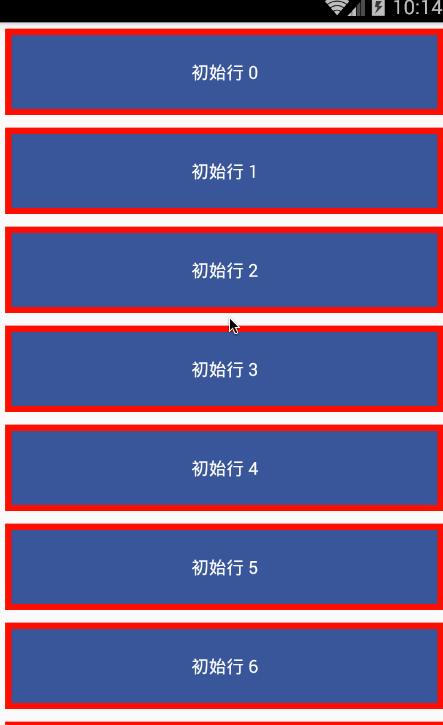

# React Native 控件之 RefreshControl 组件详解(21)

## (一)前言

今天我们一起来看一下 RefreshControl 下拉刷新组件讲解以及使用实例

刚创建的 React Native 技术交流群(282693535),欢迎各位大牛,React Native 技术爱好者加入交流!同时博客左侧欢迎微信扫描关注订阅号,移动技术干货,精彩文章技术推送!

该组件和上一篇组将的 PullToRefreshAndroidView 组件相类似([点击进入](http://www.lcode.org/%E3%80%90react-native%E5%BC%80%E5%8F%91%E3%80%91react-native%E6%8E%A7%E4%BB%B6%E4%B9%8Bpulltorefreshviewandroid%E4%B8%8B%E6%8B%89%E5%88%B7%E6%96%B0%E7%BB%84%E4%BB%B6%E8%AE%B2%E8%A7%A320/))，也是实现下拉刷新的功能。不过该组件是用在 ScrollView 的内部的，为 ScrollView 添加一个下拉刷新的功能。当 ScrollView 的垂直方向的偏移量 scrollY:0 的时候，手指往下拖拽 ScrollView 就会触发 onRefresh 事件方法。

## (二)属性方法

  1. onRefresh  function 方法 当视图开始刷新的时候调用
  2. refreshing  bool  决定加载进去指示器是否为活跃状态，也表名当前是否在刷新中
  3. colors [ColorPropType]   android 平台适用  进行设置加载进去指示器的颜色，至少设置一种，最好可以设置 4 种
  4. enabled  bool   android 平台适用   用来设置下拉刷新功能是否可用
  5. progressBackgroundColor ColorPropType  设置加载进度指示器的背景颜色
  6. size RefreshLayoutConsts.SIZE.DEFAULT  android 平台适用  加载进度指示器的尺寸大小 ，具体可以查看 RefreshControl.SIZE(详细点击进入)
  7. tintColor ColorPropType   iOS 平台适用  设置加载进度指示器的颜色
  8. title string iOS 平台适用  设置加载进度指示器下面的标题文本信息

## (三)使用实例

上面已经对于 RefreshControl 组件的基本介绍以及相关属性做了说明，下面来进行实例使用一下，以下代码在官方实例中进行修改而来，还是比较简单的。具体代码如下:

```
'use strict';
 
const React = require('react-native');
const {
  AppRegistry,
  ScrollView,
  StyleSheet,
  RefreshControl,
  Text,
  View,
} = React;
 
const styles = StyleSheet.create({
  row: {
    borderColor: 'red',
    borderWidth: 5,
    padding: 20,
    backgroundColor: '#3a5795',
    margin: 5,
  },
  text: {
    alignSelf: 'center',
    color: '#fff',
  },
  scrollview: {
    flex: 1,
  },
});
 
const Row = React.createClass({
  _onClick: function() {
    this.props.onClick(this.props.data);
  },
  render: function() {
    return (
        <View style={styles.row}>
          <Text style={styles.text}>
            {this.props.data.text}
          </Text>
        </View>
    );
  },
});
 
const RefreshControlDemo = React.createClass({
  getInitialState() {
    return {
      isRefreshing: false,
      loaded: 0,
      rowData: Array.from(new Array(20)).map(
        (val, i) => ({text: '初始行 ' + i})),
    };
  },
  render() {
    const rows = this.state.rowData.map((row, ii) => {
      return <Row key={ii} data={row}/>;
    });
    return (
      <ScrollView
        style={styles.scrollview}
        refreshControl={
          <RefreshControl
            refreshing={this.state.isRefreshing}
            onRefresh={this._onRefresh}
            colors={['#ff0000', '#00ff00', '#0000ff','#3ad564']}
            progressBackgroundColor="#ffffff"
          />
        }>
        {rows}
      </ScrollView>
    );
  },
  _onRefresh() {
    this.setState({isRefreshing: true});
    setTimeout(() => {
      // 准备下拉刷新的 5 条数据
      const rowData = Array.from(new Array(5))
      .map((val, i) => ({
        text: '刷新行 ' + (+this.state.loaded + i)
      }))
      .concat(this.state.rowData);
 
      this.setState({
        loaded: this.state.loaded + 5,
        isRefreshing: false,
        rowData: rowData,
      });
    }, 5000);
  },
});
 
AppRegistry.registerComponent('RefreshControlDemo', () => RefreshControlDemo);
```

具体运行效果如下:



## (四)最后总结

今天我们主要学习一下 RefreshControl 组件的基本介绍和实例演示使用，整体实现的功能还是和之前的 PullToRefreshAndroidView 一样的。大家有问题可以加一下群 React Native 技术交流群(282693535)或者底下进行回复一下。