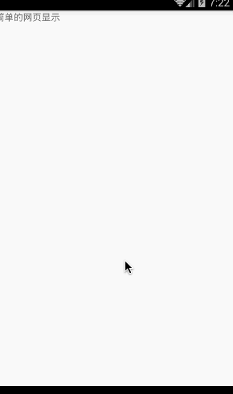
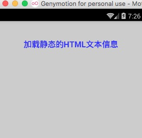

# React Native 控件之 WebView 组件详解以及实例使用(22)

## (一)前言

今天我们一起来看一下 WebView 组件讲解以及使用实例

刚创建的 React Native 技术交流群(282693535),欢迎各位大牛,React Native 技术爱好者加入交流!同时博客左侧欢迎微信扫描关注订阅号,移动技术干货,精彩文章技术推送!

该 WebView 组件进行创建渲染一个原生的 WebView，进行加载一个网页。

## (二)属性方法

  1. 继承可以使用 View 组件的所有属性和 Style(具体查看:http://facebook.github.io/react-native/docs/view.html#content 和 http://facebook.github.io/react-native/docs/view.html#style)
  2. automaticallyAdjustContentInsets bool   设置是否自动调整内容
  3. contentInset  {top:number,left:number,bottom:number,right:number}  设置内容所占的尺寸大小
  4. html  string  WebView 加载的 HTML 文本字符串
  5. injectJavaScript  string 当网页加载之前进行注入一段 js 代码
  6. onError function  方法 当网页加载失败的时候调用
  7. onLoad  function 方法  当网页加载结束的时候调用
  8. onLoadEnd fucntion 当网页加载结束调用，不管是成功还是失败
  9. onLoadStart  function  当网页开始加载的时候调用
  10. onNavigationStateChange function 方法  当导航状态发生变化的时候调用
  11. renderError  function  该方法用于渲染一个 View 视图用来显示错误信息
  12. renderLoagin function  该方法用于渲染一个 View 视图用来显示一个加载进度指示器
  13. startInLoadingState  bool
  14. url  string  设置加载的网页地址
  15. allowsInlineMediaPlayback  bool   该适合 iOS 平台，设置决定当使用 HTML5 播放视频的时候在当前页面位置还是使用原生的全屏播放器播放，默认值 false。【注意】.为了让视频在原网页位置进行播放，不光要设置该属性为 true，还必须要设置 HTML 页面中 video 节点的包含 webkit-playsinline 属性
  16. bounces bool  该适合 iOS 平台 设置是否有界面反弹特性
  17. domStorageEnabled bool  该适合 Android 平台 该只适合于 Android 平台，用于控制是否开启 DOM Storage（存储）
  18. javaScriptEnabled  bool  该适合于 Android 平台，是否开启 javascript，在 iOS 中的 WebView 是默认开启的
  19. onShouldStartLoadWithRequest  function  该适合 iOS 平台，该允许拦截 WebView 加载的 URL 地址，进行自定义处理。该方法通过返回 true 或者 falase 来决定是否继续加载该拦截到请求
  20. scalesPageToFit  bool  该适合 iOS 平台  用于设置网页是否缩放自适应到整个屏幕视图以及用户是否可以改变缩放页面
  21. scrollEnabled  bool    该适合 iOS 平台 用于设置是否开启页面滚动

## (三)实战实例

上面我已经对于 WebView 组件的基本介绍以及相关属性方法做了讲解，下面我们用几个实例来演示一下 WebView 组件的使用。

3.1.先演示一个 WebView 组件最基本的使用方法，直接加载一个网页，具体代码如下:

```
'use strict';
import React, {
  AppRegistry,
  Component,
  StyleSheet,
  Text,
  View,
  WebView,
} from 'react-native';
var DEFAULT_URL = 'http://www.lcode.org';
 
var WebViewDemo = React.createClass({
  render: function() {
    return (
      <View style={{flex:1}}>
        <Text style={{height:40}}>简单的网页显示</Text>
        <WebView style={styles.webview_style} 
          url={DEFAULT_URL}
          startInLoadingState={true}
          domStorageEnabled={true}
          javaScriptEnabled={true}
          >
        </WebView>
      </View>
    );
  },
});
var styles = StyleSheet.create({
    webview_style:{  
       backgroundColor:'#00ff00',   
    }
});
 
AppRegistry.registerComponent('WebViewDemo', () => WebViewDemo);
```

运行效果截图如下:



3.2.WebView 加载本地的 HTML 静态字符串，具体代码如下:

```
'use strict';
import React, {
  AppRegistry,
  Component,
  StyleSheet,
  Text,
  View,
  WebView,
} from 'react-native';
var DEFAULT_URL = 'http://www.lcode.org';
const HTML = `
<!DOCTYPE html>\n
<html>
  <head>
    <title>HTML 字符串</title>
    <meta http-equiv="content-type" content="text/html; charset=utf-8">
    <meta name="viewport" content="width=320, user-scalable=no">
    <style type="text/css">
      body {
        margin: 0;
        padding: 0;
        font: 62.5% arial, sans-serif;
        background: #ccc;
      }
      h1 {
        padding: 45px;
        margin: 0;
        text-align: center;
        color: #33f;
      }
    </style>
  </head>
  <body>
    <h1>加载静态的 HTML 文本信息</h1>
  </body>
</html>
`;
var WebViewDemo = React.createClass({
  render: function() {
    return (
      <View style={{flex:1}}>
        <WebView style={styles.webview_style} 
          html={HTML}
          startInLoadingState={true}
          domStorageEnabled={true}
          javaScriptEnabled={true}
          >
        </WebView>
      </View>
    );
  },
});
var styles = StyleSheet.create({
    webview_style:{  
       backgroundColor:'#00ff00',   
    }
});
 
AppRegistry.registerComponent('WebViewDemo', () => WebViewDemo);
```

运行效果截图如下:



## (四)最后总结

今天我们主要学习一下 WebView 组件的基本介绍和实例演示使用，具体还有更加详细的使用方法会在后面进阶中继续更新的。大家有问题可以加一下群 React Native 技术交流群(282693535)或者底下进行回复一下。