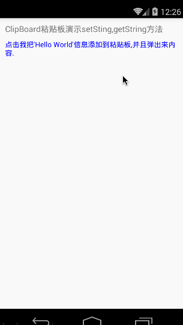

# React Native 控件之 Cilpboard 粘贴板使用详解(27)

## (一)前言

今天我们继续来看一下另外的一个控件粘贴板(Clipboard)的使用详解及实例。

刚创建的 React Native 技术交流 2 群(496601483),欢迎各位大牛,React Native 技术爱好者加入交流!同时博客右侧欢迎微信扫描关注订阅号,移动技术干货,精彩文章技术推送!

该组件是 Android、iOS 平台通用组件，调用粘贴板。该 Clipboard 组件可以复制信息保存到粘贴板中或者从粘贴板中取数据。该组件的实现核心代码[请点击查看](https://github.com/facebook/react-native/blob/46a8f1d8e0f2f779bc09395f02be1d0b71587482/Libraries/Components/Clipboard/Clipboard.js)

## (二)属性方法

1.setString(message:string)  static 静态方法  直接 Clipboard 调用该方法，设置相关内从到粘贴板中

2.getString()   static 静态方法   直接 Clipboard 调用该方法，从粘贴板中获取内容

## (三)实例方法

下面我们来用一个具体实例来演示一下 Clicpboard 组件的基本使用,实例代码如下:

```
/**
 * 简单演示 Clipboard 粘贴板的基本使用
 * https://github.com/facebook/react-native
 */
'use strict';
import React, {
  AppRegistry,
  Component,
  StyleSheet,
  Text,
  View,
  Clipboard,
  ToastAndroid,
} from 'react-native';
 
class ClipBoardDemo extends Component {
      constructor(props){
        super(props);
        this.state = {
            content:'需要保存的内容...',
 
        };
  }
  async _setClipboardContent(){
    Clipboard.setString('Hello World');
    try {
      var content = await Clipboard.getString();
      ToastAndroid.show('粘贴板的内容为:'+content,ToastAndroid.SHORT);
    } catch (e) {
      ToastAndroid.show(e.message,ToastAndroid.SHORT);
    }
  }
  render() {
    return (
      <View>
        <Text style={styles.welcome}>
            ClipBoard 粘贴板演示 setSting,getString 方法
        </Text>
        <Text onPress={this._setClipboardContent} style={{color: 'blue',marginLeft:10}}>
           点击我把'Hello World'信息添加到粘贴板,并且弹出来内容.
        </Text>
      </View>
    );
  }
}
const styles = StyleSheet.create({
  welcome: {
    fontSize: 16,
    textAlign: 'left',
    marginLeft:10,
    margin: 10,
  },
});
AppRegistry.registerComponent('ClipBoardDemo', () => ClipBoardDemo);
<span style="font-family: Georgia, 'Times New Roman', 'Bitstream Charter', Times, serif; font-size: 13px; line-height: 19px;">具体运行截图如下:</span>
```



## (四)AppState 实例

今天我们主要讲解学习了 Clipboard 粘贴板组件的详解以及使用，大家有问题可以加一下群 React Native 技术交流 2 群(496601483).或者底下进行回复一下。