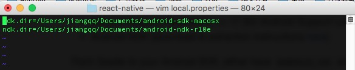

# React Native 配置运行官方例子-初学者的福音(8)

## (一)前言
特别说明:本系列专题文章的系统环境是 OS X,如果各位童鞋是 Windows 的话，出现运行安装等坑爹问题，还得重新排查解决哦~俗话说学习一样新东西的时候，例如这边我们要学 React Native 的组件使用，那么最好的学习资料就是官方提供的材料了，作作为开发人员最好的学习资料就是源码，幸好官方给我们提供了 UIExplorer 项目，这里边包含 React Native 的基本所有组件的使用介绍和方法。下面我们来把该项目进行运行起来，不过这边只暂时使用到 Android 项目哦~ iOS 的部分后期在进行讲解吧。请谅解哦~
刚创建的 React Native 技术交流群(282693535),欢迎各位大牛,React Native 技术爱好者加入交流!同时博客左侧欢迎微信扫描关注订阅号,移动技术干货,精彩文章技术推送!

##(二)运行 APP 工作
2.1.React Native 项目源码下载
React Native 项目官方地址:https://github.com/facebook/react-native 我们可以使用如下命令把代码 clone 到本地。

```
git clone https://github.com/facebook/react-native.git
```

具体项目结构如下:


2.2.Android 环境要求如下，请确保你的环境已经达到如下要求:
1. Android Sdk 版本 23(在 build.gradle 中的 compileSdkVersion)
2. SDK build tools version 23.0.1(build.gradle 中 buildToolsVersion)
3. Android Support Repository>=17
4. Andoid NDK 需要安装好
[注]以上第1点到第3点的版本不需要和我这边一样，可以根据实际情况走，不过最好是最新版本哦~
2.3.下面开始下载 NDK 以及配置
1.去官网下载 NDK 项目(注意科学上网):http://developer.android.com/ndk/dowloads/index.html


我的系统是 OS X，所以下载了 Mac 版本 NDK 了(NDK 项目名:android-ndk-r10e-darwin-x86_64.bin)。
然后切换到该 NDK 文件所在目录运行如下命令进行改变权限以及解压缩即可了。

```
chmod a+x android-ndk-r10e-darwin-x86_64.bin
```


接着运行解压缩命令,进行解压缩 NDK

```
./android-ndk-r10e-darwin-x86_64.bin
```


2.4.react-native 项目中添加 local.properties 文件，其中配置一下 Android SDK 和 Android NDK 的路径即可。
我们在 clone 出来的 react-native 项目的根目录创建 local.properties 文件，文件中添加信息如下:



[注]以上里面的路径信息根据我本机的路径走得，实际情况还要看各位的 SDK 和 NDK 的路径。
2.5.添加 Node 依赖模块:该命令行需要切到 react-native 项目中,主要运行如下命令

```
cd react-native
```

以及

```
npm install
```

这样就添加了 Node_Modules 模块(其中包含了 react-native 核心库)
2.6.运行相应 Demo(这边主要演示 UIExplorer 项目，其他项目运行方法相似)

[【特别注意】windows 版本 shell 脚本不能执行问题，请点击进入解决方案](http://www.lcode.org/%e3%80%90react-native%e5%bc%80%e5%8f%91%e3%80%91react-native%e9%85%8d%e7%bd%ae%e8%bf%90%e8%a1%8c%e5%ae%98%e6%96%b9%e4%be%8b%e5%ad%90-%e5%88%9d%e5%ad%a6%e8%80%85%e7%9a%84%e7%a6%8f%e9%9f%b38/)
以上的步骤大家如果已经全部走完了之后，下面运行如下命令进行编译安装即可:

```
./gradlew :Example:UIExplorer:android:app:installDebug
```


接着运行如下命令带起服务器,然后点击打开模拟器中的 APP

```
./packager/packager.sh
```


最终运行效果如下:


上面我们完成了 react-native 基础 UI 组件实例项目的运行,对于其他 Demo，例如 Movies，其实方法差不多的，大家可以测试一下，举例如下:

```
./gradlew :Examples:Movies:android:app:installDebug
```

## (三)最后总结
今天我们主要给大家介绍了运行 react-native 项目中实例项目，例如 UIExplorer 项目，该里面包含了基本所有的组件的使用方式，而且介绍的非常详细对于初学者来说，就是很好的学习入门的知识，也希望大家都能部署调试起来。大家有问题可以加一下群 React Native 技术交流群(282693535)或者底下进行回复一下。