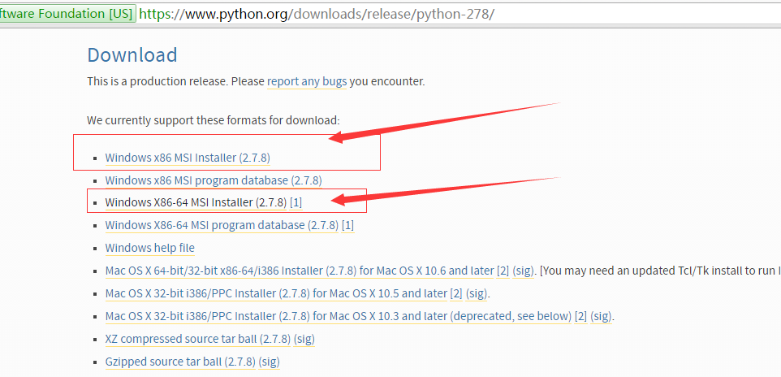

# 超详细 Windows 版本编译运行 React Native 官方实例 UIExplorer 项目(多图慎入)

## (一)前言
特别说明:群里很多童鞋都在说想 Windows 系统官方实例，但是官方提供的文档以及网上的例子都是 OS X 版本。今天特意给大家更新一下 Windows 版本运行官方 实例(UIExporler)全过程。俗话说学习一样新东西的时候，例如这边我们要学 React Native 的组件使用，那么最好的学习资料就是官方提供的材料了，作作为开发人员最好的学习资料就是源码，幸好官方给我们提供了 UIExplorer 项目，这里边包含 React Native 的基本所有组件的使用介绍和方法。下面我们来把该项目进行运行起来，不过这边只暂时使用到 Android 项目哦~ iOS 的部分后期在进行讲解吧。请谅解哦~
刚创建的 React Native 技术交流群(282693535),欢迎各位大牛,React Native 技术爱好者加入交流!同时博客右侧欢迎微信扫描关注订阅号,移动技术干货,精彩文章技术推送!

[关于 React Native 各种疑难杂症,问题深坑总结方案请点击查看:](http://www.lcode.org/react-native%E7%96%91%E9%9A%BE%E7%82%B9%E9%97%AE%E9%A2%98%E6%B7%B1%E5%9D%91%E6%9C%80%E5%BC%BA%E6%80%BB%E7%BB%93%E5%B8%96%E4%B8%8D%E6%96%AD%E6%9B%B4%E6%96%B0%E4%B8%AD/)

[Mac OS X 版本编译运行官方实例请点击查看:](http://www.lcode.org/%E3%80%90react-native%E5%BC%80%E5%8F%91%E3%80%91react-native%E9%85%8D%E7%BD%AE%E8%BF%90%E8%A1%8C%E5%AE%98%E6%96%B9%E4%BE%8B%E5%AD%90-%E5%88%9D%E5%AD%A6%E8%80%85%E7%9A%84%E7%A6%8F%E9%9F%B38/)

## (二)运行 APP 工作

【注意】本文章的前置条件，需要你 Windows 环境正确安装了 React Native 环境:点击进入 Windows 系统安装配置 React Native 教程。
2.1.React Native 项目源码下载
React Native 项目官方地址:https://github.com/facebook/react-native 我们可以使用如下命令把代码 clone 到本地。

```
git clone https://github.com/facebook/react-native.git
```

具体项目结构如下:


2.2.Android 环境要求如下，请确保你的环境已经达到如下要求:
1. Android Sdk 版本 23(在 build.gradle 中的 compileSdkVersion)
2. SDK build tools version 23.0.1(build.gradle 中 buildToolsVersion)
3. Android Support Repository>=17
4. Andoid NDK 需要安装以及配置

5. Cygwin 安装
[注]以上第①点到第③点的版本不需要和我这边一样，可以根据实际情况走，不过最好是最新版本哦~

2.3.下载安装 cygwin 软件

根据官方提供的文档我们需要执行类似于./packager/packager.sh 这样的 shell 脚本，普通的 Windows 系统是无法执行这样的脚本的。所以我们的 Windows 系统可以下载安装 cygwin 之后就可以执行 shell 脚本啦。下载地址: https://www.cygwin.com/去下载对应的版本即可了。


下载完成开始安装:


选择从网络(Internet)进行安装，点击下一步:


安装路径尽量采用英文(不要中文),然后默认选择下一步就行了.


选择下载的镜像:


这一步，我们选择需要下载安装的组件包，为了使我们安装的 Cygwin 能够编译程序，我们需要安装 gcc 编译 器，默认情况下，gcc 并不会被安装，我们需要选中它来安装。为了安装 gcc，我们用鼠标点开组件列表中的“Devel”分支，在该分支下，有很多组件， 我们必须的是：

1. binutils
2. gcc
3. gcc-mingw
4. gdb


需要安装的组件选择完成之后开始下一步组件安装啦~


最终安装组件完成


下面我们在系统环境变量 PATH 中添加我们 cygwin 的 bin 目录这样我们就可以通过命令行界面直接使用 bash 进入 cygwin 环境啦~


配置完成之后，重启命令行终端，然后敲入 bash 命令进入如下界面，就代表 OK 了


2.4.下载安装 NDK 然后安装以及配置

因为官方的实例是需要进行安装配置 NDK 的，所以大家需要去官方网站进行下载(请注意科学上网) http://developer.android.com/ndk/dowloads/index.html  大家下载自己系统对应的版本即可。下载成功之后解压缩，然后环境变量创建 ANDROID_NDK 配置一下即可


2.5.添加 Node 依赖模块:该命令行需要切到 react-native 项目中,主要运行如下命令

```
cd react-native
```

以及

```
npm install
```

这样就添加了 node_modules 模块(其中包含了 react-native 核心库)

突然运行发现错误了:


这个是 npm 的版本问题，该 npm2 的版本不支持 windows 系统，所以我们需要进行升级。

首先通过 npm version 查看当前的版本,然后升级到指定版本([npm 升级方法点击进入](http://jingyan.baidu.com/article/ac6a9a5e60a44f2b653eac85.html))


升级成功如下:


然后复制 C:\Users\{你的 Windows 用户名}\AppData\Roaming\npm\node_modules\npm 下的文件到你的 NodeJS 安装目录下的 \node_modules\npm 中，覆盖掉原有的全部文件；

接下来重新在刚刚 react-native 中运行 npm install 命令即可.

有预感的还是出现错误啦!


出现错误发现我们电脑没有安装 python 模块，有些童鞋这个错误可能不会出现的~那我们继续开始安装 python 模块吧。

下载地址: https://www.python.org/downloads/release/python-278/

大家根据自己的电脑系统以及版本进行下载安装吧

【特别注意】python 版本请选择 2.5-3.0 之间的版本哦~



下载安装配置一下环境变量即可


然后打开命令行执行 python,看到如下信息就成功安装 python 了


上面这些支持项已经全部安装了，下载切换到 rect-native 项目重新执行 npm install 开始添加 mode 模块吧


2.6.开始编译官方实例 UIExploerer 项目

打开之前安装的 cygwin 终端，切换到当前 react-native 项目中。注意切换路径方法以实际项目路径为准


运行如下命令开始编译安装我们的官方实例

```
./gradlew :Example:UIExplorer:android:app:installDebug
```


这边花的时间要看网络情况的，有时候速度会非常慢，等大家耐心等待~

接下来就是最关键的一步啦~执行如下命令进行打包启动服务.

```
./packager/packager.sh
```


OK 这样我的服务已经启动起来，大家只需要去设备中点击打开 APP 即可

最后我们来看一下官方实例 UIExplorer 的运行效果


## (三)最后总结

今天主要给大家演示一下 Windows 版本编译运行 React Native 官方实例 UIExplorer 项目，至于其他几个实例只要把命令改一下就行了，各位童鞋举一反三吧。