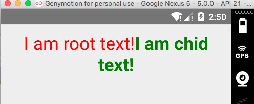
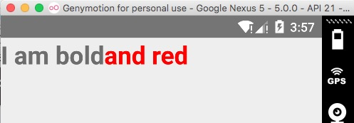
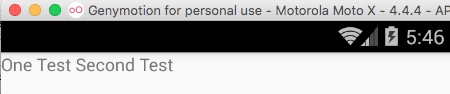
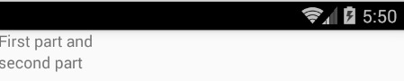
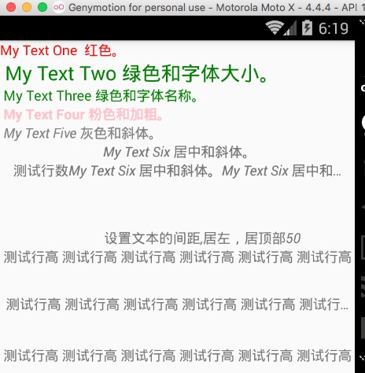

# React Native 控件之 Text 组件讲解

## (一)前言

今天我们一起来看一下 Text 控件的具体介绍和使用方法，具体环境搭建以及相关配置的请查看之前的相关文章。
刚创建的 React Native 技术交流群(282693535),欢迎各位大牛,React Native 技术爱好者加入交流!同时博客左侧欢迎微信扫描关注订阅号,移动技术干货,精彩文章技术推送!
## (二)基本介绍
该 Text 组件为 React 中一个基本组件，该和 Android 中的 TextView 组件相类似用来显示基本的文本信息，该控件除了基本的显示布局之外，可以进行嵌套显示，设置样式，以及可以做事件(例如:点击)处理。下面我们来一个实例：

```
/**
 * 进行简单 Text 组件使用实例
 * Sample React Native App  test.android.js
 * https://github.com/facebook/react-native
 */
'use strict';
var React = require('react-native');
var {
  AppRegistry,
  Text,
  StyleSheet,
} = React;
 
var styles = StyleSheet.create({
     titleBase:{
        margin:10,
        textAlign:'center',
        color:'red',
        fontSize:28,
        fontFamily:'Cochin',
     },
     title:{
        color:'green',
        fontWeight:'bold',
     },
});
var TestText = React.createClass({
  render: function() {
    return (
      <Text style={styles.titleBase}>
         I am root text!
         <Text style={styles.title}>
              I am chid text!
          </Text>
      </Text>
    );
  }
});
AppRegistry.registerComponent('TestText', () => TestText);
```

具体运行效果如下:



上述实例采用 TextView 的嵌套方式，最外层的 Text 的 Style titleBase 定义相关风格，内层的风格 style 定义相关风格，我们可以看到运行效果，如果内层没有重写外层定义的样式，那么内层会进行继承。如果重写了样式，那么内层会根据自己定义的样式进行渲染，该和 CSS 样式表差不多。

上面例子主要定义了布局，字体大小，字体风格，颜色等相关样式，下面我们会着重进行讲解。

## (三)属性方法(主要一些可用的属性)
1. allowFontScaling (bool):控制字体是否根据 iOS 的设置进行自动缩放-iOS 平台,Android 平台不适用
2. numberOfLines (number):进行设置 Text 显示文本的行数，如果显示的内容超过了行数，默认其他多余的信息就不会显示了。
3. onLayout (function) 当布局位置发生变动的时候自动进行触发该方法, 其中该 function 的参数如下:
[code lang="" start="" highlight=""]{nativeEvent: {layout: {x, y, width, height}}}[/code]
4. onPress (fcuntion) 该方法当文本发生点击的时候调用该方法.

## (四)风格样式

1..继承可以使用 View 组件的所有 Style(具体查看 http://facebook.github.io/react-native/docs/view.html#style)
2.color:字体颜色
3..fontFamily 字体名称
4..fontSize  字体大小
5..fontStyle   字体风格(normal,italic)
6..fontWeight  字体粗细权重("normal", 'bold', '100', '200', '300', '400', '500', '600', '700', '800', '900')
7..textShadowOffset 设置阴影效果{width: number, height: number}
8..textShadowRadius 阴影效果圆角       9..textShadowColor 阴影效果的颜色
10.letterSpacing 字符间距            11.lineHeight 行高
12.textAlign   文本对其方式("auto", 'left', 'right', 'center', 'justify')
13.textDecorationLine  横线位置 ("none", 'underline', 'line-through', 'underline line-through')
14.textDecorationStyle   线的风格("solid", 'double', 'dotted', 'dashed')
15.textDecorationColor  线的颜色       16.writingDirection  文本方向("auto", 'ltr', 'rtl')

## (五)特别注意点

5.1.嵌套特点:和 Web 上面一直的设计方案，我们通过嵌套包裹的方案，相同的属性的文本可以用父标签进行包裹，然后内部特殊的文本采用子标签方案，具体例子如下:

```
<Text style={{fontWeight: 'bold',fontSize:28}}>
            I am bold
           <Text style={{color: 'red'}}>
              and red
          </Text>
     </Text>
```

具体运行效果如下:



我们看到整体字体格式为 bold 以及字体大小为 28，不过后边的'and red'的字体颜色为红色。

5.2.容器布局规则

之前我们介绍 View 组件，我们知道该组件是支持 FlexBox(弹性布局),但是 Text 组件直接是文本布局的，也就是说一个 Text 接着 Text，横向，如果文本已经到末尾了，那就直接换行。
我们来看一下具体实例代码:

```
<Text>
          <Text>One Test </Text>
          <Text>Second Test</Text>
      </Text>
```

运行截图如下:



这样我们可以看到两个 Text 直接横向排布，第二个 Text 直接接在第一个 Text 后面了。但是如果该父控件采用 View，View 是支持 FlexBox 布局的，具体看如下实例代码:

```
<View>
       <Text>First part and </Text>
       <Text>second part</Text>
</View>
```

默认垂直分布,运行结果如下:



5.3.样式继承规格

从以上一些例子中我们也发现了，组件可以嵌套，而且样式还支持继承，也就说父组件定义了相关样式，如果子组件没有重写样式的话，那么该子组件会继承父组件定义的样式。

## (六)Text 实例

下面使用以上一些属性和相关样式来演示一下实例:

```
/**
 *  Text 组件实例演示
 * Sample React Native App
 * https://github.com/facebook/react-native
 */
'use strict';
var React = require('react-native');
var {
  AppRegistry,
  Text,
  View,
  StyleSheet,
} = React;
var TestText = React.createClass({
  render: function() {
    return (
      <View>
       <Text style={{color:'red'}}>
          My Text One  红色。
       </Text>
       <Text style={{color:'green',fontSize:20}}> My Text Two 绿色和字体大小。</Text>
       <Text style={{color:'green',fontFamily:'Cochin'}}> My Text Three 绿色和字体名称。</Text>
       <Text style={{color:'pink',fontWeight:'bold'}}> My Text Four 粉色和加粗。</Text>
       <Text style={{color:'gray',fontStyle:'italic'}}> My Text Five 灰色和斜体。</Text>
       <Text style={{textAlign:'center',fontStyle:'italic'}}> My Text Six 居中和斜体。</Text>
       <Text numberOfLines={1} style={{textAlign:'center',fontStyle:'italic'}}>测试行数 My Text Six 居中和斜体。My Text Six 居中和斜体。 My Text Six 居中和斜体。</Text>
       <Text style={{marginLeft:50,marginTop:50,textAlign:'center',fontStyle:'italic'}}>设置文本的间距,居左，居顶部 50</Text>
       <Text numberOfLines={2} style={{lineHeight:50,textAlign:'center',fontStyle:'italic'}}>
          测试行高 测试行高 测试行高 测试行高 测试行高 测试行高 测试行高 测试行高 测试行高 测试行高 测试行高 
          测试行高 测试行高 测试行高 测试行高 测试行高 测试行高
       </Text>
      </View>
    );
  }
});
AppRegistry.registerComponent('TestText', () => TestText);
```

具体运行截图如下:



## (七)最后总结

今天我们主要给大家介绍 Text 组件的相关属性和样式的基本使用方法。大家有问题可以加一下群 React Native 技术交流群(282693535)或者底下进行回复一下。