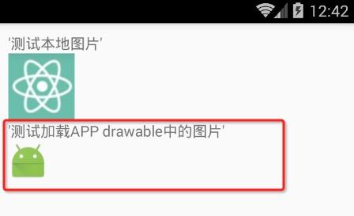
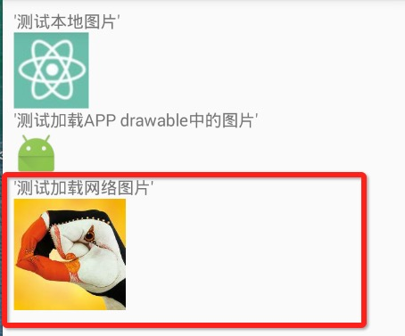

# React Native 控件之 Image 组件讲解与美团首页顶部效果实例(10)

## (一)前言
今天我们一起来看一下 Image 组件的相关使用讲解以及模仿实现一下美团首页顶部分类的效果。具体环境搭建以及相关配置的请查看之前的相关文章。刚创建的 React Native 技术交流群(282693535),欢迎各位大牛,React Native 技术爱好者加入交流!同时博客左侧欢迎微信扫描关注订阅号,移动技术干货,精彩文章技术推送!Image 是一个现实多种不同类型图片的 React 组件，可以进行加载网络图片，本地资源图片,打包的 APP 中的图片资源，以及磁盘例如:相册中的图片。

## (二)Image 基本用法

2.1.加载项目资源图片

从 0.14 版本开始 react native 支持加载我们项目目录中的图片资源，我现在在测试项目中创建一个 img 目录，在里边加入 my_icon.png 图片.，那么可以通过以下方式进行访问:

```
<View  style={{marginLeft:10,marginTop:10}}>
      <Text style={{fontSize:16}}>'测试本地图片'</Text>
      <Image source={require('./img/my_icon.png')} />
 </View>
```

运行结果如下:


该图片资源文件的查找和 JS 模块相似，该会根据填写的图片路径相对于当前的 js 文件路径进行搜索。RN 更加好的是 Packager 会根据平台选择相应的文件，例如:my_icon.ios.png 和 my_icon.android.png 两个文件(命名方式 android 或者 ios)。该会根据 android 或者 ios 平台选择相应的文件。

对于 iOS 开发来讲，大家肯定会知道我们经常可以设置@2X，@2X 等格式的图片来进行适配手机屏幕，例如:my_icon@2x.png 或者 my_icon@3x.png。这样的话 Packager 进行打包的时候会根据屏幕的不同密度进行选择显示对应的图片。如果没有恰好的满足当前屏幕的分辨率，那么会选择最接近的那个图片资源。

[注意].这边使用 Image 组件，require 中的图片名称必须为一个静态的字符串信息。不能在 require 中进行拼接。例如:

```
<Image source={require('./img/my_icon'+'.png')} />
```

这样之后运行就报错了:


2.2.加载使用 APP 中的图片

现阶段做原生 APP 的需求还是比较多的，不过现在使用了 React  Native 之后，我们可以进行混合开发 APP(一部分采用 React Native，另一部分采用原生平台代码).甚至可以使用已经打包在 APP 中的图片资源(例如:xcode asset 文件夹以及 Android drawable 文件夹)

例如如下代码我们获取 android 项目中的 app_icon 图片，并且设置图片的尺寸带 40x40

```
<Image source={{uri:'ic_launcher'}} style={{width: 40, height: 40}} />
```

不过如果要显示效果：希望大家做如下修改，因为现在 android 项目采用 gradle，现在不会默认生成 drawable 文件夹中了，所以大家如果要演示效果，需要在 res 下面新建一个 drawable 文件夹，然后放一个图片进入，接着在重新打包运行即可(这边测试的是把 ic_launcher.png 图片放入到 res/drawable 文件夹中)。不过经测试 drawable-hdpi 这类的不同分辨率格式文件夹也可以运行。

该适用于调试版本，如果采用发布版本就需要例如'image!xx.png'格式的访问方式了

运行效果如下:



2.2.加载使用 APP 中的图片

客户端的很多图片资源基本上都是实时通过网络进行获取的，该写法和上面的加载本地资源图片的方式不太一样，这边一定需要指定图片的尺寸大小,具体代码示例代码如下:

```
<Image source={{uri:'http://img2.xxh.cc:8080/images/ZTT_1404756641470_image.jpg'}}  style={{width:100,height:100}}/>
```

加载网络图片效果如下:



2.3.Image 实现某些控件的背景图效果

React Native 中支持嵌套的方式，例如我们现在有一个 Text 组件，假如要实现背景图的效果，那么可以使用 Image 嵌套的 Text 的方式，然后 Image 加载图片方式实现,例如代码如下:

```
<Image source={require('./img/my_icon.png')} >
           <Text style={{color:'red'}}>下面是背景图</Text>
</Image>
```

具体掩饰效果如下：我们发现 Text 组件文本底部是一个图片的背景


## (三)Image 属性方法

1.onLayout   (function) 当 Image 布局发生改变的，会进行调用该方法，调用的代码为:

{nativeEvent: {layout: {x, y, width, height}}}.

2.onLoad (function):当图片加载成功之后，回调该方法

3.onLoadEnd (function):当图片加载失败回调该方法，该不会管图片加载成功还是失败

4.onLoadStart (fcuntion):当图片开始加载的时候调用该方法

5.resizeMode  缩放比例,可选参数('cover', 'contain', 'stretch') 该当图片的尺寸超过布局的尺寸的时候，会根据设置 Mode 进行缩放或者裁剪图片

6.source {uri:string} 进行标记图片的引用，该参数可以为一个网络 url 地址或者一个本地的路径

## (四)Image 样式风格

1.FlexBox  支持弹性盒子风格

2.Transforms  支持属性动画                3.resizeMode  设置缩放模式

4.backgroundColor 背景颜色

5.borderColor     边框颜色              6.borderWidth 边框宽度

7.borderRadius  边框圆角

8.overflow 设置图片尺寸超过容器可以设置显示或者隐藏('visible','hidden')

9.tintColor  颜色设置         10.opacity 设置不透明度 0.0(透明)-1.0(完全不透明)

## (五)Image 实例-仿照美团首页顶部分类

下面我们模仿一下美团首页的顶部分类的效果，也算是总结了前面所学的 View，Text 和今天的 Image 组件，具体代码如下:

```
/**
 * 模仿美团首页顶部分类效果
 * Sample React Native App
 * https://github.com/facebook/react-native
 */
'use strict';
import React, {
  AppRegistry,
  Component,
  StyleSheet,
  Text,
  View,
  Image,
} from 'react-native';
class TestImage extends Component {
  render() {
    return (
      <View style={{marginLeft:5,marginTop:10,marginRight:5}}>
       
         <View style={{flexDirection:'row'}}>
             <View style={{width:70}}>
                 <Image source={require('./img/one.png')} style={{alignSelf:'center',width:45,height:45}} />
                 <Text style={{marginTop:5,textAlign:'center',fontSize:11,color:'#555555'}}>美食</Text>
             </View>
              <View style={{width:70}}>
                 <Image source={require('./img/two.png')} style={{alignSelf:'center',width:45,height:45}} />
                 <Text style={{marginTop:5,alignSelf:'center',fontSize:11,color:'#555555',textAlign:'center'}}>电影</Text>
             </View>
             <View style={{width:70}}>
                 <Image source={require('./img/three.png')} style={{alignSelf:'center',width:45,height:45}} />
                 <Text style={{marginTop:5,alignSelf:'center',fontSize:11,color:'#555555',textAlign:'center'}}>酒店</Text>
             </View>
             <View style={{width:70}}>
                 <Image source={require('./img/four.png')} style={{alignSelf:'center',width:45,height:45}} />
                 <Text style={{marginTop:5,alignSelf:'center',fontSize:11,color:'#555555',textAlign:'center'}}>KTV</Text>
             </View>
             <View style={{width:70}}>
                 <Image source={require('./img/five.png')} style={{alignSelf:'center',width:45,height:45}} />
                 <Text style={{marginTop:5,alignSelf:'center',fontSize:11,color:'#555555',textAlign:'center'}}>外卖</Text>
             </View>
          </View>
          <View style={{flexDirection:'row',marginTop:10}}>
             <View style={{width:70}}>
                 <Image source={require('./img/six.png')} style={{alignSelf:'center',width:45,height:45}} />
                 <Text style={{marginTop:5,textAlign:'center',fontSize:11,color:'#555555'}}>优惠买单</Text>
             </View>
              <View style={{width:70}}>
                 <Image source={require('./img/seven.png')} style={{alignSelf:'center',width:45,height:45}} />
                 <Text style={{marginTop:5,alignSelf:'center',fontSize:11,color:'#555555',textAlign:'center'}}>周边游</Text>
             </View>
             <View style={{width:70}}>
                 <Image source={require('./img/eight.png')} style={{alignSelf:'center',width:45,height:45}} />
                 <Text style={{marginTop:5,alignSelf:'center',fontSize:11,color:'#555555',textAlign:'center'}}>休闲娱乐</Text>
             </View>
             <View style={{width:70}}>
                 <Image source={require('./img/nine.png')} style={{alignSelf:'center',width:45,height:45}} />
                 <Text style={{marginTop:5,alignSelf:'center',fontSize:11,color:'#555555',textAlign:'center'}}>今日新单</Text>
             </View>
             <View style={{width:70}}>
                 <Image source={require('./img/ten.png')} style={{alignSelf:'center',width:45,height:45}} />
                 <Text style={{marginTop:5,alignSelf:'center',fontSize:11,color:'#555555',textAlign:'center'}}>丽人</Text>
             </View>
          </View>
      </View>
    );
  }
}
AppRegistry.registerComponent('TestImage', () => TestImage);
```

注以上的代码的样式没有重构 单独用 StyleSheet 写，具体运行效果如下：


## (六)最后总结

今天我们主要给大家介绍 Image 组件，以及通过一个具体实例把之前的 View 和 Text 组件的基本使用串联了一下。大家有问题可以加一下群 React Native 技术交流群(282693535)或者底下进行回复一下。