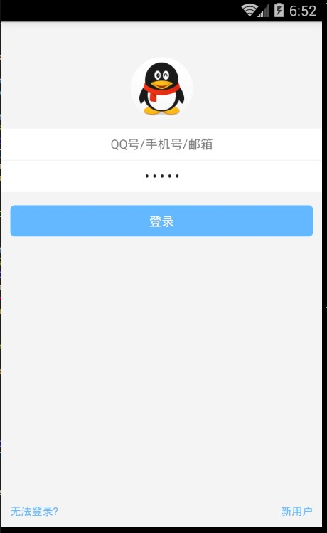

# React Native 控件之 TextInput 组件讲解与 QQ 登录界面实现(11)

## (一)前言
今天我们一起来看一下文本输入框 TextInput 组件的相关使用讲解以及模仿实现一下 QQ 登录界面的效果。具体环境搭建以及相关配置的请查看之前的相关文章。

刚创建的 React Native 技术交流群(282693535),欢迎各位大牛,React Native 技术爱好者加入交流!同时博客右侧欢迎微信扫描关注订阅号,移动技术干货,精彩文章技术推送!

TextInput 组件允许用户在应用中通过键盘进行输入文本信息。并且该组件还提供了多种配置属性例如:自动拼写修复,自动大小写切换,占位默认字符设置以及多种不同类型的键盘切换例如:我们可以弹出数字键盘。

## (二)实例
TextInput 组件和前面讲的 Image 或者 Text 组件差不多，用起来都非常简单。我们直接在应用中添加一个 TextInput 组件，然后给该组件添加相关属性(例:边框颜色,粗细,背景,默认值)以及监听方法(例如:输入信息,焦点变化等事件)。我们首先看一下官方提供的一个简单例子:

```
<TextInput
    style={{height: 40, borderColor: 'gray', borderWidth: 1}}
    onChangeText={(text) => this.setState({text})}
    value={this.state.text}
  />
```

该直接定义了 TextInput 组件，同时设置组件的风格高度,变宽粗细以及边框颜色。并且我们这边监听了 TextInput 的 onChangeText 的事件来进行获取用户的输入信息。除了该监听事件方法以外还有 onSubmitEditing(提交编辑)以及 onFoucs(输入框获取焦点的时候调用)等相关的监听方法。

下面在演示另外一个 TextInput 实例，该创建了三个 TextInput，同时每个 TextInput 都添加了默认信息(hit)，第一个 TextInput 组件设置高度 40,边框粗细和边框的颜色，切可以输入多行信息。第二个 TextInput 设置左右额边距以及自动获取到焦点。第三个 TextInput 设置不可编辑状态。具体代码如下:

```
<View style={styles.container}>
       <Text style={styles.welcome}>
         Welcome to React Native!
       </Text>
        <TextInput style={{height:40,borderColor:'red',borderWidth:1}}
         multiline={true}
         defaultValue='默认信息 1'
        />
       <TextInput 
           style={{marginLeft:10,marginRight:10}}
           autoFocus={true}
           defaultValue='默认信息 2'/>
       <TextInput 
           editable={false}
           defaultValue='默认信息 3'/>
     </View>
```

具体运行效果如下:


(三)属性方法(这边讲解平台公用以及 Android 生效的属性方法)
3.1.View 支持 View 的相关属性
3.2.autoCapitalize  控制 TextInput 输入的字符进行切换成大写(可选择参数:'none', 'sentences', 'words', 'characters')

  - none:不自动切换任何字符成大写
  - sentences:默认每个句子的首字母变成大写
  - words:每个单词的首字母变成大写
  - characters:每个字母全部变成大写
3.3.autoCorrect  bool  设置拼写自动修正功能 默认为开启(true)
3.4.autoFocus bool  设置是否默认获取到焦点默认为关闭(false)。该需要 componentDidMount 方法被调用之后才会获取焦点哦(componentDidMount 是 React 组件被渲染之后 React 主动回调的方法)
3.5.defaultValue  string 给文本输入设置一个默认初始值。
3.6.editable bool  设置文本框是否可以编辑 默认值为 true,可以进行编辑
3.7.keyboardType  键盘类型(可选参数:"default", 'email-address', 'numeric', 'phone-pad', "ascii-capable", 'numbers-and-punctuation', 'url', 'number-pad', 'name-phone-pad', 'decimal-pad', 'twitter', 'web-search') 该用来选择默认弹出键盘的类型例如我们甚至 numeric 就是弹出数字键盘。鉴于平台的原因如下的值是所有平台都可以进行通用的

  - default
  - numeric            数字键盘
  - email-address  邮箱地址
3.8.maxLength  number  可以限制文本输入框最大的输入字符长度
3.9.multiline bool  设置可以输入多行文字，默认为 false(表示无论文本输入多少，都是单行显示)
3.10.onBlur  function 监听方法，文本框失去焦点回调方法
3.11.onChange function 监听方法,文本框内容发生改变回调方法
3.12.onChangeText  function 监听方法，文本框内容发生改变回调方法，该方法会进行传递文本内容
3.13.onEndEditing  function 监听方法，当文本结束文本输入回调方法
3.14.onFocus  function 监听方法  文本框获取到焦点回调方法
3.15.onLayout  function 监听方法  组价布局发生变化的时候调用，调用方法参数为 {x,y,width,height}
3.16.onSubmitEditing function 监听方法，当编辑提交的时候回调方法。不过如果 multiline={true}的时候，该属性就不生效
3.17.placeholer string 当文本输入框还没有任何输入的时候，默认显示信息，当有输入的时候该值会被清除
3.18.placeholerText Color  string 设置默认信息颜色(placeholer)
3.19.secureTextEntry  bool 设置是否为密码安全输入框 ，默认为 false
3.20.style 风格属性  可以参考 Text 组件风格
3.21.value  string 输入框中的内容值
以上是一些 Android，iOS 平台通用的属性，下面根据官网的文档，我这边组要讲解一下适用于 Android 平台的属性方法
3.22.numberOfLines number 设置文本输入框行数，该需要首先设置 multiline 为 true,设置 TextInput 为多行文本。
3.23.textAlign 设置文本横向布局方式 可选参数('start', 'center', 'end')
3.24.textAlignVertical 设置文本垂直方向布局方式 可选参数('top', 'center', 'bottom')
3.25.underlineColorAndroid  设置文本输入框下划线的颜色

## (四)TextInput 实战-仿照 QQ 登录界面
下面我们来仿照 QQ 登录界面的效果，进行布局一下，具体实现代码如下:

```
/**
 * Sample React Native App
 * https://github.com/facebook/react-native
 */
'use strict';
import React, {
  AppRegistry,
  Component,
  StyleSheet,
  Text,
  Image,
  View,
  TextInput,
} from 'react-native';
 
class TestInput extends Component {
  render() {
    return (
      <View style={{backgroundColor:'#f4f4f4',flex:1}}>
          <Image
              style={styles.style_image} 
              source={require('./img/app_icon.png')}/>
          <TextInput 
              style={styles.style_user_input}
              placeholder='QQ 号/手机号/邮箱'
              numberOfLines={1}
              autoFocus={true}
              underlineColorAndroid={'transparent'} 
              textAlign='center'
          />
          <View
              style={{height:1,backgroundColor:'#f4f4f4'}}
          />
          <TextInput 
              style={styles.style_pwd_input}
              placeholder='密码'
              numberOfLines={1}
              underlineColorAndroid={'transparent'} 
              secureTextEntry={true}
              textAlign='center'
          />
          <View 
              style={styles.style_view_commit}
           >
            <Text style={{color:'#fff'}}>
               登录
            </Text>
 
          </View>
 
          <View style={{flex:1,flexDirection:'row',alignItems: 'flex-end',bottom:10}}>
             <Text style={styles.style_view_unlogin}>
                 无法登录?
            </Text>
            <Text style={styles.style_view_register}>
                 新用户
            </Text>
          </View>
      </View>
    );
  }
}
const styles = StyleSheet.create({
  style_image:{
    borderRadius:35,
    height:70,
    width:70,
    marginTop:40,
    alignSelf:'center',
  },
  style_user_input:{  
      backgroundColor:'#fff',
      marginTop:10,
      height:35,
  },
   style_pwd_input:{  
      backgroundColor:'#fff',
      height:35,
  },
   style_view_commit:{  
      marginTop:15,
      marginLeft:10,
      marginRight:10,
      backgroundColor:'#63B8FF',
      height:35,
      borderRadius:5,
      justifyContent: 'center',
      alignItems: 'center',
  },
  style_view_unlogin:{
    fontSize:12,
    color:'#63B8FF',
    marginLeft:10,
  },
  style_view_register:{
    fontSize:12,
    color:'#63B8FF',
    marginRight:10,
    alignItems:'flex-end',
    flex:1,
    flexDirection:'row',
    textAlign:'right',
  }
});
 
AppRegistry.registerComponent('TestInput', () => TestInput);
```

运行效果如下:



## (五)最后总结

今天我们主要给大家介绍 TextInput 组件，以及通过一个 QQ 登录界面具体实例把之前的 View,Text,Image 组件的基本使用串联了一下。大家有问题可以加一下群 React Native 技术交流群(282693535)或者底下进行回复一下。