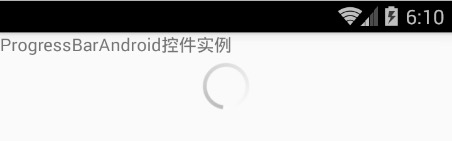
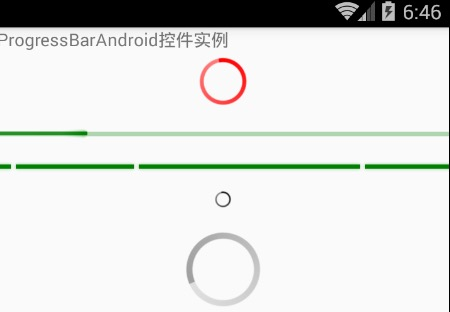

# React Native 控件之 ProgressBarAndroid 进度条讲解(12)

## (一)前言

今天我们一起来看一下进度加载条 ProgressBarAndroid 控件的讲解与基本使用。

刚创建的 React Native 技术交流群(282693535),欢迎各位大牛,React Native 技术爱好者加入交流!同时博客右侧欢迎微信扫描关注订阅号,移动技术干货,精彩文章技术推送!

该 ProgressBarAndroid 的 React 组件进行封装了 Android 平台的 ProgressBar 控件。该组件用于显示 APP 中的内容加载过程中的进度信息。

## (二)使用介绍

ProgressBarAndroid 控件使用起来相对来讲还是非常简单的。首先我们来看一下官方的写的一个例子:

```
render: function() {
  var progressBar =
    <View style={styles.container}>
      <ProgressBar styleAttr="Inverse" />
    </View>;
 
  return (
    <MyLoadingComponent
      componentView={componentView}
      loadingView={progressBar}
      style={styles.loadingComponent}
    />
  );
},
```

但是大家仔细看以上的代码会发现：这里面的标签怎么是 ProgressBar 呢？其实官方文档这些写是有一点误导性的，如果你直接这样写，肯定会报错，查看官方 Demo 例子你会发现在该例子文件顶端需要引入 ProgressBarAndroid 组件如下:

```
var ProgressBar = require('ProgressBarAndroid');
```

下面我直接采用 ProgressBarAndroi 来实现一个最最简单的例子，代码如下:

```
<View >
        <Text>
            ProgressBarAndroid 控件实例
        </Text>
        <ProgressBarAndroid styleAttr='Inverse'/>
</View>
```

运行效果如下:



## (三)属性方法

3.1.支持 View 控件的属性方法 (这些属性是从 View 控件中继承下来)  例如:大小,布局,边距啊

3.2.color  设置进度的颜色属性值

3.3.indeterminate 设置是否要显示一个默认的进度信息，该如果 styleAttr 的风格设置成 Horizontal 的时候该值必须设置成 false

3.4.progress  number  设置当前的加载进度值(该值在 0-1 之间)

3.5.styleAttr    进度条框的风格 ，可以取的值如下:

  - Horizontal
  - Small
  - Large
  - Inverse
  - SmallInverse
  - LargeInverse

## (四)ProgressBarAndroid 使用实例

以上是整体 ProgressBarAndroid 的基本介绍，下面我们使用上面的各种风格来实现以下效果实例,具体代码如下:

```
'use strict';
import React, {
  AppRegistry,
  Component,
  StyleSheet,
  Text,
  View,
  ProgressBarAndroid,
} from 'react-native';
 
class ProgressBarDemo extends Component {
  render() {
    return (
      <View >
        <Text>
            ProgressBarAndroid 控件实例
        </Text>
        <ProgressBarAndroid  color="red" styleAttr='Inverse'/>
        <ProgressBarAndroid  color="green" styleAttr='Horizontal' progress={0.2} 
            indeterminate={false} style={{marginTop:10}}/>
        <ProgressBarAndroid  color="green" styleAttr='Horizontal'
            indeterminate={true} style={{marginTop:10}}/>
        <ProgressBarAndroid  color="black" styleAttr='SmallInverse'
            style={{marginTop:10}}/>
        <ProgressBarAndroid  styleAttr='LargeInverse'
            style={{marginTop:10}}/>
      </View>
    );
  }
}
AppRegistry.registerComponent('ProgressBarDemo', () => ProgressBarDemo);
```

整体运行效果如下:



## (五)最后总结

今天我们主要学习一下 ProgressBarAndroid 加载进度框组件的使用方法。大家有问题可以加一下群 React Native 技术交流群(282693535)或者底下进行回复一下。