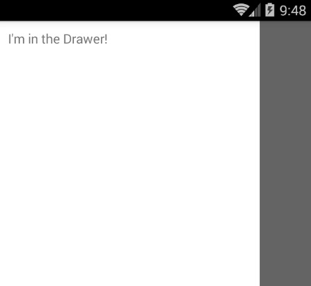
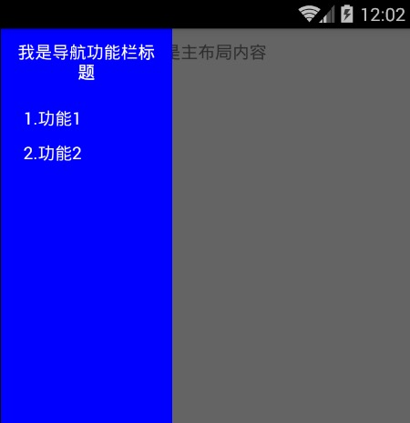

# React Native 控件之 DrawerLayoutAndroid 抽屉导航切换组件讲解(13)

## (一)前言

今天我们一起来看一下抽屉 DrawerLayoutAndroid 导航切换控件的讲解与基本使用。

刚创建的 React Native 技术交流群(282693535),欢迎各位大牛,React Native 技术爱好者加入交流!同时博客左侧欢迎微信扫描关注订阅号,移动技术干货,精彩文章技术推送!

该 DrawerLayoutAndroid 组件封装了 Android 平台的 DrawerLayout 控件(只限定与 Android 平台)。该抽屉页面(经常用于导航页面)是通过 renderNavigationView 进行渲染的。该 DrawerLayoutAndroid 的中的子视图会变成主视图(主要用于放置内容)。我们知道导航菜单中。导航栏的视图在屏幕中一开始是隐藏的，但是我们可以通过 drawerPostition 指定位置进行把导航视图拖拽出来，最终拖拽出来的距离大小可以使用 drawerWidth 属性进行指定。

## (二)使用基本介绍

该控件用起来也还是相对比较简单的，只要熟悉一下其中基本的属性和方法即可，下面来看官方的一个实例:

```
/**
 * Sample React Native App
 * https://github.com/facebook/react-native
 */
'use strict';
import React, {
  AppRegistry,
  Component,
  StyleSheet,
  Text,
  View,
  DrawerLayoutAndroid,
} from 'react-native';
 
class DrawerLayoutDemo extends Component {
  render() {
    var navigationView = (
    <View style={{flex: 1, backgroundColor: '#fff'}}>
      <Text style={{margin: 10, fontSize: 15, textAlign: 'left'}}>I'm in the Drawer!</Text>
    </View>
  );
  return (
    <DrawerLayoutAndroid
      drawerWidth={300}
      drawerPosition={DrawerLayoutAndroid.positions.Left}
      renderNavigationView={() => navigationView}>
      <View style={{flex: 1, alignItems: 'center'}}>
        <Text style={{margin: 10, fontSize: 15, textAlign: 'right'}}>Hello</Text>
        <Text style={{margin: 10, fontSize: 15, textAlign: 'right'}}>World!</Text>
      </View>
    </DrawerLayoutAndroid>
   );
  }
}
const styles = StyleSheet.create({
});
AppRegistry.registerComponent('DrawerLayoutDemo', () => DrawerLayoutDemo);
```

运行效果如下:



## (三)使用基本介绍

3.1.View 的属性使用  继承了 View 控件的属性信息(例如:宽和高,背景颜色,边距等相关属性样式)

3.2.drawerPosition   参数为枚举类型(DrawerConsts.DrawerPosition.Left, DrawerConsts.DrawerPosition.Right)

进行指定导航菜单用那一侧进行滑动出来，根据官方实例最终传入的两个枚举值分别    为:DrawerLayoutAndroid.positions.Left 和 DrawerLayoutAndroid.positions.Right

3.3.drawerWidth  进行指定导航菜单视图的宽度，也就是说该侧面导航视图可以从屏幕边缘拖拽到屏幕的宽度距离

3.4.keyboardDismissMode    参数为枚举类型('none','on-drag') 进行指定在导航视图拖拽的过程中是否要隐藏键盘

  - none   (默认值),默认不会隐藏键盘
  - on-drag  当拖拽开始的时候进行隐藏键盘
3.5.onDrawerClose   function 方法 当导航视图被关闭后进行回调该方法

3.6.onDrawerOpen   function 方法 当导航视图被打开后进行回调该方法

3.7.onDrawerSlide  function  方法  当导航视图和用户进行交互的时候调用该方法

3.8.onDrawerStateChanged function 方法，该当导航视图的状态发生变化的时候调用该方法。该状态会有以下三种状态

  - idle (空闲) 表示导航视图上面没有任何交互状态
  - dragging (正在拖拽中)   表示用户正在和导航视图产生交互动作
  - settling (暂停-刚刚结束)  表示用户 刚刚结束和导航视图的交互动作，当前导航视图正在打开或者关闭拖拽滑动动画效果
3.9.renderNavigationView  function 方法，该方法进行渲染一个导航抽屉的视图(用于用户从屏幕边缘拖拽出来)

## (四)DrawerLayoutAndroid 使用实例

具体基本使用实例代码如下:

```
/**
 * Sample React Native App
 * https://github.com/facebook/react-native
 */
'use strict';
import React, {
  AppRegistry,
  Component,
  StyleSheet,
  Text,
  View,
  DrawerLayoutAndroid,
} from 'react-native';
 
class DrawerLayoutDemo extends Component {
  render() {
    var navigationView = (
    <View style={{flex: 1, backgroundColor: 'blue'}}>
      <Text style={{margin: 10,color:'#fff',fontSize: 15, textAlign: 'center'}}>我是导航功能栏标题</Text>
      <Text style={{marginTop: 10,marginLeft:20,color:'#fff',fontSize: 15, textAlign: 'left'}}>1.功能 1</Text>
      <Text style={{marginTop: 10,marginLeft:20,color:'#fff',fontSize: 15, textAlign: 'left'}}>2.功能 2</Text>
    </View>
  );
  return (
    <DrawerLayoutAndroid
      drawerWidth={150}
      drawerPosition={DrawerLayoutAndroid.positions.left}
      renderNavigationView={() => navigationView}>
      <View style={{flex: 1, alignItems: 'center'}}>
        <Text style={{margin: 10, fontSize: 15, textAlign: 'right'}}>我是主布局内容</Text>
      </View>
    </DrawerLayoutAndroid>
   );
  }
}
const styles = StyleSheet.create({
});
AppRegistry.registerComponent('DrawerLayoutDemo', () => DrawerLayoutDemo);
```

运行效果截图:



## (五)最后总结

今天我们主要学习一下 DrawerLayoutAndroid 抽屉导航视图切换的介绍以及使用方法。大家有问题可以加一下群 React Native 技术交流群(282693535)或者底下进行回复一下。