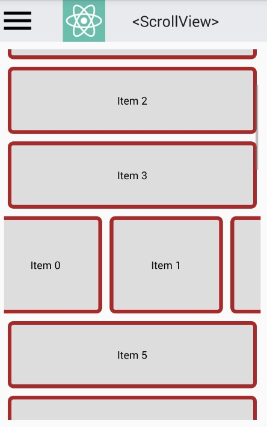
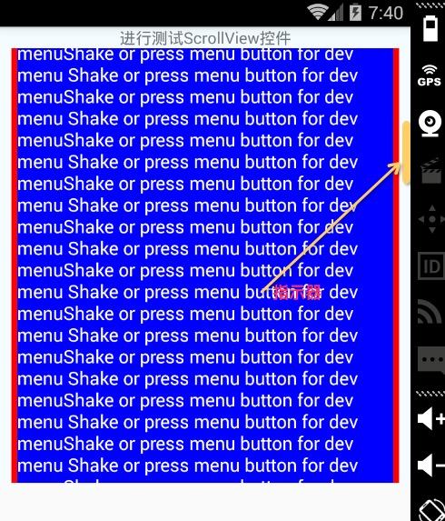

# React Native 控件之 ScrollView 组件讲解(14)

## (一)前言

今天我们一起来看一下滚动视图 ScrollView 组件的介绍和使用讲解。

刚创建的 React Native 技术交流群(282693535),欢迎各位大牛,React Native 技术爱好者加入交流!同时博客右侧欢迎微信扫描关注订阅号,移动技术干货,精彩文章技术推送!

该组件封装了 Android 平台的 ScrollView(滚动视图)组件，并且提供触摸事件"responder"系统功能。使用 ScrollViews 的时候我们必须要去确保该有一个固定的高度，因为该其实就是包含很多不固定高度的字控件装入到固定的容器中(通过滑动交互)。如果我们要给 ScrollView 进行设置高度的话，要么我们直接给该 ScrollView 进行设置高度(注意该方法不建议哦)。另外一种方法是就是该 ScrollView 的父控件设置相关高度。使用第二种方法 ScrollView 中是不能加{flex:1},不然不会有效果的。

## (二)官方实例

首先我们来看一下官方的实例代码,不过该代码整体封装性比较强，可能对于初学者来说初看起来还是有点问题的，不过后面我会写一个例子的，具体代码如下:

```
'use strict';
var React = require('react-native');
var {
  ScrollView,
  StyleSheet,
  Text,
  TouchableOpacity
} = React;
 
var NUM_ITEMS = 20;
 
var ScrollViewSimpleExample = React.createClass({
  statics: {
    title: '<ScrollView>',
    description: 'Component that enables scrolling through child components.'
  },
  makeItems: function(nItems: number, styles): Array<any> {
    var items = [];
    for (var i = 0; i < nItems; i++) {
       items[i] = (
         <TouchableOpacity key={i} style={styles}>
           <Text>{'Item ' + i}</Text>
         </TouchableOpacity>
       );
    }
    return items;
  },
 
  render: function() {
    // One of the items is a horizontal scroll view
    var items = this.makeItems(NUM_ITEMS, styles.itemWrapper);
    items[4] = (
      <ScrollView key={'scrollView'} horizontal={true}>
        {this.makeItems(NUM_ITEMS, [styles.itemWrapper, styles.horizontalItemWrapper])}
      </ScrollView>
    );
 
    var verticalScrollView = (
      <ScrollView style={styles.verticalScrollView}>
        {items}
      </ScrollView>
    );
 
    return verticalScrollView;
  }
});
 
var styles = StyleSheet.create({
  verticalScrollView: {
    margin: 10,
  },
  itemWrapper: {
    backgroundColor: '#dddddd',
    alignItems: 'center',
    borderRadius: 5,
    borderWidth: 5,
    borderColor: '#a52a2a',
    padding: 30,
    margin: 5,
  },
  horizontalItemWrapper: {
    padding: 50
  }
});
module.exports = ScrollViewSimpleExample;
```

运行效果如下图：



## (三)属性方法(这边只关注通用以及 Android 平台的)

3.1.View 相关属性样式全部继承(例如:宽和高,背景颜色,边距等相关属性样式)

3.2.contentContainerStyle  样式风格属性(传入 StyleSheet 创建的 Style 文件)。该样式会作用于被 ScrollView 包裹的所有的子视图。实例如下:

```
return ( 
      <ScrollView contentContainerStyle={styles.contentContainer}> </ScrollView> 
      ); 
   …
 var styles = StyleSheet.create({ 
          contentContainer: { 
                   paddingVertical: 20 
               } 
         });
```

3.3.horizontal   表示 ScrollView 是横向滑动还是纵向滑动。该默认为 false 表示纵向滑动

3.4.keyboardDismissMode   枚举类型表示键盘隐藏类型，可选值('none', "interactive", 'on-drag')  三个值的意义分别如下:

  - none  默认值，表示在进行拖拽滑动的时候不隐藏键盘
  - on-drag   表示在进行拖拽滑动开始的时候隐藏键盘
  - interactive  表示当拖拽触摸移动的同时隐藏键盘，向上拖拽的时候取消隐藏。不过在 Android 平台上面该选项不支持，所以会和'none'一样的效果。
3.5.keyboardShouldPersistTaps  该属性默认为 false，表示如果当前是 textinput 控件，并且键盘是弹出状态的话，点击 textinput 之外地方，会进行隐藏键盘。反之不会有效果，键盘还是成打开状态。

3.6.onContentSizeChange  function  该当滚动视图的内容尺寸大小发生变化的时候进行调用

3.7.onScroll  function  该方法在滚动的时候每 frame(帧)调用一次。该方法事件调用的频率可以使用 scrollEventThrottle 属性进行设置。

3.8.refreshControl   element 设置元素控件，该可以进行指定 RefreshControl 组件。这样可以为 ScrollView 添加下拉刷新的功能.

3.9.removeClippedSubviews  测试属性 当该值为 true 的时候。在 ScrollView 视图之外的视图(该视图的 overflow 属性值必须要为 hidden)会从被暂时移除，该设置可以提高滚动的性能。

3.10.showsHorizontalScrollIndicator   该值设置是否需要显示横向滚动指示条

3.11.showsVerticalScrollIndicator 该值设置是否需要显示纵向滚动指示条

3.12.sendMomentumEvents   当 ScrollView 有 onMomentumScrollBegin 或者 onMomentumScrollEnd 方法设置，该 sendMomentumEvents 值设置为 true 的时候。变化的事件信息会通过该 Android 框架自动发送出来，然后之前设置的方法进行捕捉。

生下来的其他属性方法都只适合于 iOS 平台，这边暂时不做相关讲解。具体[请点击查看官方文档](http://facebook.github.io/react-native/docs/scrollview.html#content)

## (四)风格样式

对于风格样式这块，其实和 View 视图中差不多的，大家可以[点击进行查看 View 组件的介绍和详解文章](http://www.lcode.org/%E3%80%90react-native%E5%BC%80%E5%8F%91%E3%80%91react-native%E6%8E%A7%E4%BB%B6%E4%B9%8Bview%E8%A7%86%E5%9B%BE%E8%AE%B2%E8%A7%A3/)

  - Flexbox...
  - ShadowPropTypesIOS#style…
  - Transforms...
  - backfaceVisibility enum('visible', 'hidden')
  - backgroundColor color
  - borderBottomColor color
  - borderBottomLeftRadius number
  - borderBottomRightRadius number
  - borderBottomWidth number
  - borderColor color
  - borderLeftColor color
  - borderLeftWidth number
  - borderRadius number
  - borderRightColor color
  - borderRightWidth number
  - borderStyle enum('solid', 'dotted', 'dashed')
  - borderTopColor color
  - borderTopLeftRadius number
  - borderTopRightRadius number
  - borderTopWidth number
  - borderWidth number
  - opacity number
  - overflow enum('visible', 'hidden')

## (五)使用实例

以上我们对于 ScrollView 的介绍以及相关属性方法以及样式做了一定的介绍，下面我们来写一个比较简单的实例，来演示一下该 ScrollView 控件的基本使用。实例代码如下:

```
/**
 * Sample React Native App
 * https://github.com/facebook/react-native
 */
'use strict';
import React, {
  AppRegistry,
  Component,
  StyleSheet,
  Text,
  View,
  ScrollView,
} from 'react-native';
 
class ListViewDemo extends Component {
  render() {
    return (
      <View style={styles.container}>
        <Text style={styles.welcome}>
           进行测试 ScrollView 控件
        </Text>
         <ScrollView showsVerticalScrollIndicator={true} 
              contentContainerStyle={styles.contentContainer}>
            <Text 
            style={{color:'#FFF',margin:5,fontSize:16,backgroundColor:"blue"}}>
                Shake or press menu button for dev menuShake or press menu button for dev menu
                Shake or press menu button for dev menuShake or press menu button for dev menu
                Shake or press menu button for dev menuShake or press menu button for dev menu
                Shake or press menu button for dev menuShake or press menu button for dev menu
                Shake or press menu button for dev menuShake or press menu button for dev menu
                Shake or press menu button for dev menuShake or press menu button for dev menu
                Shake or press menu button for dev menuShake or press menu button for dev menu
                Shake or press menu button for dev menuShake or press menu button for dev menu
                Shake or press menu button for dev menuShake or press menu button for dev menu
                Shake or press menu button for dev menuShake or press menu button for dev menu
                Shake or press menu button for dev menuShake or press menu button for dev menu
                Shake or press menu button for dev menuShake or press menu button for dev menu
                Shake or press menu button for dev menuShake or press menu button for dev menu
                Shake or press menu button for dev menuShake or press menu button for dev menu
                Shake or press menu button for dev menuShake or press menu button for dev menu
                Shake or press menu button for dev menuShake or press menu button for dev menu
                Shake or press menu button for dev menuShake or press menu button for dev menu
                Shake or press menu button for dev menuShake or press menu button for dev menu
                Shake or press menu button for dev menuShake or press menu button for dev menu
                Shake or press menu button for dev menuShake or press menu button for dev menu
                Shake or press menu button for dev menuShake or press menu button for dev menu
                Shake or press menu button for dev menuShake or press menu button for dev menu
                Shake or press menu button for dev menuShake or press menu button for dev menu
                Shake or press menu button for dev menuShake or press menu button for dev menu
                Shake or press menu button for dev menuShake or press menu button for dev menu
                Shake or press menu button for dev menuShake or press menu button for dev menu
                Shake or press menu button for dev menuShake or press menu button for dev menu
            </Text>
         </ScrollView>
      </View>
    );
  }
}
const styles = StyleSheet.create({
  container: {
    height:400,
    justifyContent: 'center',
    alignItems: 'center',
    backgroundColor: '#F5FCFF',
  },
  contentContainer: {
      margin:10,
      backgroundColor:"#ff0000",
    }
});
AppRegistry.registerComponent('ScrollViewDemo', () => ScrollViewDemo);
```

运行效果如下:



## (六)最后总结

今天我们主要学习一下 ScrollView 组件的介绍以及使用方法。大家有问题可以加一下群 React Native 技术交流群(282693535)或者底下进行回复一下。