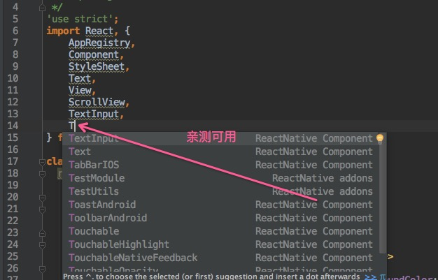

# WebStorm 开发工具设置 React Native 代码智能提醒

最近在做 React Native 开发的时候，相信大家一般会使用 WebStorm，Sublime，Atom 等等开发工具。WebStorm 是一款非常优秀的 Web 开发工具，同样支持 React Native 开发。但是苦于该暂时不提供 React Native 代码智能提醒功能，OK~今天我正好逛 Github 的时候突然发现这一款插件 Webstrom live template，特意介绍给大家吧。

刚创建的 React Native 技术交流群(282693535),欢迎各位大牛,React Native 技术爱好者加入交流!同时博客右侧欢迎微信扫描关注订阅号,移动技术干货,精彩文章技术推送!
插件地址:https://github.com/virtoolswebplayer/ReactNative-LiveTemplate

ReactNative 的代码模板,包括:

  - 组件名称
  - Api 名称
  - 所有 StyleSheets 属性
  - 调用 ReactNative 组件时, 首先 按下 command + J , 然后输入属性名的 首字母 如输入 onP 自动提示 onPress, onPressIn, onPressOut, ....

**下载方法:**

首先大家可以把该项目下载或者如下命令 clone 下来:

```
git clone https://github.com/virtoolswebplayer/ReactNative-LiveTemplate
```

**安装方法一(Windows 和 Mac 都支持):**

```
file -> import settings -> ReactNative.jar
```

**安装方法二(该方法只是针对 Mac):**

将 ReactNative.xml 复制到 ~/Library/Preferences/WebStorm11/templates 重启 WebStrom

**使用方法:**

通用方法
直接输入组件 或 Api 名称的首字母, 比如想要 View ,只要输入 V 自动提示代码里就会看到 View
StyleSheet 属性提示
首先 按下 command + J , 然后输入属性名的 首字母
如: 输入 f ,会自动提示 fontSize,fontFamily,fontStyle...等等
楼主亲测使用效果图哦~

