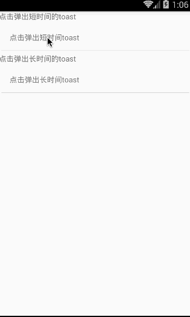

# React Native API 模块之 ToastAndroid 详解及使用(24)

## (一)前言

截止到昨天我们已经顺利完成 React Native 组件 Android 部分的讲解及学习，今天开始我们来看一下 API 模块。首先来看一个比较简单的模块:ToastAndroid。android 平台的 toast 消息。

刚创建的 React Native 技术交流 2 群(496601483),欢迎各位大牛,React Native 技术爱好者加入交流!同时博客右侧欢迎微信扫描关注订阅号,移动技术干货,精彩文章技术推送!

该 ToastAndroid 模块是把 Android 平台原生模块 Toast 封装成一个 JS 模块使用，来进行弹出一个 toast 消息。该模块有一个'show'方法会传入下面两个参数:①:message  string 字符串格式，设置要进行 toast 显示的文本    ②:duration  int 格式 toast 消息弹出显示的时长。有两个可选值 ToastAndroid.SHORT 或者 ToastAndroid.LONG

## (二)方法

1.show(message:string,duration:number)  static 静态方法，该设置 toast 消息的弹出

## (三)属性

1.SHORT  静态 int 值，表示 toast 显示较短的时间

2.LONG   静态 int 值，表示 otast 显示较长的时间

## (四)使用实例

上下讲解了 ToastAndroid 模块的属性和介绍，下面来演示一下实例效果。具体代码如下:

```
/**
 * Sample React Native App
 * https://github.com/facebook/react-native
 */
'use strict';
import React, {
  AppRegistry,
  Component,
  StyleSheet,
  Text,
  View,
  ToastAndroid,
  TouchableHighlight,
} from 'react-native';
class CustomButton extends React.Component {
  render() {
    return (
      <TouchableHighlight
        style={styles.button}
        underlayColor="#a5a5a5"
        onPress={this.props.onPress}>
        <Text style={styles.buttonText}>{this.props.text}</Text>
      </TouchableHighlight>
    );
  }
}
class ToastAndroidDemo extends Component {
  render() {
    return (
      <View>
        <Text style={styles.welcome}>
          点击弹出短时间的 toast
        </Text>
        <CustomButton text="点击弹出短时间 toast"
        onPress={()=>ToastAndroid.show('点击我好疼,短时间的~',ToastAndroid.SHORT)}/>
        <Text style={styles.welcome}>
          点击弹出长时间的 toast
        </Text>
        <CustomButton text="点击弹出长时间 toast"
        onPress={()=>ToastAndroid.show('点击我好疼,长时间的~',ToastAndroid.LONG)}/>
      </View>
    );
  }
}
const styles = StyleSheet.create({
  button: {
    margin:5,
    backgroundColor: 'white',
    padding: 15,
    borderBottomWidth: StyleSheet.hairlineWidth,
    borderBottomColor: '#cdcdcd',
  }
});
 
AppRegistry.registerComponent('ToastAndroidDemo', () => ToastAndroidDemo);
```

运行截图如下:



## (五)最后总结

今天我们主要讲解学习了 ToastAndroid 模块。大家有问题可以加一下群 React Native 技术交流 2 群(496601483).或者底下进行回复一下。