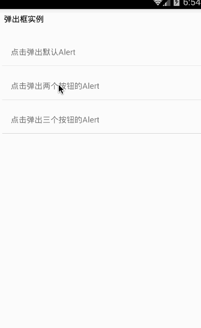

# React Native API 模块之 Alert 弹出框详解及使用(25)

## (一)前言

今天我们继续来一个 Android、iOS 平台通用的弹出框 Alert 模块。

刚创建的 React Native 技术交流 2 群(496601483),欢迎各位大牛,React Native 技术爱好者加入交流!同时博客右侧欢迎微信扫描关注订阅号,移动技术干货,精彩文章技术推送!

该 Alert 模块是创建弹出一个弹框，显示一个标题以及相关信息内容。该弹出框可以提供一系列的可选按钮，点击任何一个按钮都会调用 onPress 方法并且关闭弹框。默认情况下，该只会显示一个'确定'按钮。

该模块 API 是在 Android、iOS 平台通用的显示静态的弹框。如果需要显示一个提示框可以让用户输入相关信息的，详细[请查看 AlertIOS](https://github.com/facebook/react-native/blob/6f1417c84982e0705912b57bf9d1aaaf1476d7d9/Libraries/Utilities/AlertIOS.js);该带输入框的弹框只适用于 iOS 平台。

## (二)iOS 平台相关

只有 iOS 平台可以指定多个数量的 button,每个按钮都可以设置特殊的风格，不过风格为'default','cancel','destructive'三种状态之一。

## (三)Android 平台相关

iOS 平台可以指定多个数量的 button，但是在 Android 平台上面最多只能指定三个按钮。Android 平台的弹出框的按钮有'中间态','取消','确认'三种状态

1.如果你只有指定了一个按钮，那么该为'position' (例如:确定)

2.如果你指定了两个按钮，那么该会'negative','position' (例如:确定，取消)

3.如果你指定了三个按钮，那么该会'neutral','negative','positive'(例如:稍后再说,'确定','取消')

## (四)Alert 方法

static alert(title:string,message?:string,buttons?:Buttons,type?:AlertType)  该会 Alert 模块显示弹框的静态方法，有四个参数，分别为标题，信息，按钮，以及按钮的风格类型

## (五)Alert 使用实例

上面已经讲解了 Alert 模块的基本介绍，现在来演示一下该模块的具体使用，实例代码如下:

```
/**
 * React Native Alert 模块具体使用实例
 * https://github.com/facebook/react-native
 */
'use strict';
import React, {
  AppRegistry,
  Component,
  StyleSheet,
  Text,
  View,
  Alert,
  ToastAndroid,
  TouchableHighlight,
} from 'react-native';
class CustomButton extends React.Component {
  render() {
    return (
      <TouchableHighlight
        style={styles.button}
        underlayColor="#a5a5a5"
        onPress={this.props.onPress}>
        <Text style={styles.buttonText}>{this.props.text}</Text>
      </TouchableHighlight>
    );
  }
}
class AlertDemo extends Component {
  render() {
    return (
      <View>
        <Text style={{height:30,color:'black',margin:8}}>
          弹出框实例
        </Text>
        <CustomButton text='点击弹出默认 Alert'
          onPress={()=>Alert.alert('温馨提醒','确定退出吗?')}
          />
        <CustomButton text='点击弹出两个按钮的 Alert'
          onPress={()=>Alert.alert('温馨提醒','确定退出吗?',[
            {text:'取消',onPress:()=>ToastAndroid.show('你点击了取消~',ToastAndroid.SHORT)},
            {text:'确定',onPress:()=>ToastAndroid.show('你点击了确定~',ToastAndroid.SHORT)}
            ])}
          />
        <CustomButton text='点击弹出三个按钮的 Alert'
          onPress={()=>Alert.alert('温馨提醒','确定退出吗?',[
            {text:'One',onPress:()=>ToastAndroid.show('你点击了 One~',ToastAndroid.SHORT)},
            {text:'Two',onPress:()=>ToastAndroid.show('你点击了 Two~',ToastAndroid.SHORT)},
            {text:'Three',onPress:()=>ToastAndroid.show('你点击了 Three~',ToastAndroid.SHORT)}
            ])}
          />
      </View>
    );
  }
}
const styles = StyleSheet.create({
  button: {
    margin:5,
    backgroundColor: 'white',
    padding: 15,
    borderBottomWidth: StyleSheet.hairlineWidth,
    borderBottomColor: '#cdcdcd',
  }
});
 
AppRegistry.registerComponent('AlertDemo', () => AlertDemo);
```

运行截图如下:



## (六)最后总结

今天我们主要讲解学习了 Alert 弹出框模块。大家有问题可以加一下群 React Native 技术交流 2 群(496601483).或者底下进行回复一下。