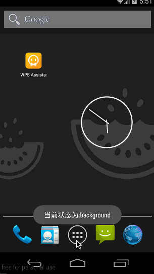

# React Native API 模块之 AppState 详解(26)

## (一)前言

今天我们继续看另外一个 API 模块 AppState。

刚创建的 React Native 技术交流 2 群(496601483),欢迎各位大牛,React Native 技术爱好者加入交流!同时博客右侧欢迎微信扫描关注订阅号,移动技术干货,精彩文章技术推送!

AppState 模块可以告诉用户我们的 APP 是在前台还是在后台运行，并且当然 APP 的运行状态发生改变的时候进行通知用户。一般该模块的用途在:当我们进行处理 Push(推送)消息的时候，AppState 可以帮助我们进行决定内容或者处理的行为意图。

## (二)AppState 状态

App 一般有三种状态分别如下:

1.active   表示当前 App 在前台运行

2.background    表示当前 app 运行在后台，此时的用户正在和另外一个 app 交互，或者用户在 home 界面(主界面)

3.inactive   该状态我们可以暂时不考虑，因为该状态不会出现在现在 React Native App 中。

更多内容大家可以查看一下 [Apple  App 的声明周期](https://developer.apple.com/library/ios/documentation/iPhone/Conceptual/iPhoneOSProgrammingGuide/TheAppLifeCycle/TheAppLifeCycle.html)

## (三)基本使用

我们可以通过 AppState.currentState 来进行检测查询当前的状态，该值是一直会更新保持最新的。当然 AppState 在刚起来的时候的 currentState 的值会 null 的，一直会知道通过桥接获取到原生应用的状态更新通知为止。

下面一起来看一下官方文档提供的一段演示代码:

```
};
},
componentDidMount: function() {
  AppState.addEventListener('change', this._handleAppStateChange);
},
componentWillUnmount: function() {
  AppState.removeEventListener('change', this._handleAppStateChange);
},
_handleAppStateChange: function(currentAppState) {
  this.setState({ currentAppState, });
},
render: function() {
  return (
    <Text>Current state is: {this.state.currentAppState}</Text>
  );
},
```

上述的例子会看到"Current state is:active"，因为当 app 的状态为 active 的时候才能被用户看到。currentState 为 null 的时候只会发生在启动的时候，该时间是很短的。

## (四)模块方法

1.addEventListener(type:string,handler:Function)  static  模块静态方法，添加一个 AppState 状态变化的监听方法。方法参数填入 type:'change'以及处理方法

2.removeEventListener(type:string,handler:Function) static 模块静态方法，移除一个 AppState 状态的监听方法，方法参数和上面的一样。

## (五)属性

currentState:标志当前状态类型

## (六)AppState 实例

上面我们讲解了 AppState 的基本内容，现在我们开始演示一下 AppState 的相关实例用法，具体代码如下:

```
/**
 * Sample React Native App
 * https://github.com/facebook/react-native
 */
'use strict';
import React, {
  AppRegistry,
  Component,
  StyleSheet,
  Text,
  View,
  AppState,
  ToastAndroid,
} from 'react-native';
 
class AppStateDemo extends Component {
  constructor(props){
        super(props);
        this._handleAppStateChange = this.handleAppStateChange.bind(this);
        this.state = {
            _appState:AppState.currentState,
            _changeMessage:'',
 
        };
  }
  componentWillMount() {
     //ToastAndroid.show('挂载',ToastAndroid.SHORT);
     AppState.addEventListener('change', this._handleAppStateChange);
  }
  componentWillUnmount() {
     //ToastAndroid.show('取消挂载',ToastAndroid.SHORT);
     AppState.removeEventListener('change', this._handleAppStateChange);
  }
  handleAppStateChange(appState) {
      ToastAndroid.show('当前状态为:'+appState,ToastAndroid.SHORT);
  } 
  render() {
    return (
      <View style={styles.container}>
        <Text>当前 App 状态信息如下:</Text>
        <Text>
           {this.state._appState}
        </Text>
      </View>
    );
  }
}
const styles = StyleSheet.create({
  container: {
    flex: 1,
    justifyContent: 'center',
    alignItems: 'center',
    backgroundColor: '#F5FCFF',
  },
});
 
AppRegistry.registerComponent('AppStateDemo', () => AppStateDemo);
```

运行截图如下:



## (七)AppState 实例

今天我们主要讲解学习了 AppState 检查 App 前后、后台运行状态模块。大家有问题可以加一下群 React Native 技术交流 2 群(496601483).或者底下进行回复一下。