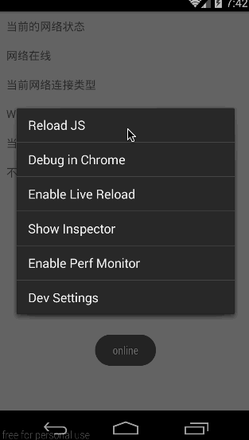

# React Native API 模块之 NetInfo(网络信息)使用详解(28)

尊重版权,转载请注明出处

本文来自:江清清的技术专栏(http://www.lcode.org)

## (一)前言

今天我们继续来看一下 NetInfo 模块-网络信息模块

刚创建的 React Native 技术交流 2 群(496601483),欢迎各位大牛,React Native 技术爱好者加入交流!同时博客右侧欢迎微信扫描关注订阅号,移动技术干货,精彩文章技术推送!

通过该 NetInfo 模块我们可以检测手机客户端设备联网/断网状态。下面来看一下官方提供的基本使用实例代码:

```
NetInfo.fetch().done((reach) => {
  console.log('Initial: ' + reach);
});
function handleFirstConnectivityChange(reach) {
  console.log('First change: ' + reach);
  NetInfo.removeEventListener(
    'change',
    handleFirstConnectivityChange
  );
}
NetInfo.addEventListener(
  'change',
  handleFirstConnectivityChange
);
```

## (二)iOS 平台

在 iOS 平台上面，该模块会通过异步方式去检测设备是否联网还是连接移动数据网络。该可能的网络状态值为：

1.none   设备没有联网

2.wifi     设备联网并且是连接的 wifi 网络，或者当前是 iOS 模拟器

3.cell      设备联网是通过连接 Edge,3G,WiMax 或者 LET 网络

4.unknown  该检测发生异常错误或者网络状态无从知道

## (三)Android 平台

在 Android 平台上面为了获取网络状态，我们需要在 android 项目的 AndroidManifest.xml 文件中配置以下的权限:

```
<uses-permission android:name="android.permission.ACCESS_NETWORK_STATE" />
```

该也是通过异步方法来检测设备是否联网以及连接的网络的细节信息。

Android 平台的网络连接类型状态如下:

1.NONE   设备没有网络连接

2.BLUETOOTH  蓝牙数据连接

3.DUMMY   虚拟数据连接

4.ETHERNET  以太网数据连接

5.MOBILE  手机移动网络数据连接

6.MOBILE_DUN  拨号移动网络数据连接

7.MOBILE_HIPRI  高权限的移动网络数据连接

8.MOBILE_MMS   彩信移动网络数据连接

9.MOBILE_SUPL   SUP 网络数据连接

10.VPN   虚拟网络连接 ，最低支持 Android API 21 版本

11.WIFI   无线网络连接

12.WIMAX   wimax 网络连接

13.UNKNOWN  未知网络数据连接

根据文档说明:除此之外的其他一些网络谅解状态已经被 Android API 隐藏了，但是我们可以在有需要的时候进行使用。

## (四)isConnectionExpensive(判断连接的网络是否计费)

该方法只适合 Android 平台，用来判断当前连接的网络是否需要收费。例如当用户连接的是移动数据网络，那么会判断成该网络是需要计费的。具体判断代码如下：

```
NetInfo.isConnectionExpensive((isConnectionExpensive) => {
 
  console.log('Connection is ' + (isConnectionExpensive ? 'Expensive' : 'Not Expensive'));
 
});
```

## (五)isConnected

该方法是合适所有的平台，通过异步方法来获取当前与没有网络连接，具体检测代码实例如下:

```
NetInfo.isConnected.fetch().done((isConnected) => {
 
  console.log('First, is ' + (isConnected ? 'online' : 'offline'));
 
});
 
function handleFirstConnectivityChange(isConnected) {
 
  console.log('Then, is ' + (isConnected ? 'online' : 'offline'));
 
  NetInfo.isConnected.removeEventListener(
 
    'change',
 
    handleFirstConnectivityChange
 
  );
 
}
 
NetInfo.isConnected.addEventListener(
 
  'change',
 
  handleFirstConnectivityChange
 
);
```

## (六)属性与方法

1.addEventListener(eventName:ChangeEventName,handler:Function)   静态方法，用设置网络变化事件监听器，同时需要传入回调的处理方法

2.removeEventListener(eventName:ChangeEventName,handler:Function)  静态方法, 用于移除网络事件变化监听器

3.fetch()   静态方法  检测当前网络连接状态

4.isConnectionExpensve(callback:(metered:?boolean,error?:string)=>void)   静态方法，检测当前连接的网络是否需要计费

5.isConnected :ObjectExpression 当前网络是否连接的属性

## (七)NetInfo 模块使用实例

上面我们已经针对 NetInfo 模块做了详细的介绍，包括基本知识点以及相关属性方法，下面依然从实例开始演示一下该模块的实际使用。在实例之前千万不要忘记 Android 项目中的权限配置如下:


NetInfo 基本用法，进行检测当前设备的网络连接状态,网络详细信息已经是否计费，具体代码如下:

```
/**
 * Sample React Native App
 * https://github.com/facebook/react-native
 */
'use strict';
import React, {
  NetInfo,
  AppRegistry,
  Component,
  StyleSheet,
  Text,
  View,
  ToastAndroid,
} from 'react-native';
 
class NetInfoDemo extends Component {
  constructor(props){
        super(props);
        this.state = {
           isConnected: null,
           connectionInfo:null,
     };
    }
  componentDidMount() {
    NetInfo.isConnected.addEventListener(
        'change',
         this._handleConnectivityChange
    );
    //检测网络是否连接
    NetInfo.isConnected.fetch().done(
        (isConnected) => { this.setState({isConnected}); }
    );
    //检测网络连接信息
     NetInfo.fetch().done(
        (connectionInfo) => { this.setState({connectionInfo}); }
    );
  }
  componentWillUnmount() {
    NetInfo.isConnected.removeEventListener(
        'change',
        this._handleConnectivityChange
    );
  }
  _handleConnectivityChange(isConnected) {
       ToastAndroid.show((isConnected ? 'online' : 'offline'),ToastAndroid.SHORT);
  }
  render() {
    return (
      <View >
        <Text style={styles.welcome}>
            当前的网络状态
        </Text>
        <Text style={styles.welcome}>
           {this.state.isConnected ? '网络在线' : '离线'}
        </Text>
        <Text style={styles.welcome}>
            当前网络连接类型
        </Text>
        <Text style={styles.welcome}>
            {this.state.connectionInfo}
        </Text>
        <Text style={styles.welcome}>
            当前连接网络是否计费
        </Text>
        <Text style={styles.welcome}>
          {NetInfo.isConnectionExpensive === true ? '需要计费' : '不要'}
        </Text>
      </View>
    );
  }
}
const styles = StyleSheet.create({
  welcome: {
    fontSize: 16,
    textAlign: 'left',
    margin: 10,
  },
});
AppRegistry.registerComponent('NetInfoDemo', () => NetInfoDemo);
```

运行截图如下:



## (八)最后总结

今天我们主要讲解学习了 NetInfo 模块的相关知识点以及基本使用方法，大家有问题可以加一下群 React Native 技术交流 2 群(496601483).或者底下进行回复一下。