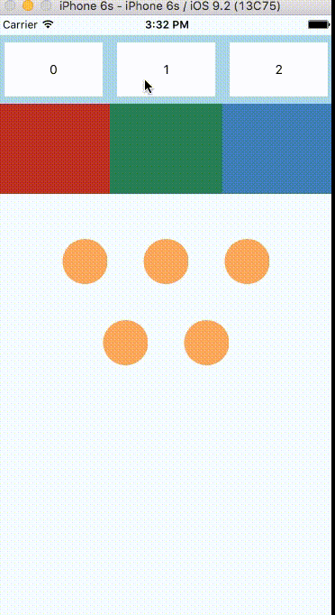
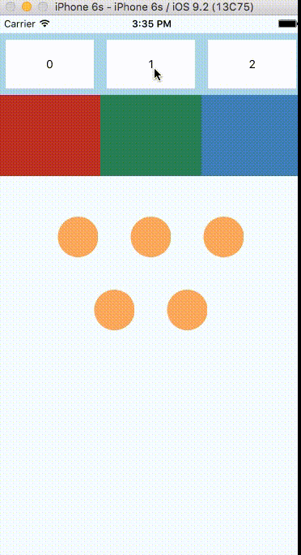

# React Native 超棒的 LayoutAnimation(布局动画)

 原文翻译自:https://medium.com/@Jpoliachik/react-native-s-layoutanimation-is-awesome-4a4d317afd3e#.6syi2v6yh

刚创建的 React Native 技术交流群(282693535),欢迎各位大牛,React Native 技术爱好者加入交流!同时博客右侧欢迎微信扫描关注订阅号,移动技术干货,精彩文章技术推送!

如果你是用 React Native 进行开发，然而还没有尝试过使用 LayoutAnimation 的话，那么你就太 out 啦~

做为一个 iOS 开发者突然使用 React Native 进行开发，我之前非常担心会失去 iOS 中 CoreAnimation 的很多特性以及使用便利。UIView 的动画是非常不错的。在 React Native 中，我们只需要设置好期望的 View(视图)属性，然后 React Native 的 Animated([具体点击进入](https://facebook.github.io/react-native/docs/animated.html#content)) API 就会达到原生开发中的类似动画效果了。但是我们需要给每一个期望的动画设置一个状态属性。对于复杂的视图来讲这样设置整个代码会很快变得一团糟~

打开 LayoutAnimation([点击进入](https://facebook.github.io/react-native/docs/layoutanimation.html#content))的文档,千万不要对于该简短的文档感到吃惊哦，其实用起来确实很简单。

对于布局中的多个布局变化的功能，一行代码就可以搞定了。添加如下设置:允许视图重新渲染以及让 LayoutAnimation 为你处理所有的插值(变化)。对于大的并且复杂的视图来讲，这是非常有用强大的。

下面演示一个例子:在该例子中，我这边有一个三种可能的状态的复杂视图。下面根据三种按钮的选中的'index'索引来进行分别渲染不同的高度，宽度以及 item 视图的数量。该下面状态效果变化的代码没有任何动画。具体实现的效果运行如下:



我们发现该上面是没有任何动画效果的，现在我们来通过添加 LayoutAnimation 实现状态改变的时候视图动画效果，下面的一行代码是非常必要的.

```
LayoutAnimation.configureNext(LayoutAnimation.Presets.spring);
```

该代码设置了 spring 的动画效果[注意].spring 是该定义的动画效果的一种类型

如上代码设置之后，该对于任何布局变化的时候都会使用'spring'动画类型来进行渲染呈现。具体效果如下:



看到这个效果之后，大家是不是觉的非常性感呢？

【注意】LayoutAnimation 只对于布局的创建和更新事件才起作用，然而删除事件是不支持的。看上面的效果，当黄色的小圆圈删除的时候是没有任何动画的。

LayoutAnimation 有以下三种动画效果类型:

  1. caseInEaseOut
  2. linear
  3. spring
大家可以设置不同的动画类型来看效果，或者可以进行查看源代码进行学习([源代码点击进入](https://github.com/facebook/react-native/blob/master/Libraries/LayoutAnimation/LayoutAnimation.js))

工作特点:LayoutAnimation 运行原理通过指定的视图计算动画期望的位置，底层通过原生动画框架(CoreAnimation on iOS)来完成动画效果。帧动画可以支持不透明度以及缩放属性。不过我们可以添加一些其他的属性例如:backgroundColor 和 transformations

【注】这边没有去分析 Android 源代码，所以这边对于 Android 平台可能会有所不同。

LayoutAnimation 在 React  Native 中绝对是很好的实现动画效果，完成可以和原生体验相媲美，非常值得大家一试。本文章实例完成代码[请点击查看](https://gist.github.com/Jpoliachik/0dd83689646d1051b0bc)

今天我们主要翻译一篇国外的关于 React Native 的 LayoutAnimation 介绍的文章。大家有问题可以加一下群 React Native 技术交流群(282693535)或者底下进行回复一下。