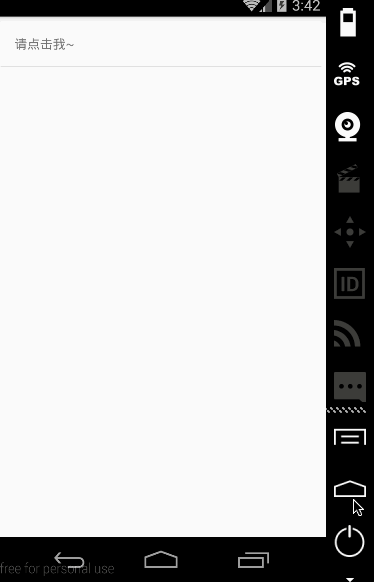

# React Native 控件之组件封装实例(Button 按钮)

## (一)前言

今天我们一起来看一下 WebView 组件讲解以及使用实例

刚创建的 React Native 技术交流 1 群(282693535),React Native 技术交流 2 群(496601483),欢迎各位大牛,React Native 技术爱好者加入交流!同时博客右侧欢迎微信扫描关注订阅号,移动技术干货,精彩文章技术推送!

做为客户端开发来讲，Button(按钮组件)是最基本的，在 React Native 中也存在相关 Touchable*系列的组件来实现点击事件([详细请点击](http://www.lcode.org/%E3%80%90react-native%E5%BC%80%E5%8F%91%E3%80%91react-native%E6%8E%A7%E4%BB%B6%E4%B9%8Btouchable%E7%B3%BB%E5%88%97%E7%BB%84%E4%BB%B6%E8%AF%A6%E8%A7%A318/))。下面我们来进行稍微封装一个 Button 组件,然后进行单独使用，其实用法和之前的差不多。

## (二)使用说明

我们创建渲染一个 ModeCustomButton 组件，里边包含 TouchableHightlight 以及 Text 组件，然后返回，在其他地方可以进行使用。具体渲染代码如下:

```
class MoreCustomButton extends React.Component {
  render() {
    return (
      <TouchableHighlight
        style={styles.button}
        underlayColor="#a5a5a5"
        onPress={this.props.onPress}>
        <Text style={styles.buttonText}>{this.props.text}</Text>
      </TouchableHighlight>
    );
  }
}
```

## (三)简要实例

该具体封装以及使用实例如下:

```
/**
 * Sample React Native App
 * https://github.com/facebook/react-native
 */
'use strict';
import React, {
  AppRegistry,
  Component,
  StyleSheet,
  Text,
  View,
  TouchableHighlight,
  ToastAndroid,
} from 'react-native';
 
class MoreCustomButton extends React.Component {
  render() {
    return (
      <TouchableHighlight
        style={styles.button}
        underlayColor="#a5a5a5"
        onPress={this.props.onPress}>
        <Text style={styles.buttonText}>{this.props.text}</Text>
      </TouchableHighlight>
    );
  }
}
class CustomButton extends Component {
  render() {
    return (
      <MoreCustomButton
          onPress={() => {
          ToastAndroid.show('你点击了我了~好疼！', ToastAndroid.LONG)}}
          text="请点击我~"
        />
    );
  }
}
const styles = StyleSheet.create({
  button: {
    margin:5,
    backgroundColor: 'white',
    padding: 15,
    borderBottomWidth: StyleSheet.hairlineWidth,
    borderBottomColor: '#cdcdcd',
  }
});
 
AppRegistry.registerComponent('CustomButton', () => CustomButton);
```

具体运行结果截图:



## (四)最后总结

今天我们主要看一下简单封装 Button 按钮以及使用。大家有问题可以加一下群 React Native 技术交流 1 群(282693535),React Native 技术交流 2 群(496601483).或者底下进行回复一下。